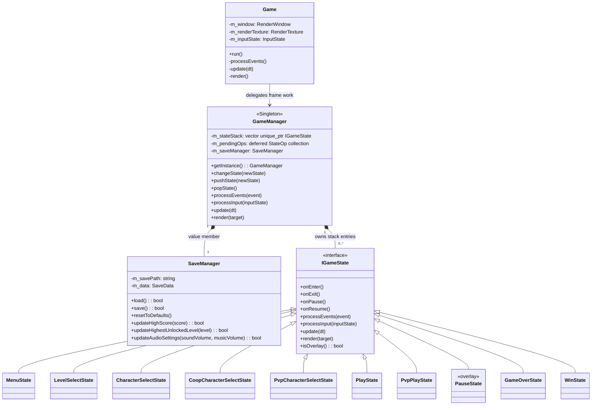
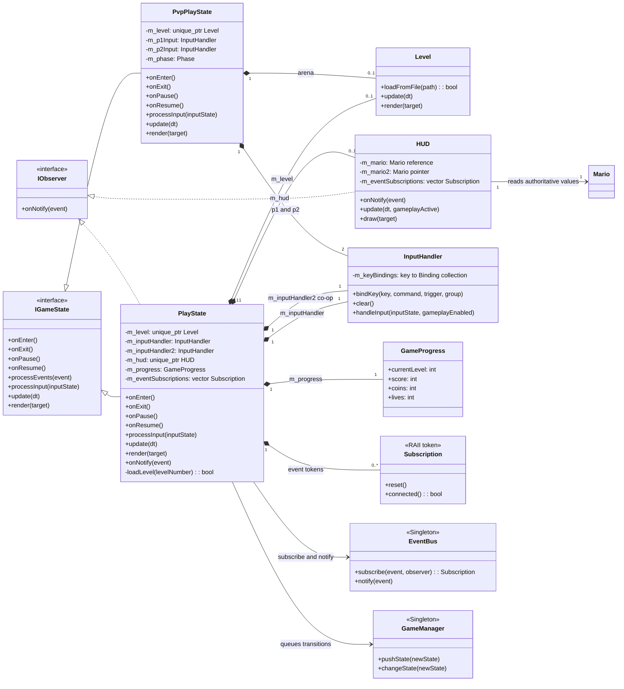
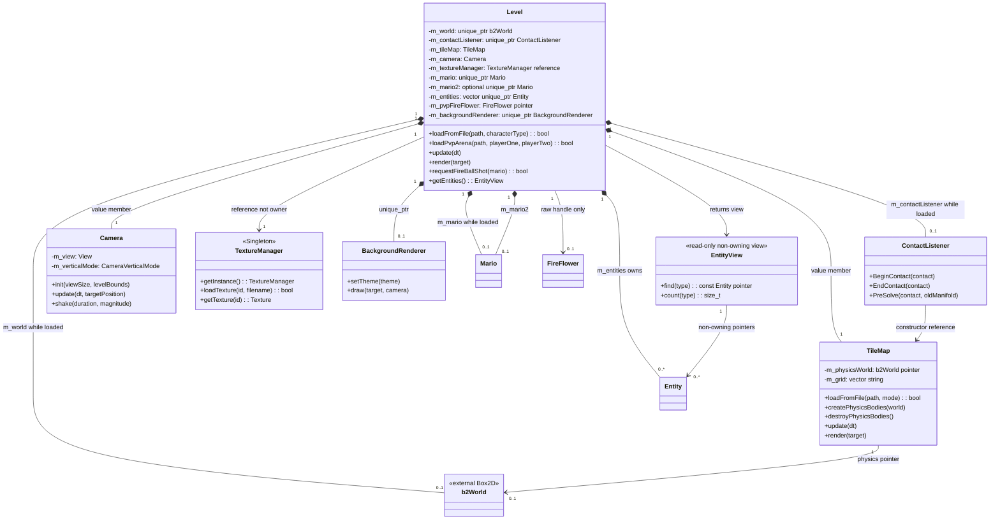
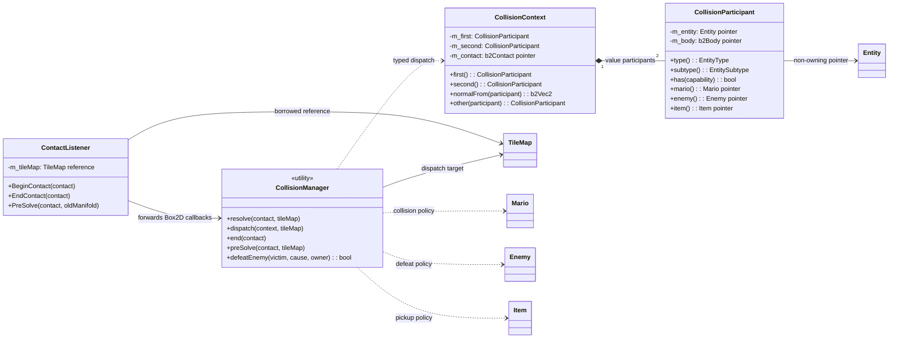
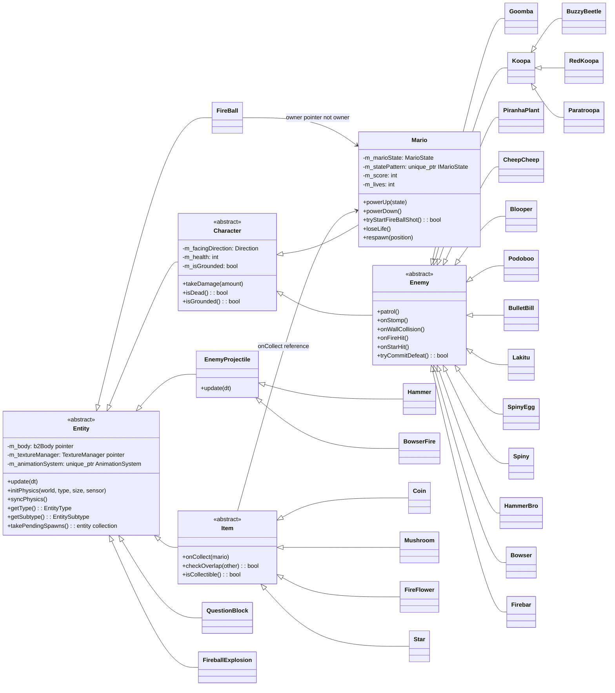
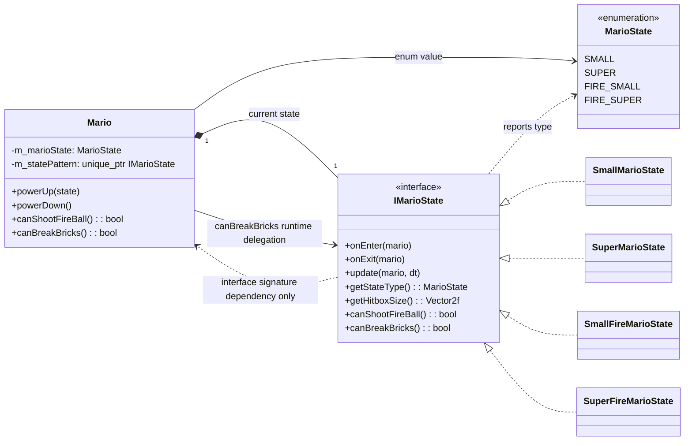
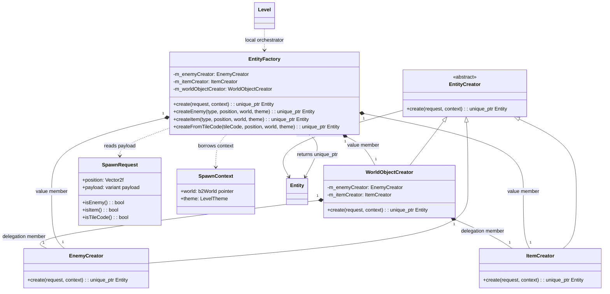
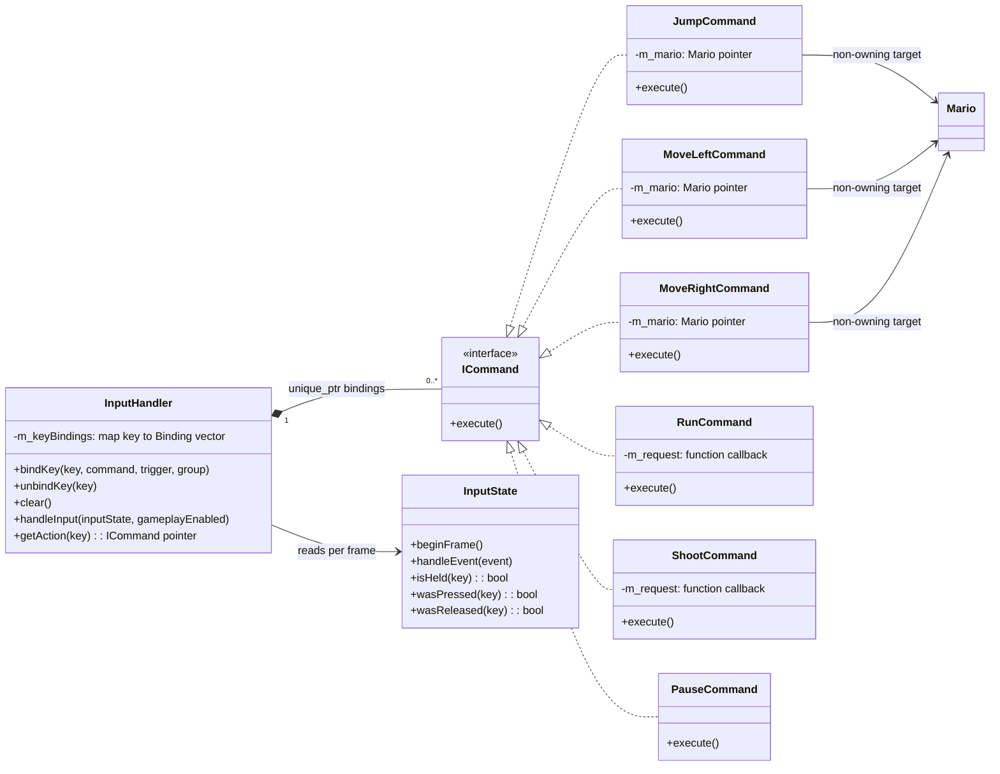

# Current class diagrams of the game

This document describes the classes and runtime boundaries inferred from the
current source code in `include/` and `src/`. The diagrams are split by
responsibility so each slice can be read without confusing ownership
relations with usage relations.

## Scope and how to read

- `*--` is composition: the left object owns the component's lifetime
  (usually a by-value member or a `std::unique_ptr`).
- `o--` is aggregation/non-owning recording; `-->` and `..>` are references,
  calls, or return types — they transfer no ownership.
- Cardinality labels (`1`, `0..1`, `0..*`, `2`) reflect the runtime
  members/collections, not the number of statically created C++ classes.
  `<<RAII token>>` is a role declared or shown directly in the code.
  `SaveManager` deliberately carries no Singleton label.
- Class, enum, and method names stay in English as in C++; the explanations
  are prose. Long templates are shortened inside class boxes to keep Mermaid
  stable; the precise owning type is recorded in the notes and evidence
  table.

The color scheme is consistent across blocks: orange = core/owner, blue =
state or physics, green = gameplay/entity, purple = pattern/event, and light
red = enemy. Colors are only a visual aid; semantics are decided by the
arrows and notes.

## Navigation

1. [Application loop and state stack](#runtime)
2. [Ownership boundary of the gameplay states](#state-boundary)
3. [Level, physics, and the entity collection](#world)
4. [Collision callback boundary](#collision)
5. [Entity inheritance tree](#entity-hierarchy)
6. [Mario power-up state](#mario-state)
7. [Factory Method](#factory)
8. [EventBus and Observer](#observer)
9. [Command and input](#command)
10. [Source evidence](#evidence)

## 1. Application loop and state stack

This is the path of one frame: `Game` receives events and keeps the
`InputState`, then delegates input, update, and render to `GameManager`.
`GameManager` is a Singleton coordinating a stack of `unique_ptr<IGameState>`;
`SaveManager` is merely a by-value member of the manager, not an independent
Singleton.

`GameManager::changeState`, `pushState`, and `popState` only enqueue a
`PendingOp`; only at the end of `GameManager::update()` does
`processPendingOps()` run. `CHANGE` calls `onExit()` on the old stack then
`onEnter()` on the new state; `PUSH` calls `onPause()` on the state below and
`POP` calls `onResume()` on the new top state. When the top state is an
overlay, `render()` draws the state below first. These behaviors are real
lifecycle semantics, not just inheritance relations on the picture.

## 2. Ownership boundary of the gameplay states

`PlayState` is the only campaign state owning the current level, HUD, two
by-value `InputHandler`s (the second handler is for co-op), session progress,
and event subscription tokens. `PvpPlayState` has an arena `Level` and two
input handlers. Neither state owns `Mario` directly; `Level` is the owner.

In `PlayState::onEnter()`, four subscriptions are kept in
`m_eventSubscriptions`; `onExit()` releases them before stopping the music.
On receiving `GAME_PAUSED`, the state enqueues `PauseState` through
`GameManager` instead of owning the overlay itself. `HUD` holds a
`const Mario&` and optionally a second `const Mario*`, so the arrow to
`Mario` means reading data, not ownership.

## 3. Level, physics, and the entity collection

`Level` is the ownership boundary of a stage: the Box2D world and listener
are `unique_ptr`s, `TileMap`/`Camera` are by-value members, the primary and
second Mario (co-op/PvP) are `unique_ptr`s, and spawned entities are gathered
in a `vector<unique_ptr<Entity>>`. `TextureManager&` is a reference taken
from the global Singleton; Level does not release it. `m_pvpFireFlower` is
only a raw handle to a flower already inside `m_entities`.

`Level::spawnEntitiesFromTileMap()` creates a local `EntityFactory`, calls
`create(SpawnRequest, SpawnContext)`, attaches the `TextureManager`, and
pushes the result into `m_entities`; Mario is created separately beforehand.
Therefore the `Level`--`Entity` relation in the picture is true ownership,
while `getEntities()` only returns a view that expires when Level
loads/updates/mutates.

## 4. Collision callback boundary

Box2D calls `ContactListener`; the listener forwards the callback to
`CollisionManager`. This utility creates/receives a `CollisionContext`
containing two type-checked `CollisionParticipant`s. The participants merely
point at live entities and bodies; they never change Level's ownership.

This is dependency/callback, not a new object graph: `ContactListener`'s
constructor takes a `TileMap&`; `CollisionManager` has a deleted constructor
and only provides static helpers. Compatibility overloads like `isMario()`
or `isItem()` on `Entity` are not drawn as new subclasses.

## 5. Entity inheritance tree

This diagram separates the hierarchy from Level's ownership. The enemy and
item branches list the current concrete headers; other direct world objects
such as `Elevator`, `Springboard`, `Toad`, `ScorePopup`, `BlockDebris`,
`BowserAxe`, and `BulletBillLauncher` are still `Entity`s but are omitted
from the enemy/item slice.

`Entity` receives a non-owning `TextureManager*`; `AnimationSystem` is the
state held by the entity via `unique_ptr`. `Enemy` and `Item` are polymorphic
behavior interfaces (patrol/defeat and onCollect), while runtime collision
identity still relies on `EntityType`, `EntitySubtype`, and capability bits.
Therefore the enum identity must not be interpreted as an extra inheritance
layer.

## 6. Mario power-up state

Besides the game's state stack, Mario has its own State Pattern. Mario holds
the current state in a `std::unique_ptr<IMarioState>` and swaps the
implementation when `applyStateTransition()` changes `MarioState`; the four
concrete states only supply the hitbox, fireball, and brick-breaking rules.

These are two different state seams: `IGameState` controls the lifecycle of
game screens; `IMarioState` controls the power-up rules of one Mario. The
methods `onEnter`, `onExit`, `update`, `getHitboxSize`, and
`canShootFireBall` remain interface signatures, but there is no production
call through `m_statePattern` for them in the current `Mario.cpp`. The dashed
arrow to `Mario` is therefore only a parameter-type dependency; the single
runtime arrow in this slice is `Mario::canBreakBricks()` calling
`m_statePattern->canBreakBricks()`. Do not merge the two state seams into one
shared hierarchy, and do not assign `SaveManager` to the State Pattern.

## 7. Factory Method: request -> creator -> entity

`EntityFactory::create()` is the canonical entry point. A `SpawnRequest`
carries exactly one variant payload among `EnemyType`, `ItemType`, or a tile
code; `SpawnContext` passes only a non-owning `b2World*` and the theme.
`EntityFactory` holds three creators by value; `WorldObjectCreator` in turn
holds two stateless creators by value. There is no Singleton label on the
factory: the old static helpers merely forward to the default orchestrator.

In `Level::spawnEntitiesFromTileMap()`, the factory creates the object and
only then does Level attach the texture and tile map for enemies and move the
`unique_ptr` into the collection. Only Level receives ownership of the
result; creators keep no entity after returning it.

## 8. EventBus and Observer with the RAII token

`EventBus` implements `ISubject` and is a Singleton. `subscribe()` returns a
move-only `Subscription`; the token holds a `shared_ptr<SubscriptionLease>`,
while EventBus state stores only weak lease records. The `IObserver*` inside
a lease is a non-owning pointer. When the last token is destroyed or
`reset()`, the registration is disconnected.

```mermaid
classDiagram
    direction LR

    class ISubject {
        <<interface>>
        +subscribe(event, observer): Subscription
        +unsubscribe(event, observer)
        +notify(event)
    }

    class IObserver {
        <<interface>>
        +onNotify(event)
    }

    class EventBus {
        <<Singleton>>
        -m_state: shared_ptr EventBusState
        +getInstance(): EventBus
        +subscribe(event, observer): Subscription
        +unsubscribe(event, observer)
        +notify(gameEvent)
        +notify(eventType)
    }

    class Subscription {
        <<RAII token>>
        -m_lease: shared_ptr SubscriptionLease
        +reset()
        +connected(): bool
    }

    class EventBusState {
        <<internal>>
        -listeners: weak lease records
    }

    class SubscriptionLease {
        <<internal>>
        -bus: weak_ptr EventBusState
        -observer: IObserver pointer
        -tokenCount: size_t
        +disconnect()
        +connected(): bool
    }

    class GameEvent {
        +type: EventType
        +context: value variant
    }

    class PlayState
    class HUD
    class SoundManager {
        <<Singleton>>
        -m_eventSubscriptions: vector Subscription
        +getInstance(): SoundManager
        +onNotify(event)
    }

    ISubject <|.. EventBus
    IObserver <|.. PlayState
    IObserver <|.. HUD
    IObserver <|.. SoundManager
    EventBus "1" *-- "1" EventBusState : shared state
    EventBus ..> Subscription : returns token
    Subscription "1" *-- "0..1" SubscriptionLease : shared_ptr token lease
    EventBusState "1" o-- "0..*" SubscriptionLease : weak records
    SubscriptionLease --> EventBusState : weak bus link
    SubscriptionLease --> IObserver : non-owning pointer
    EventBus --> IObserver : dispatches callbacks
    EventBus ..> GameEvent : copies value event
    PlayState "1" *-- "0..*" Subscription : vector tokens
    HUD "1" *-- "0..*" Subscription : vector tokens
    SoundManager "1" *-- "0..*" Subscription : vector tokens
    SoundManager --> EventBus : subscribes in constructor

```

`EventBus::notify(const GameEvent&)` snapshots the listeners and re-checks
the lease before each callback, so a callback may `reset()` another token
without corrupting the loop. `PlayState::onEnter()` registers four events;
`HUD` is also an observer and keeps its own tokens. `SoundManager` is the
third `IObserver` Singleton: `Game` obtains the instance at the composition
root, the constructor subscribes to 21 events with `EventBus` and keeps the
tokens so `onNotify()` can play SFX. The EventType-only `notify` remains a
compatibility overload; the canonical payload is the value-only `GameEvent`.

## 9. Command and input rebinding

`InputHandler` owns commands via `unique_ptr` inside bindings; rebinding the
same key/trigger/group replaces the old object. `handleInput()` reads the
`InputState`, executes Pressed/Released/Held commands, and picks the newest
horizontal/vertical command. Concrete commands hold a non-owning Mario
pointer or receive a callback; in particular `ShootCommand` only issues a
request and never creates the `FireBall` itself.

`PlayState::rebindCommands()` builds the concrete commands with
`m_level->getMario()` and maps the shoot callback to
`Level::requestFireBallShot()`. This is a dependency created at the call
site, not field ownership from the command to Level.

## 10. Source evidence and representation limits

| Diagram relation/contract | Current evidence |
| --- | --- |
| `Game` loop delegates to the manager | [`include/core/Game.h:14`](https://github.com/baoduong2342007/CS202-Group04-FinalProject/blob/main/05_Source_Code/include/core/Game.h#L14), [`src/core/Game.cpp:78`](https://github.com/baoduong2342007/CS202-Group04-FinalProject/blob/main/05_Source_Code/src/core/Game.cpp#L78), [`src/core/Game.cpp:105`](https://github.com/baoduong2342007/CS202-Group04-FinalProject/blob/main/05_Source_Code/src/core/Game.cpp#L105), [`src/core/Game.cpp:129`](https://github.com/baoduong2342007/CS202-Group04-FinalProject/blob/main/05_Source_Code/src/core/Game.cpp#L129) |
| Singleton, deferred state stack, value `SaveManager` | [`include/core/GameManager.h:23`](https://github.com/baoduong2342007/CS202-Group04-FinalProject/blob/main/05_Source_Code/include/core/GameManager.h#L23), [`include/core/GameManager.h:72`](https://github.com/baoduong2342007/CS202-Group04-FinalProject/blob/main/05_Source_Code/include/core/GameManager.h#L72), [`include/core/GameManager.h:74`](https://github.com/baoduong2342007/CS202-Group04-FinalProject/blob/main/05_Source_Code/include/core/GameManager.h#L74), [`include/core/SaveManager.h:22`](https://github.com/baoduong2342007/CS202-Group04-FinalProject/blob/main/05_Source_Code/include/core/SaveManager.h#L22), [`src/core/GameManager.cpp:27`](https://github.com/baoduong2342007/CS202-Group04-FinalProject/blob/main/05_Source_Code/src/core/GameManager.cpp#L27), [`src/core/GameManager.cpp:76`](https://github.com/baoduong2342007/CS202-Group04-FinalProject/blob/main/05_Source_Code/src/core/GameManager.cpp#L76), [`src/core/GameManager.cpp:88`](https://github.com/baoduong2342007/CS202-Group04-FinalProject/blob/main/05_Source_Code/src/core/GameManager.cpp#L88) |
| change/push/pop lifecycle and overlay rendering | [`src/core/GameManager.cpp:44`](https://github.com/baoduong2342007/CS202-Group04-FinalProject/blob/main/05_Source_Code/src/core/GameManager.cpp#L44), [`src/core/GameManager.cpp:57`](https://github.com/baoduong2342007/CS202-Group04-FinalProject/blob/main/05_Source_Code/src/core/GameManager.cpp#L57), [`src/core/GameManager.cpp:64`](https://github.com/baoduong2342007/CS202-Group04-FinalProject/blob/main/05_Source_Code/src/core/GameManager.cpp#L64), [`src/core/GameManager.cpp:109`](https://github.com/baoduong2342007/CS202-Group04-FinalProject/blob/main/05_Source_Code/src/core/GameManager.cpp#L109) |
| Concrete game states and the state contract | [`include/states/IGameState.h:19`](https://github.com/baoduong2342007/CS202-Group04-FinalProject/blob/main/05_Source_Code/include/states/IGameState.h#L19), [`include/states/PlayState.h:23`](https://github.com/baoduong2342007/CS202-Group04-FinalProject/blob/main/05_Source_Code/include/states/PlayState.h#L23), [`include/states/PvpPlayState.h:24`](https://github.com/baoduong2342007/CS202-Group04-FinalProject/blob/main/05_Source_Code/include/states/PvpPlayState.h#L24), [`include/states/PauseState.h:13`](https://github.com/baoduong2342007/CS202-Group04-FinalProject/blob/main/05_Source_Code/include/states/PauseState.h#L13) |
| `PlayState` owns Level/HUD/handlers/tokens | [`include/states/PlayState.h:77`](https://github.com/baoduong2342007/CS202-Group04-FinalProject/blob/main/05_Source_Code/include/states/PlayState.h#L77), [`include/states/PlayState.h:78`](https://github.com/baoduong2342007/CS202-Group04-FinalProject/blob/main/05_Source_Code/include/states/PlayState.h#L78), [`include/states/PlayState.h:82`](https://github.com/baoduong2342007/CS202-Group04-FinalProject/blob/main/05_Source_Code/include/states/PlayState.h#L82), [`include/states/PlayState.h:106`](https://github.com/baoduong2342007/CS202-Group04-FinalProject/blob/main/05_Source_Code/include/states/PlayState.h#L106), [`include/ui/HUD.h:37`](https://github.com/baoduong2342007/CS202-Group04-FinalProject/blob/main/05_Source_Code/include/ui/HUD.h#L37), [`src/states/PlayState.cpp:281`](https://github.com/baoduong2342007/CS202-Group04-FinalProject/blob/main/05_Source_Code/src/states/PlayState.cpp#L281) |
| Level ownership and non-owning handles | [`include/level/Level.h:30`](https://github.com/baoduong2342007/CS202-Group04-FinalProject/blob/main/05_Source_Code/include/level/Level.h#L30), [`include/level/Level.h:210`](https://github.com/baoduong2342007/CS202-Group04-FinalProject/blob/main/05_Source_Code/include/level/Level.h#L210), [`include/level/Level.h:211`](https://github.com/baoduong2342007/CS202-Group04-FinalProject/blob/main/05_Source_Code/include/level/Level.h#L211), [`include/level/Level.h:212`](https://github.com/baoduong2342007/CS202-Group04-FinalProject/blob/main/05_Source_Code/include/level/Level.h#L212), [`include/level/Level.h:215`](https://github.com/baoduong2342007/CS202-Group04-FinalProject/blob/main/05_Source_Code/include/level/Level.h#L215), [`include/level/Level.h:218`](https://github.com/baoduong2342007/CS202-Group04-FinalProject/blob/main/05_Source_Code/include/level/Level.h#L218), [`src/level/Level.cpp:174`](https://github.com/baoduong2342007/CS202-Group04-FinalProject/blob/main/05_Source_Code/src/level/Level.cpp#L174), [`src/level/Level.cpp:175`](https://github.com/baoduong2342007/CS202-Group04-FinalProject/blob/main/05_Source_Code/src/level/Level.cpp#L175) |
| Level factory call and entity adoption | [`src/level/Level.cpp:685`](https://github.com/baoduong2342007/CS202-Group04-FinalProject/blob/main/05_Source_Code/src/level/Level.cpp#L685), [`src/level/Level.cpp:705`](https://github.com/baoduong2342007/CS202-Group04-FinalProject/blob/main/05_Source_Code/src/level/Level.cpp#L705), [`src/level/Level.cpp:730`](https://github.com/baoduong2342007/CS202-Group04-FinalProject/blob/main/05_Source_Code/src/level/Level.cpp#L730), [`src/level/Level.cpp:737`](https://github.com/baoduong2342007/CS202-Group04-FinalProject/blob/main/05_Source_Code/src/level/Level.cpp#L737) |
| Entity/Character/Mario/Enemy hierarchy | [`include/entities/Entity.h:31`](https://github.com/baoduong2342007/CS202-Group04-FinalProject/blob/main/05_Source_Code/include/entities/Entity.h#L31), [`include/entities/Character.h:17`](https://github.com/baoduong2342007/CS202-Group04-FinalProject/blob/main/05_Source_Code/include/entities/Character.h#L17), [`include/entities/Mario.h:54`](https://github.com/baoduong2342007/CS202-Group04-FinalProject/blob/main/05_Source_Code/include/entities/Mario.h#L54), [`include/entities/Enemy.h:21`](https://github.com/baoduong2342007/CS202-Group04-FinalProject/blob/main/05_Source_Code/include/entities/Enemy.h#L21), [`include/entities/Goomba.h:17`](https://github.com/baoduong2342007/CS202-Group04-FinalProject/blob/main/05_Source_Code/include/entities/Goomba.h#L17), [`include/entities/Koopa.h:26`](https://github.com/baoduong2342007/CS202-Group04-FinalProject/blob/main/05_Source_Code/include/entities/Koopa.h#L26), [`include/entities/PiranhaPlant.h:15`](https://github.com/baoduong2342007/CS202-Group04-FinalProject/blob/main/05_Source_Code/include/entities/PiranhaPlant.h#L15), [`include/entities/BuzzyBeetle.h:13`](https://github.com/baoduong2342007/CS202-Group04-FinalProject/blob/main/05_Source_Code/include/entities/BuzzyBeetle.h#L13) |
| Item hierarchy and collection contract | [`include/items/Item.h:14`](https://github.com/baoduong2342007/CS202-Group04-FinalProject/blob/main/05_Source_Code/include/items/Item.h#L14), [`include/items/Item.h:26`](https://github.com/baoduong2342007/CS202-Group04-FinalProject/blob/main/05_Source_Code/include/items/Item.h#L26), [`include/items/Coin.h:18`](https://github.com/baoduong2342007/CS202-Group04-FinalProject/blob/main/05_Source_Code/include/items/Coin.h#L18), [`include/items/Mushroom.h:19`](https://github.com/baoduong2342007/CS202-Group04-FinalProject/blob/main/05_Source_Code/include/items/Mushroom.h#L19), [`include/items/FireFlower.h:12`](https://github.com/baoduong2342007/CS202-Group04-FinalProject/blob/main/05_Source_Code/include/items/FireFlower.h#L12), [`include/items/Star.h:13`](https://github.com/baoduong2342007/CS202-Group04-FinalProject/blob/main/05_Source_Code/include/items/Star.h#L13) |
| Mario power-up State Pattern | [`include/states/IMarioState.h:17`](https://github.com/baoduong2342007/CS202-Group04-FinalProject/blob/main/05_Source_Code/include/states/IMarioState.h#L17), [`include/entities/Mario.h:205`](https://github.com/baoduong2342007/CS202-Group04-FinalProject/blob/main/05_Source_Code/include/entities/Mario.h#L205), [`src/entities/Mario.cpp:252`](https://github.com/baoduong2342007/CS202-Group04-FinalProject/blob/main/05_Source_Code/src/entities/Mario.cpp#L252), [`src/entities/Mario.cpp:963`](https://github.com/baoduong2342007/CS202-Group04-FinalProject/blob/main/05_Source_Code/src/entities/Mario.cpp#L963), [`src/entities/Mario.cpp:1486`](https://github.com/baoduong2342007/CS202-Group04-FinalProject/blob/main/05_Source_Code/src/entities/Mario.cpp#L1486), [`src/entities/Mario.cpp:1490`](https://github.com/baoduong2342007/CS202-Group04-FinalProject/blob/main/05_Source_Code/src/entities/Mario.cpp#L1490) |
| Read-only `EntityView` lookup results | [`include/level/EntityView.h:25`](https://github.com/baoduong2342007/CS202-Group04-FinalProject/blob/main/05_Source_Code/include/level/EntityView.h#L25), [`include/level/EntityView.h:133`](https://github.com/baoduong2342007/CS202-Group04-FinalProject/blob/main/05_Source_Code/include/level/EntityView.h#L133), [`include/level/EntityView.h:143`](https://github.com/baoduong2342007/CS202-Group04-FinalProject/blob/main/05_Source_Code/include/level/EntityView.h#L143), [`include/level/EntityView.h:156`](https://github.com/baoduong2342007/CS202-Group04-FinalProject/blob/main/05_Source_Code/include/level/EntityView.h#L156), [`include/level/EntityView.h:171`](https://github.com/baoduong2342007/CS202-Group04-FinalProject/blob/main/05_Source_Code/include/level/EntityView.h#L171) |
| Collision callback and typed context | [`include/physics/ContactListener.h:14`](https://github.com/baoduong2342007/CS202-Group04-FinalProject/blob/main/05_Source_Code/include/physics/ContactListener.h#L14), [`include/physics/CollisionManager.h:33`](https://github.com/baoduong2342007/CS202-Group04-FinalProject/blob/main/05_Source_Code/include/physics/CollisionManager.h#L33), [`include/physics/CollisionManager.h:61`](https://github.com/baoduong2342007/CS202-Group04-FinalProject/blob/main/05_Source_Code/include/physics/CollisionManager.h#L61), [`include/physics/CollisionManager.h:95`](https://github.com/baoduong2342007/CS202-Group04-FinalProject/blob/main/05_Source_Code/include/physics/CollisionManager.h#L95), [`src/physics/ContactListener.cpp:10`](https://github.com/baoduong2342007/CS202-Group04-FinalProject/blob/main/05_Source_Code/src/physics/ContactListener.cpp#L10), [`src/physics/ContactListener.cpp:14`](https://github.com/baoduong2342007/CS202-Group04-FinalProject/blob/main/05_Source_Code/src/physics/ContactListener.cpp#L14) |
| Factory Method creator composition | [`include/patterns/EntityFactory.h:20`](https://github.com/baoduong2342007/CS202-Group04-FinalProject/blob/main/05_Source_Code/include/patterns/EntityFactory.h#L20), [`include/patterns/EntityFactory.h:48`](https://github.com/baoduong2342007/CS202-Group04-FinalProject/blob/main/05_Source_Code/include/patterns/EntityFactory.h#L48), [`include/patterns/EntityCreator.h:14`](https://github.com/baoduong2342007/CS202-Group04-FinalProject/blob/main/05_Source_Code/include/patterns/EntityCreator.h#L14), [`include/patterns/WorldObjectCreator.h:13`](https://github.com/baoduong2342007/CS202-Group04-FinalProject/blob/main/05_Source_Code/include/patterns/WorldObjectCreator.h#L13), [`src/patterns/EntityFactory.cpp:19`](https://github.com/baoduong2342007/CS202-Group04-FinalProject/blob/main/05_Source_Code/src/patterns/EntityFactory.cpp#L19) |
| EventBus, Observer, and the RAII token | [`include/patterns/EventBus.h:36`](https://github.com/baoduong2342007/CS202-Group04-FinalProject/blob/main/05_Source_Code/include/patterns/EventBus.h#L36), [`include/patterns/IObserver.h:17`](https://github.com/baoduong2342007/CS202-Group04-FinalProject/blob/main/05_Source_Code/include/patterns/IObserver.h#L17), [`include/patterns/Subscription.h:23`](https://github.com/baoduong2342007/CS202-Group04-FinalProject/blob/main/05_Source_Code/include/patterns/Subscription.h#L23), [`src/patterns/EventBus.cpp:17`](https://github.com/baoduong2342007/CS202-Group04-FinalProject/blob/main/05_Source_Code/src/patterns/EventBus.cpp#L17), [`src/patterns/EventBus.cpp:51`](https://github.com/baoduong2342007/CS202-Group04-FinalProject/blob/main/05_Source_Code/src/patterns/EventBus.cpp#L51), [`src/patterns/EventBus.cpp:196`](https://github.com/baoduong2342007/CS202-Group04-FinalProject/blob/main/05_Source_Code/src/patterns/EventBus.cpp#L196), [`src/patterns/EventBus.cpp:210`](https://github.com/baoduong2342007/CS202-Group04-FinalProject/blob/main/05_Source_Code/src/patterns/EventBus.cpp#L210), [`src/patterns/EventBus.cpp:242`](https://github.com/baoduong2342007/CS202-Group04-FinalProject/blob/main/05_Source_Code/src/patterns/EventBus.cpp#L242) |
| `SoundManager` Singleton observer and subscription seam | [`include/core/SoundManager.h:116`](https://github.com/baoduong2342007/CS202-Group04-FinalProject/blob/main/05_Source_Code/include/core/SoundManager.h#L116), [`include/core/SoundManager.h:127`](https://github.com/baoduong2342007/CS202-Group04-FinalProject/blob/main/05_Source_Code/include/core/SoundManager.h#L127), [`include/core/SoundManager.h:251`](https://github.com/baoduong2342007/CS202-Group04-FinalProject/blob/main/05_Source_Code/include/core/SoundManager.h#L251), [`src/core/SoundManager.cpp:40`](https://github.com/baoduong2342007/CS202-Group04-FinalProject/blob/main/05_Source_Code/src/core/SoundManager.cpp#L40), [`src/core/SoundManager.cpp:45`](https://github.com/baoduong2342007/CS202-Group04-FinalProject/blob/main/05_Source_Code/src/core/SoundManager.cpp#L45), [`src/core/SoundManager.cpp:48`](https://github.com/baoduong2342007/CS202-Group04-FinalProject/blob/main/05_Source_Code/src/core/SoundManager.cpp#L48), [`src/core/SoundManager.cpp:105`](https://github.com/baoduong2342007/CS202-Group04-FinalProject/blob/main/05_Source_Code/src/core/SoundManager.cpp#L105), [`src/core/SoundManager.cpp:109`](https://github.com/baoduong2342007/CS202-Group04-FinalProject/blob/main/05_Source_Code/src/core/SoundManager.cpp#L109), [`src/core/Game.cpp:62`](https://github.com/baoduong2342007/CS202-Group04-FinalProject/blob/main/05_Source_Code/src/core/Game.cpp#L62), [`src/core/Game.cpp:65`](https://github.com/baoduong2342007/CS202-Group04-FinalProject/blob/main/05_Source_Code/src/core/Game.cpp#L65) |
| Command ownership and dispatch | [`include/patterns/InputHandler.h:40`](https://github.com/baoduong2342007/CS202-Group04-FinalProject/blob/main/05_Source_Code/include/patterns/InputHandler.h#L40), [`include/patterns/InputHandler.h:86`](https://github.com/baoduong2342007/CS202-Group04-FinalProject/blob/main/05_Source_Code/include/patterns/InputHandler.h#L86), [`include/patterns/ICommand.h:16`](https://github.com/baoduong2342007/CS202-Group04-FinalProject/blob/main/05_Source_Code/include/patterns/ICommand.h#L16), [`src/patterns/InputHandler.cpp:18`](https://github.com/baoduong2342007/CS202-Group04-FinalProject/blob/main/05_Source_Code/src/patterns/InputHandler.cpp#L18), [`src/patterns/InputHandler.cpp:46`](https://github.com/baoduong2342007/CS202-Group04-FinalProject/blob/main/05_Source_Code/src/patterns/InputHandler.cpp#L46), [`src/states/PlayState.cpp:62`](https://github.com/baoduong2342007/CS202-Group04-FinalProject/blob/main/05_Source_Code/src/states/PlayState.cpp#L62) |

The diagrams do not attempt to list every private field, every tile object,
or every gameplay enum. What is omitted is implementation detail that does
not change the ownership/contract boundaries drawn; a class not appearing
must not be inferred to be non-existent. A Mermaid parser/renderer is not
installed in the workspace, so the document's local verification relies on
standard `classDiagram` blocks, class IDs free of dangerous
namespace/generic characters, and delimiter balance checks.
