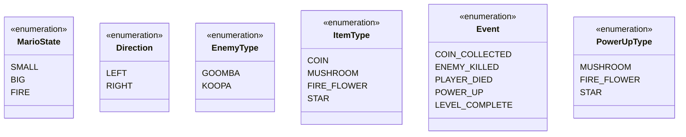

/**
 * @file class_diagram.md
 * @author TV1
 * @brief Draft class diagram for Super Mario project (Week 1)
 * @note This is a draft — will be refined as implementation progresses.
 *       Final version will be exported as class_diagram.png in Week 6.
 */

# Class Diagram — Super Mario (Draft)

> **Status:** Week 1 Draft
> **Last updated:** 2026-07-01
> **Author:** TV1 (Dương)

---

## Full Class Diagram

```mermaid
classDiagram
    direction TB

    %% ============================================================
    %% CORE MODULE (TV1 + TV2)
    %% ============================================================

    class Game {
        -sf::RenderWindow m_window
        -sf::Clock m_clock
        -float m_deltaTime
        +Game()
        +run() void
        -processEvents() void
        -update(float dt) void
        -render() void
    }

    class GameManager {
        -static GameManager* s_instance
        -IGameState* m_currentState
        -GameManager()
        +static getInstance() GameManager&
        +changeState(IGameState* state) void
        +update(float dt) void
        +render(sf::RenderWindow& window) void
    }

    class SoundManager {
        -static SoundManager* s_instance
        -map~string, sf::SoundBuffer~ m_buffers
        -SoundManager()
        +static getInstance() SoundManager&
        +playSound(string name) void
        +playMusic(string name) void
        +setVolume(float vol) void
    }

    %% ============================================================
    %% STATE PATTERN (TV1 + TV2)
    %% ============================================================

    class IGameState {
        <<interface>>
        +init()* void
        +update(float dt)* void
        +render(sf::RenderWindow& window)* void
        +exit()* void
    }

    class MenuState {
        +init() void
        +update(float dt) void
        +render(sf::RenderWindow& window) void
        +exit() void
    }

    class PlayState {
        -Level* m_currentLevel
        +init() void
        +update(float dt) void
        +render(sf::RenderWindow& window) void
        +exit() void
    }

    class PauseState {
        +init() void
        +update(float dt) void
        +render(sf::RenderWindow& window) void
        +exit() void
    }

    class GameOverState {
        +init() void
        +update(float dt) void
        +render(sf::RenderWindow& window) void
        +exit() void
    }

    class WinState {
        +init() void
        +update(float dt) void
        +render(sf::RenderWindow& window) void
        +exit() void
    }

    IGameState <|.. MenuState
    IGameState <|.. PlayState
    IGameState <|.. PauseState
    IGameState <|.. GameOverState
    IGameState <|.. WinState
    GameManager --> IGameState : manages

    %% ============================================================
    %% ENTITY HIERARCHY (TV1 base, TV3 Mario, TV4 Enemy)
    %% ============================================================

    class Entity {
        <<abstract>>
        #sf::Vector2f m_position
        #sf::Vector2f m_velocity
        #sf::Sprite m_sprite
        #bool m_isActive
        +Entity(sf::Vector2f pos)
        +update(float dt)* void
        +render(sf::RenderWindow& window)* void
        +getPosition() sf::Vector2f
        +setPosition(sf::Vector2f pos) void
        +getBounds() sf::FloatRect
        +isActive() bool
    }

    class Character {
        <<abstract>>
        #int m_health
        #Direction m_direction
        #bool m_isOnGround
        +takeDamage() void
        +isAlive() bool
        +getDirection() Direction
    }

    class Mario {
        -MarioState m_state
        -int m_lives
        -int m_score
        +handleInput(InputHandler& input) void
        +jump() void
        +applyPowerUp(PowerUpType type) void
        +loseLife() void
        +getLives() int
        +getScore() int
        +getState() MarioState
    }

    class Enemy {
        <<abstract>>
        +patrol()* void
        +onStomp()* void
    }

    class Goomba {
        +patrol() void
        +onStomp() void
    }

    class Koopa {
        -bool m_isShell
        +patrol() void
        +onStomp() void
        +kickShell() void
    }

    class FireBall {
        -float m_speed
        +update(float dt) void
        +render(sf::RenderWindow& window) void
    }

    Entity <|-- Character
    Entity <|-- FireBall
    Character <|-- Mario
    Character <|-- Enemy
    Enemy <|-- Goomba
    Enemy <|-- Koopa

    %% ============================================================
    %% ITEM HIERARCHY (TV5)
    %% ============================================================

    class Item {
        <<abstract>>
        +activate(Mario& mario)* void
        +collect()* void
    }

    class Coin {
        +activate(Mario& mario) void
        +collect() void
    }

    class Mushroom {
        +activate(Mario& mario) void
        +collect() void
    }

    class FireFlower {
        +activate(Mario& mario) void
        +collect() void
    }

    class Star {
        -float m_duration
        +activate(Mario& mario) void
        +collect() void
    }

    Entity <|-- Item
    Item <|-- Coin
    Item <|-- Mushroom
    Item <|-- FireFlower
    Item <|-- Star

    %% ============================================================
    %% LEVEL MODULE (TV4 + TV2)
    %% ============================================================

    class Level {
        -TileMap m_tileMap
        -vector~Entity*~ m_entities
        +loadFromFile(string path) bool
        +update(float dt) void
        +render(sf::RenderWindow& window) void
        +getEntities() vector~Entity*~
    }

    class TileMap {
        -vector~vector~int~~ m_grid
        -sf::Texture m_tileset
        +loadFromFile(string path) bool
        +render(sf::RenderWindow& window) void
        +getTileAt(int x, int y) int
        +isSolid(int x, int y) bool
    }

    class Camera {
        -sf::View m_view
        -sf::FloatRect m_levelBounds
        +follow(sf::Vector2f target) void
        +applyTo(sf::RenderWindow& window) void
        +setBounds(sf::FloatRect bounds) void
    }

    Level *-- TileMap : contains
    Level o-- Entity : holds

    %% ============================================================
    %% RENDER MODULE (TV2)
    %% ============================================================

    class TextureManager {
        -static TextureManager* s_instance
        -map~string, sf::Texture~ m_textures
        +static getInstance() TextureManager&
        +load(string id, string path) bool
        +get(string id) sf::Texture&
    }

    class AnimationSystem {
        -vector~sf::IntRect~ m_frames
        -float m_frameTime
        -int m_currentFrame
        +addClip(string name, vector~sf::IntRect~ frames) void
        +play(string name) void
        +update(float dt) void
        +getCurrentFrame() sf::IntRect
    }

    %% ============================================================
    %% PHYSICS MODULE (TV3)
    %% ============================================================

    class PhysicsEngine {
        -float m_gravity
        +applyGravity(Entity& entity, float dt) void
        +applyVelocity(Entity& entity, float dt) void
    }

    class CollisionManager {
        +checkCollision(Entity* a, Entity* b) bool
        +resolveCollision(Entity* a, Entity* b, Direction dir) void
        +checkTileCollision(Entity* entity, TileMap& map) bool
    }

    %% ============================================================
    %% DESIGN PATTERNS (TV1 + TV5)
    %% ============================================================

    class EntityFactory {
        +createEnemy(EnemyType type, sf::Vector2f pos) Enemy*
        +createItem(ItemType type, sf::Vector2f pos) Item*
    }

    class IObserver {
        <<interface>>
        +onNotify(Event event, void* data)* void
    }

    class ISubject {
        <<interface>>
        +subscribe(Event event, IObserver* obs)* void
        +unsubscribe(Event event, IObserver* obs)* void
        +publish(Event event, void* data)* void
    }

    class EventBus {
        -static EventBus* s_instance
        -map~Event, vector~IObserver*~~ m_listeners
        +static getInstance() EventBus&
        +subscribe(Event event, IObserver* obs) void
        +unsubscribe(Event event, IObserver* obs) void
        +publish(Event event, void* data) void
    }

    class ICommand {
        <<interface>>
        +execute(Mario& mario)* void
    }

    class InputHandler {
        -map~sf::Keyboard::Key, ICommand*~ m_bindings
        +bindKey(sf::Keyboard::Key key, ICommand* cmd) void
        +getAction(sf::Keyboard::Key key) ICommand*
    }

    ISubject <|.. EventBus
    EntityFactory ..> Enemy : creates
    EntityFactory ..> Item : creates

    %% ============================================================
    %% UI MODULE (TV5)
    %% ============================================================

    class HUD {
        -int m_score
        -int m_lives
        -float m_time
        +update(int score, int lives, float time) void
        +render(sf::RenderWindow& window) void
    }

    class SaveManager {
        +saveHighScore(int score) void
        +loadHighScore() int
    }

    %% ============================================================
    %% KEY RELATIONSHIPS
    %% ============================================================

    Game --> GameManager : uses
    PlayState --> Level : uses
    PlayState --> Mario : uses
    PlayState --> PhysicsEngine : uses
    PlayState --> CollisionManager : uses
    PlayState --> Camera : uses
    Mario --> InputHandler : reads input
    Mario ..> EventBus : publishes events
    HUD ..> EventBus : subscribes
    SoundManager ..> EventBus : subscribes
```

---

## Enums

---

## Design Patterns Summary

| # | Pattern | Where | Purpose |
|---|---|---|---|
| 1 | **Singleton** | `GameManager`, `SoundManager`, `TextureManager`, `EventBus` | Ensure single instance for global managers |
| 2 | **Factory** | `EntityFactory` | Create enemies and items dynamically from level data |
| 3 | **Observer** | `EventBus`, `IObserver`, `ISubject` | Decouple game events (coin collected, enemy killed, etc.) |
| 4 | **State** | `IGameState`, `MenuState`, `PlayState`, etc. | Manage game states (menu, playing, pause, gameover) |
| 5 | **Command** | `ICommand`, `InputHandler` | Map keyboard input to actions, decoupled from Mario |

---

## Module Ownership

| Module | Owner | Classes |
|---|---|---|
| Core | TV1 (Dương) | `GameManager`, `EventBus`, `EntityFactory`, `IGameState`, `Entity`, `Character` |
| Engine | TV2 (Nhật) | `Game`, `TextureManager`, `AnimationSystem`, `Camera`, `MenuState`, `PauseState`, `GameOverState`, `WinState` |
| Mario & Physics | TV3 (Bảo) | `Mario`, `FireBall`, `PhysicsEngine`, `CollisionManager` |
| Level & Enemy | TV4 (Vy) | `Level`, `TileMap`, `Enemy`, `Goomba`, `Koopa`, `SaveManager` |
| UI, Sound & Items | TV5 (Truyền) | `SoundManager`, `HUD`, `InputHandler`, `ICommand`, `Coin`, `Mushroom`, `FireFlower`, `Star` |
