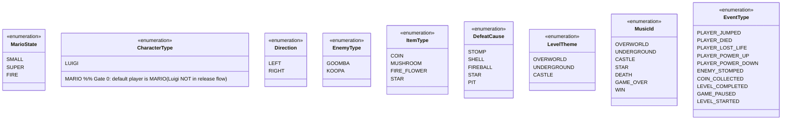

/**
 * @file class_diagram.md
 * @author TV1
 * @brief Current implementation class diagram for the Super Mario project
 * @note Reflects Sprint 6 implementation (ownership, state stack, Simple Factory, EventBus, Box2D).
 */

# Class Diagram — Super Mario

> **Status:** Sprint 6 (updated)
> **Last updated:** 2026-08-08
> **Author:** TV1 (Dương)
> **Note:** Reflects current implementation (ownership, state lifecycle, Simple Factory, EventBus, Box2D).

---

## Full Class Diagram

```mermaid
classDiagram
    direction TB

    %% ============================================================
    %% CORE MODULE (TV1 + TV2)
    %% ============================================================

    class Game {
        -sf::RenderWindow m_window
        -sf::Clock m_clock
        -float m_deltaTime
        +Game()
        +run() void
        -processEvents() void
        -update(float dt) void
        -render() void
    }

    class GameManager {
        -vector~unique_ptr~IGameState~~ m_stateStack
        -vector~PendingOp~ m_pendingOps
        -SaveManager m_saveManager       %% S6-TV1-19: composition root save
        +static getInstance() GameManager&
        +changeState(unique_ptr~IGameState~) void
        +pushState(unique_ptr~IGameState~) void
        +popState() void
        +processEvents(sf::Event) void
        +processInput(InputState) void
        +update(float dt) void
        +render(sf::RenderTarget& target) void
        +getSaveManager() SaveManager&    %% S6-TV1-19: single shared instance
        +stackDepth() int
        -applyOp(PendingOp&) void
        -processPendingOps() void
    }

    class SoundManager {
        <<Observer>>
        -static SoundManager* s_instance
        -unordered_map~string, sf::SoundBuffer~ m_buffers
        -SoundManager()
        +static getInstance() SoundManager&
        +onNotify(EventType) void
        +loadSound(string id, string filepath) bool
        +playSound(string id) void
        +playMusic(MusicId) void
        +pauseMusic() void
        +resumeMusic() void
        +stopMusic() void
        +setMusicVolume(float) void
        +setSfxVolume(float) void
    }

    class SaveManager {
        -string m_savePath
        -SaveData m_data
        +load() bool
        +save() const bool
        +updateHighScore(int score) bool
        +updateHighestUnlockedLevel(int level) bool
        +updateAudioSettings(float soundVolume, float musicVolume) bool
        +resetToDefaults() void
        +getData() const SaveData&
        +getSavePath() const string&
    }

    %% ============================================================
    %% STATE PATTERN (TV1 + TV2)
    %% ============================================================

    class IGameState {
        <<interface>>
        +onEnter()* void
        +onExit()* void
        +onPause() void
        +onResume() void
        +processEvents(sf::Event)* void
        +processInput(InputState)* void
        +update(float dt)* void
        +render(sf::RenderTarget& target)* void
        +isOverlay() const bool
    }

    class MenuState {
        +onEnter() void
        +onExit() void
        +processEvents(sf::Event) void
        +processInput(InputState) void
        +update(float dt) void
        +render(sf::RenderTarget& target) void
    }

    class PlayState {
        -unique_ptr~Level~ m_level
        -unique_ptr~HUD~ m_hud
        -GameProgress m_progress
        +onEnter() void
        +onExit() void
        +onPause() void
        +onResume() void
        +processEvents(sf::Event) void
        +processInput(InputState) void
        +update(float dt) void
        +render(sf::RenderTarget& target) void
        +onNotify(EventType) void
        -rebindCommands() void
        -loadLevel(int) bool
        -navigateToLevel(int) bool
        -snapshotProgress() void
        -restoreProgress() void
        -updateTransition(float dt) void
    }

    class PauseState {
        +onEnter() void
        +onExit() void
        +processEvents(sf::Event) void
        +processInput(InputState) void
        +update(float dt) void
        +render(sf::RenderTarget& target) void
    }

    class GameOverState {
        +onEnter() void
        +onExit() void
        +processEvents(sf::Event) void
        +processInput(InputState) void
        +update(float dt) void
        +render(sf::RenderTarget& target) void
    }

    class WinState {
        +onEnter() void
        +onExit() void
        +processEvents(sf::Event) void
        +processInput(InputState) void
        +update(float dt) void
        +render(sf::RenderTarget& target) void
    }

    IGameState <|.. MenuState
    IGameState <|.. PlayState
    IGameState <|.. PauseState
    IGameState <|.. GameOverState
    IGameState <|.. WinState
    GameManager --> IGameState : manages

    %% ============================================================
    %% ENTITY HIERARCHY (TV1 base, TV3 Mario, TV4 Enemy)
    %% ============================================================

    class Entity {
        <<abstract>>
        #sf::Vector2f m_position
        #sf::Vector2f m_velocity
        #sf::Sprite m_sprite
        #bool m_isActive
        +Entity(sf::Vector2f pos)
        +update(float dt)* void
        +render(sf::RenderTarget& target)* void
        +getPosition() sf::Vector2f
        +setPosition(sf::Vector2f pos) void
        +getBounds() sf::FloatRect
        +isActive() bool
        +isMario() bool
        +isEnemy() bool
        +isItem() bool
    }

    class Character {
        <<abstract>>
        #int m_health
        #Direction m_direction
        #bool m_isOnGround
        +takeDamage(int) void
        +isAlive() bool
        +getDirection() Direction
    }

    class Mario {
        -MarioState m_marioState
        -CharacterType m_characterType
        -int m_lives
        -int m_score
        -int m_coinCount
        +jump() void
        +moveLeft() void
        +moveRight() void
        +stopMoving() void
        +setMoveIntent(float) void
        +releaseJump() void
        +powerUp(MarioState) void
        +powerDown() void
        +loseLife() void
        +addLife(int) void
        +addScore(int) void
        +collectCoin(int) void
        +setScore(int) void
        +setCoinCount(int) void
        +setLives(int) void
        +setMarioState(MarioState) void
        +canShootFireBall() bool
        +shootFireBall(b2World*) unique_ptr~FireBall~
        +getLives() int
        +getScore() int
        +getCoinCount() int
        +getMarioState() MarioState
        +getCharacterType() CharacterType
        +setCharacterType(CharacterType) void
    }

    class Enemy {
        <<abstract>>
        +patrol()* void
        +onStomp()* void
    }

    class Goomba {
        +patrol() void
        +onStomp() void
    }

    class Koopa {
        -KoopaState m_state
        -bool m_isFlippedDead
        -float m_patrolSpeed
        +patrol() void
        +onStomp() void
        +onFireHit() void
        +onWallCollision() void
        +kick(Direction) void
        +isInShell() bool
        +isShellSliding() bool
        +getState() KoopaState
    }

    class FireBall {
        -float m_speed
        +update(float dt) void
        +render(sf::RenderTarget& target) void
    }

    Entity <|-- Character
    Entity <|-- FireBall
    Character <|-- Mario
    Character <|-- Enemy
    Enemy <|-- Goomba
    Enemy <|-- Koopa

    %% ============================================================
    %% ITEM HIERARCHY (TV5)
    %% ============================================================

    class Item {
        <<abstract>>
        +onCollect(Mario& mario)* void
        +checkOverlap(Entity&) bool
        +setCollectibleDelay(float) void
        +isCollected() bool
    }

    class Coin {
        +onCollect(Mario& mario) void
    }

    class Mushroom {
        +onCollect(Mario& mario) void
    }

    class FireFlower {
        +onCollect(Mario& mario) void
    }

    class Star {
        +onCollect(Mario& mario) void
    }

    Entity <|-- Item
    Item <|-- Coin
    Item <|-- Mushroom
    Item <|-- FireFlower
    Item <|-- Star

    %% ============================================================
    %% LEVEL MODULE (TV4 + TV2)
    %% ============================================================

    class Level {
        -unique_ptr~b2World~ m_world
        -unique_ptr~ContactListener~ m_contactListener
        -TileMap m_tileMap
        -Camera m_camera
        -unique_ptr~Mario~ m_mario
        -vector~unique_ptr~Entity~~ m_entities
        -TextureManager& m_textureManager
        +loadFromFile(string path) bool
        +update(float dt) void
        +render(sf::RenderTarget& target) void
        +shootFireBall() void
        +getMario() Mario*
        +getCamera() Camera&
        +getEntities() vector~unique_ptr~Entity~~&
    }

    class TileMap {
        -vector~string~ m_grid
        -sf::Texture m_tileset
        +loadFromFile(string path) bool
        +render(sf::RenderTarget& target) const
        +getTileAt(int col, int row) char
        +isSolid(int col, int row) bool
        +getWidth() size_t
        +getHeight() size_t
        +findTiles(char) vector~Vector2i~
        +createPhysicsBodies(b2World*) void
        +queueTileHit(int col, int row, float) void
        +hitTile(int, int, b2World*, TextureManager&, int) void
    }

    class Camera {
        -sf::View m_view
        -sf::FloatRect m_bounds
        +init(Vector2f viewSize, FloatRect levelBounds) void
        +shake(float duration, float magnitude) void
        +update(float dt, Vector2f targetPosition) void
        +getView() sf::View
    }

    Level *-- TileMap : contains
    Level o-- Entity : holds

    %% ============================================================
    %% RENDER MODULE (TV2)
    %% ============================================================

    class TextureManager {
        -static TextureManager* s_instance
        -map~string, sf::Texture~ m_textures
        +static getInstance() TextureManager&
        +loadTexture(string id, string filename) bool
        +getTexture(string id) sf::Texture&
    }

    class AnimationSystem {
        -unordered_map~string, Animation~ m_animations
        -string m_currentAnimation
        -float m_currentTime
        -bool m_isPlaying
        +addAnimation(string name, Animation anim) void
        +playAnimation(string name) void
        +update(float dt, sf::Sprite& sprite) void
        +static createGridAnimation(int startX, int startY, int frameW, int frameH, int frames) Animation
        +getCurrentFrame() sf::IntRect
    }

    %% ============================================================
    %% PHYSICS MODULE (TV3)
    %% ============================================================

    class PhysicsEngine {
        <<static utility>>
        +static update(b2World& world, float dt) bool
        +static const PPM float = 30.0
        +static pixelsToMeters(float) float
        +static metersToPixels(float) float
    }

    class CollisionManager {
        <<static utility>>
        +static resolve(b2Contact* contact, TileMap& tileMap) void
        +static preSolve(b2Contact* contact) void
    }

    %% ============================================================
    %% DESIGN PATTERNS (TV1 + TV5)
    %% ============================================================

    class EntityFactory {
        <<Simple Factory>>
        +createEnemy(EnemyType type, sf::Vector2f pos, b2World*) unique_ptr~Entity~
        +createItem(ItemType type, sf::Vector2f pos, b2World*) unique_ptr~Entity~
        +createFromTileCode(char code, sf::Vector2f pos, b2World*) unique_ptr~Entity~
    }

    class IObserver {
        <<interface>>
        +onNotify(EventType event)* void
    }

    class ISubject {
        <<interface>>
        +subscribe(EventType event, IObserver* obs)* void
        +unsubscribe(EventType event, IObserver* obs)* void
        +notify(EventType event)* void
    }

    class EventBus {
        -static EventBus* s_instance
        -unordered_map~EventType, vector~IObserver*~~ m_listeners
        +static getInstance() EventBus&
        +subscribe(EventType event, IObserver* obs) void
        +unsubscribe(EventType event, IObserver* obs) void
        +notify(EventType event) void
    }

    class ICommand {
        <<interface>>
        +execute()* void
    }

    class InputHandler {
        -map~sf::Keyboard::Key, unique_ptr~ICommand~~ m_bindings
        +bindKey(sf::Keyboard::Key key, unique_ptr~ICommand~ cmd, InputTrigger, InputGroup) void
        +clear() void
        +handleInput(InputState) void
    }

    ISubject <|.. EventBus
    EntityFactory ..> Enemy : creates
    EntityFactory ..> Item : creates

    %% ============================================================
    %% UI MODULE (TV5)
    %% ============================================================

    class HUD {
        <<Observer>>
        -const Mario& m_mario
        -int m_worldNumber
        -int m_levelNumber
        -int m_timeRemaining
        +onNotify(EventType) void
        +update() void
        +update(float dt, bool gameplayActive) void
        +draw(sf::RenderTarget& target) const
        +setWorldLevel(int world, int level) void
        +setTimeWarningCallback(function) void
        +setTimeoutCallback(function) void
        +getTimeRemaining() int
        +isTimeWarningActive() bool
    }

    class GameProgress {
        +int currentLevel
        +int score
        +int coins
        +int lives
        +MarioState power
    }

    %% ============================================================
    %% KEY RELATIONSHIPS
    %% ============================================================

    Game --> GameManager : uses
    PlayState --> Level : uses
    PlayState --> Mario : uses
    PlayState --> PhysicsEngine : uses
    PlayState --> CollisionManager : uses
    PlayState --> Camera : uses
    Mario --> InputHandler : reads input
    Mario ..> EventBus : publishes events
    HUD ..> EventBus : subscribes
    SoundManager ..> EventBus : subscribes
```

---

## Enums

```mermaid
classDiagram
    class MarioState {
        <<enumeration>>
        SMALL
        SUPER
        FIRE
    }

    class CharacterType {
        <<enumeration>>
        MARIO   %% Gate 0: default player is MARIO (Luigi NOT in release flow)
        LUIGI
    }

    class Direction {
        <<enumeration>>
        LEFT
        RIGHT
    }

    class EnemyType {
        <<enumeration>>
        GOOMBA
        KOOPA
    }

    class ItemType {
        <<enumeration>>
        COIN
        MUSHROOM
        FIRE_FLOWER
        STAR
    }

    class DefeatCause {
        <<enumeration>>
        STOMP
        SHELL
        FIREBALL
        STAR
        PIT
    }

    class LevelTheme {
        <<enumeration>>
        OVERWORLD
        UNDERGROUND
        CASTLE
    }

    class MusicId {
        <<enumeration>>
        OVERWORLD
        UNDERGROUND
        CASTLE
        STAR
        DEATH
        GAME_OVER
        WIN
    }

    class EventType {
        <<enumeration>>
        PLAYER_JUMPED
        PLAYER_DIED
        PLAYER_LOST_LIFE
        PLAYER_POWER_UP
        PLAYER_POWER_DOWN
        ENEMY_STOMPED
        COIN_COLLECTED
        LEVEL_COMPLETED
        GAME_PAUSED
        LEVEL_STARTED
    }
```

---

## Design Patterns Summary

| # | Pattern | Where | Purpose |
|---|---|---|---|
| 1 | **Singleton** | `GameManager`, `SoundManager`, `TextureManager`, `EventBus` | Ensure single instance for global managers |
| 2 | **Simple Factory** | `EntityFactory` | Create enemies and items dynamically from level data (returns `unique_ptr`) |
| 3 | **Observer** | `EventBus`, `IObserver`, `ISubject` | Decouple game events (coin collected, enemy killed, etc.) |
| 4 | **State** | `IGameState`, `MenuState`, `PlayState`, etc. | Manage game states (menu, playing, pause, gameover) |
| 5 | **Command** | `ICommand`, `InputHandler` | Map keyboard input to actions, decoupled from Mario |

---

## Module Ownership

| Module | Owner | Classes |
|---|---|---|
| Core | TV1 (Dương) | `GameManager`, `EventBus`, `EntityFactory`, `IGameState`, `Entity`, `Character` |
| Engine | TV2 (Nhật) | `Game`, `TextureManager`, `AnimationSystem`, `Camera`, `MenuState`, `PauseState`, `GameOverState`, `WinState` |
| Mario & Physics | TV3 (Bảo) | `Mario`, `FireBall`, `PhysicsEngine`, `CollisionManager` |
| Level & Enemy | TV4 (Vy) | `Level`, `TileMap`, `Enemy`, `Goomba`, `Koopa`, `SaveManager` |
| UI, Sound & Items | TV5 (Truyền) | `SoundManager`, `HUD`, `InputHandler`, `ICommand`, `Coin`, `Mushroom`, `FireFlower`, `Star` |
