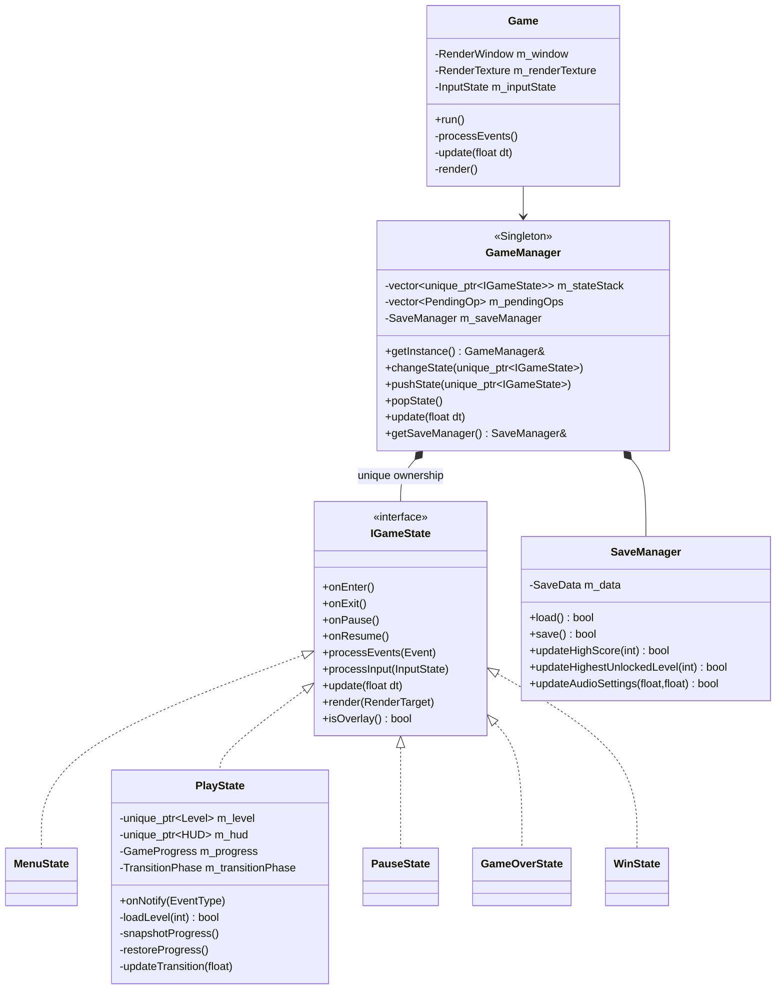
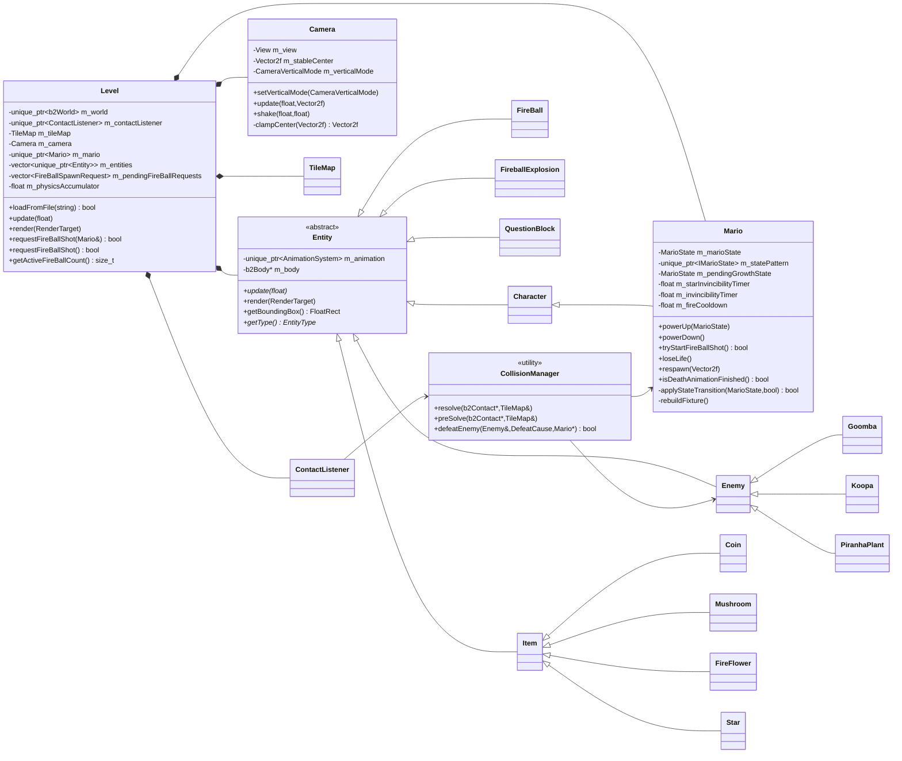
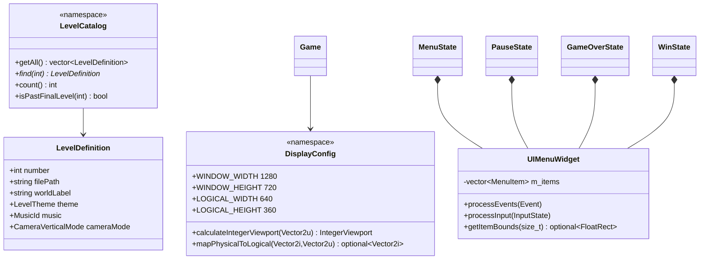
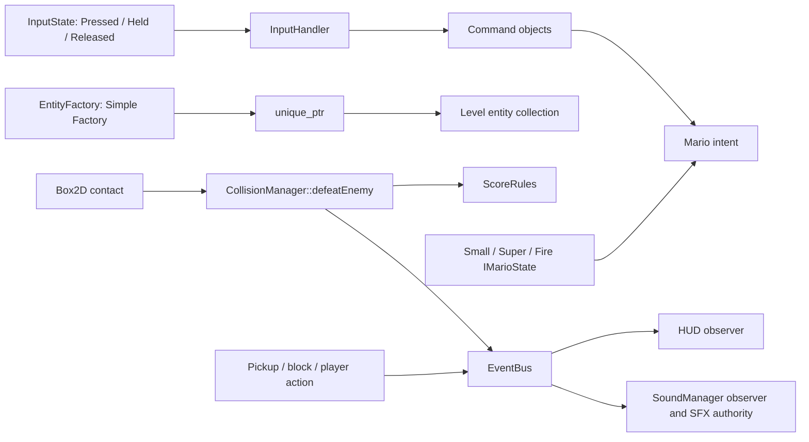

# Sprint 6 Class Diagram (Sprint 7 contract addendum)

> Updated: 2026-08-16
> Source of truth: current headers in `include/`
> Scope: release ownership, state lifecycle, gameplay transactions, and the five documented patterns
>
> The diagram remains a Sprint 6 baseline; the catalog paragraph below is the
> dated current Sprint 7 contract addendum.

## Application and state ownership

```mermaid
classDiagram
    direction TB

    class Game {
        -RenderWindow m_window
        -RenderTexture m_renderTexture
        -InputState m_inputState
        +run()
        -processEvents()
        -update(float dt)
        -render()
    }

    class GameManager {
        <<Singleton>>
        -vector~unique_ptr~IGameState~~ m_stateStack
        -vector~PendingOp~ m_pendingOps
        -SaveManager m_saveManager
        +getInstance() GameManager&
        +changeState(unique_ptr~IGameState~)
        +pushState(unique_ptr~IGameState~)
        +popState()
        +update(float dt)
        +getSaveManager() SaveManager&
    }

    class IGameState {
        <<interface>>
        +onEnter()
        +onExit()
        +onPause()
        +onResume()
        +processEvents(Event)
        +processInput(InputState)
        +update(float dt)
        +render(RenderTarget)
        +isOverlay() bool
    }

    class MenuState
    class PlayState {
        -unique_ptr~Level~ m_level
        -unique_ptr~HUD~ m_hud
        -GameProgress m_progress
        -TransitionPhase m_transitionPhase
        +onNotify(EventType)
        -loadLevel(int) bool
        -snapshotProgress()
        -restoreProgress()
        -updateTransition(float)
    }
    class PauseState
    class GameOverState
    class WinState
    class SaveManager {
        -SaveData m_data
        +load() bool
        +save() bool
        +updateHighScore(int) bool
        +updateHighestUnlockedLevel(int) bool
        +updateAudioSettings(float,float) bool
    }

    Game --> GameManager
    GameManager *-- IGameState : unique ownership
    GameManager *-- SaveManager
    IGameState <|.. MenuState
    IGameState <|.. PlayState
    IGameState <|.. PauseState
    IGameState <|.. GameOverState
    IGameState <|.. WinState
```

State operations are queued and applied at the safe point at the end of `GameManager::update()`. `PauseState` is an overlay; push calls `onPause()` on Play and pop calls `onResume()`.

## Level, physics, and entities

```mermaid
classDiagram
    direction LR

    class Level {
        -unique_ptr~b2World~ m_world
        -unique_ptr~ContactListener~ m_contactListener
        -TileMap m_tileMap
        -Camera m_camera
        -unique_ptr~Mario~ m_mario
        -vector~unique_ptr~Entity~~ m_entities
        -vector~FireBallSpawnRequest~ m_pendingFireBallRequests
        -float m_physicsAccumulator
        +loadFromFile(string) bool
        +update(float)
        +render(RenderTarget)
        +requestFireBallShot(Mario&) bool
        +requestFireBallShot() bool
        +getActiveFireBallCount() size_t
    }

    class Entity {
        <<abstract>>
        -unique_ptr~AnimationSystem~ m_animation
        -b2Body* m_body
        +update(float)*
        +render(RenderTarget)
        +getBoundingBox() FloatRect
        +getType() EntityType*
    }

    class Character
    class Mario {
        -MarioState m_marioState
        -unique_ptr~IMarioState~ m_statePattern
        -MarioState m_pendingGrowthState
        -float m_starInvincibilityTimer
        -float m_invincibilityTimer
        -float m_fireCooldown
        +powerUp(MarioState)
        +powerDown()
        +tryStartFireBallShot() bool
        +loseLife()
        +respawn(Vector2f)
        +isDeathAnimationFinished() bool
        -applyStateTransition(MarioState,bool) bool
        -rebuildFixture()
    }
    class Enemy
    class Goomba
    class Koopa
    class PiranhaPlant
    class FireBall
    class FireballExplosion
    class QuestionBlock
    class Item
    class Coin
    class Mushroom
    class FireFlower
    class Star

    class Camera {
        -View m_view
        -Vector2f m_stableCenter
        -CameraVerticalMode m_verticalMode
        +setVerticalMode(CameraVerticalMode)
        +update(float,Vector2f)
        +shake(float,float)
        -clampCenter(Vector2f) Vector2f
    }

    class CollisionManager {
        <<utility>>
        +resolve(b2Contact*,TileMap&)
        +preSolve(b2Contact*,TileMap&)
        +defeatEnemy(Enemy&,DefeatCause,Mario*) bool
    }

    Level *-- TileMap
    Level *-- Camera
    Level *-- Mario
    Level *-- Entity
    Level *-- ContactListener
    Entity <|-- Character
    Character <|-- Mario
    Entity <|-- Enemy
    Enemy <|-- Goomba
    Enemy <|-- Koopa
    Enemy <|-- PiranhaPlant
    Entity <|-- FireBall
    Entity <|-- FireballExplosion
    Entity <|-- QuestionBlock
    Entity <|-- Item
    Item <|-- Coin
    Item <|-- Mushroom
    Item <|-- FireFlower
    Item <|-- Star
    ContactListener --> CollisionManager
    CollisionManager --> Mario
    CollisionManager --> Enemy
```

`Level::requestFireBallShot()` is the single production request boundary. Accepted requests reserve Mario's cooldown immediately, including requests deferred while Box2D is locked. FireBalls live in `m_entities`; no parallel pool exists.

## Catalog and rendering contracts

```mermaid
classDiagram
    class LevelDefinition {
        +int number
        +string filePath
        +string worldLabel
        +LevelTheme theme
        +MusicId music
        +CameraVerticalMode cameraMode
    }
    class LevelCatalog {
        <<namespace>>
        +getAll() vector~LevelDefinition~
        +find(int) LevelDefinition*
        +count() int
        +isPastFinalLevel(int) bool
    }
    class DisplayConfig {
        <<namespace>>
        +WINDOW_WIDTH 1280
        +WINDOW_HEIGHT 720
        +LOGICAL_WIDTH 640
        +LOGICAL_HEIGHT 360
        +calculateIntegerViewport(Vector2u) IntegerViewport
        +mapPhysicalToLogical(Vector2i,Vector2u) optional~Vector2i~
    }
    class UIMenuWidget {
        -vector~MenuItem~ m_items
        +processEvents(Event)
        +processInput(InputState)
        +getItemBounds(size_t) optional~FloatRect~
    }
    LevelCatalog --> LevelDefinition
    Game --> DisplayConfig
    MenuState *-- UIMenuWidget
    PauseState *-- UIMenuWidget
    GameOverState *-- UIMenuWidget
    WinState *-- UIMenuWidget
```

The current Sprint 7 catalog metadata contains four entries: Level 1
Overworld (`1-1`), Level 2 Underground (`1-2`), Level 3 Underwater (`1-3`),
and Level 4 Castle (`1-4`), followed by the Win boundary. Physical input is
remapped to the logical 640x360 canvas using the same centered integer
viewport used for rendering; bar input is rejected.

Catalog metadata and syntactic map validation are separate contracts. The
current `levels/level3.txt` is Castle-style despite its Underwater catalog
metadata, so semantic Underwater acceptance/playthrough remains a blocked,
TV4-owned gate pending map/asset scope.

## Patterns and event flow

```mermaid
flowchart LR
    Input["InputState: Pressed / Held / Released"] --> Handler["InputHandler"]
    Handler --> Command["Command objects"]
    Command --> Mario["Mario intent"]

    Factory["EntityFactory: Simple Factory"] --> Owned["unique_ptr<Entity>"]
    Owned --> Level["Level entity collection"]

    Contact["Box2D contact"] --> Defeat["CollisionManager::defeatEnemy"]
    Defeat --> Score["ScoreRules"]
    Defeat --> Bus["EventBus"]
    Item["Pickup / block / player action"] --> Bus
    Bus --> HUD["HUD observer"]
    Bus --> Sound["SoundManager observer and SFX authority"]

    MarioState["Small / Super / Fire IMarioState"] --> Mario
```

The project documents and uses Singleton (`GameManager`, resource managers), Command, Observer/EventBus, State, and Simple Factory patterns. Raw pointers passed through collision and projectile requests are non-owning references; object ownership remains with `std::unique_ptr` containers.

Current `EventType` values are: player jump/death/power-up/power-down/star/expiry; enemy stomp and shell/FireBall/Star defeat; FireBall shot; shell kick; block bump/brick break/item emerge/1-Up/coin; level completed/started; game paused/resumed.
