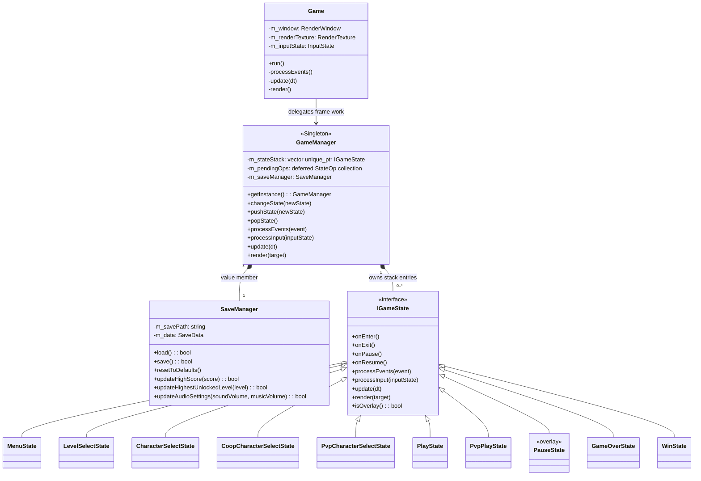
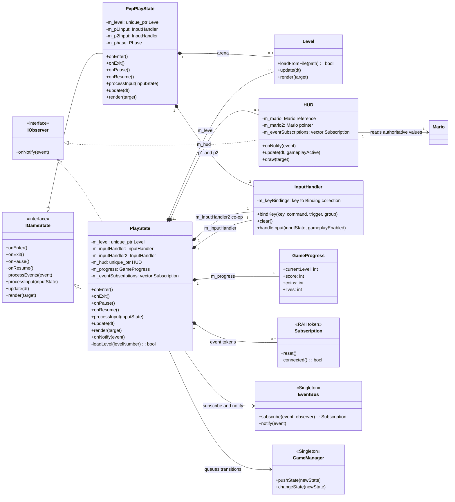
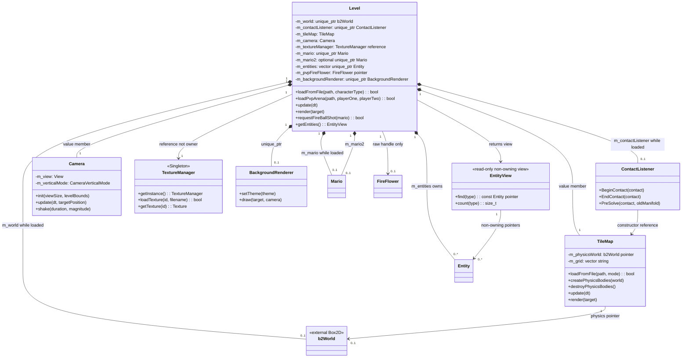
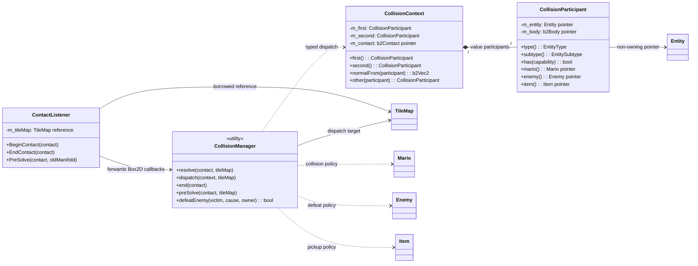
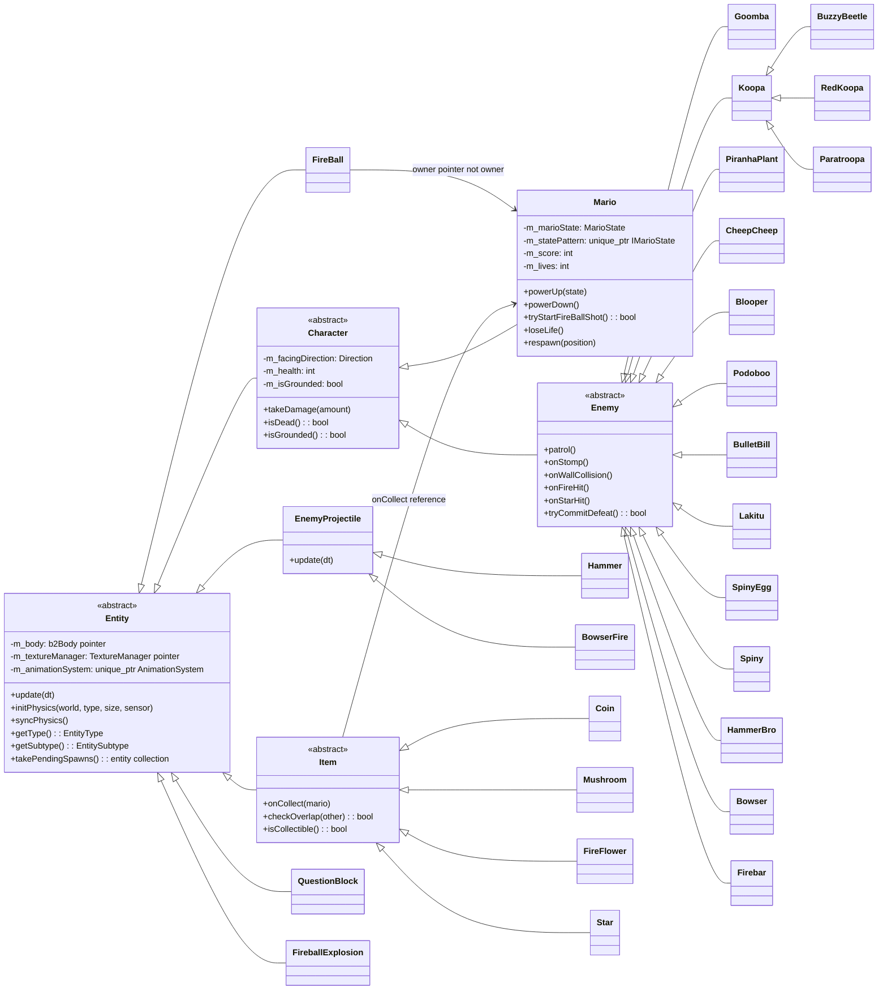
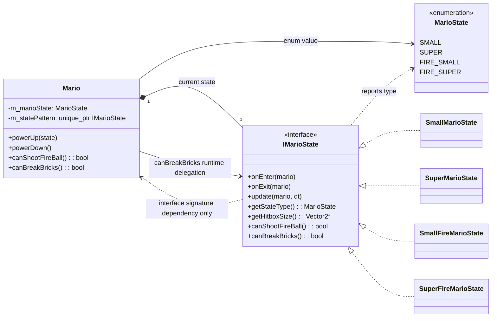
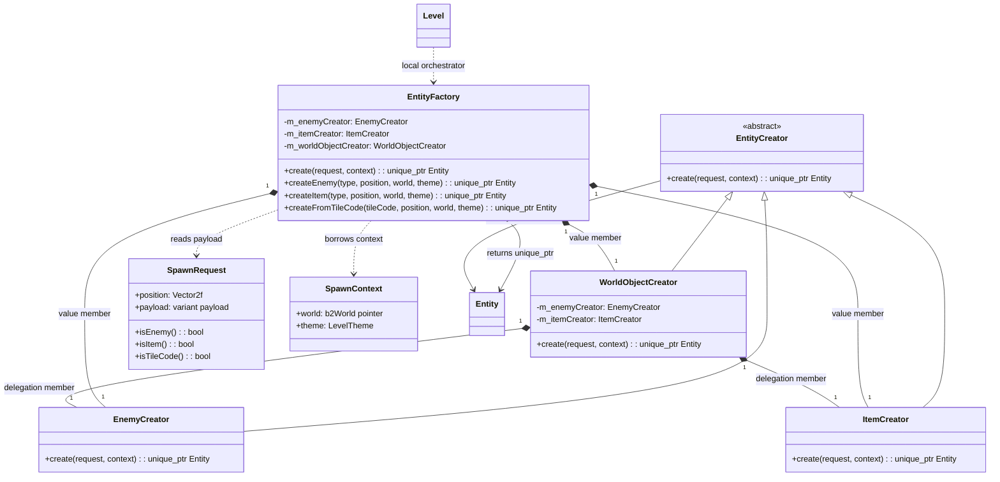
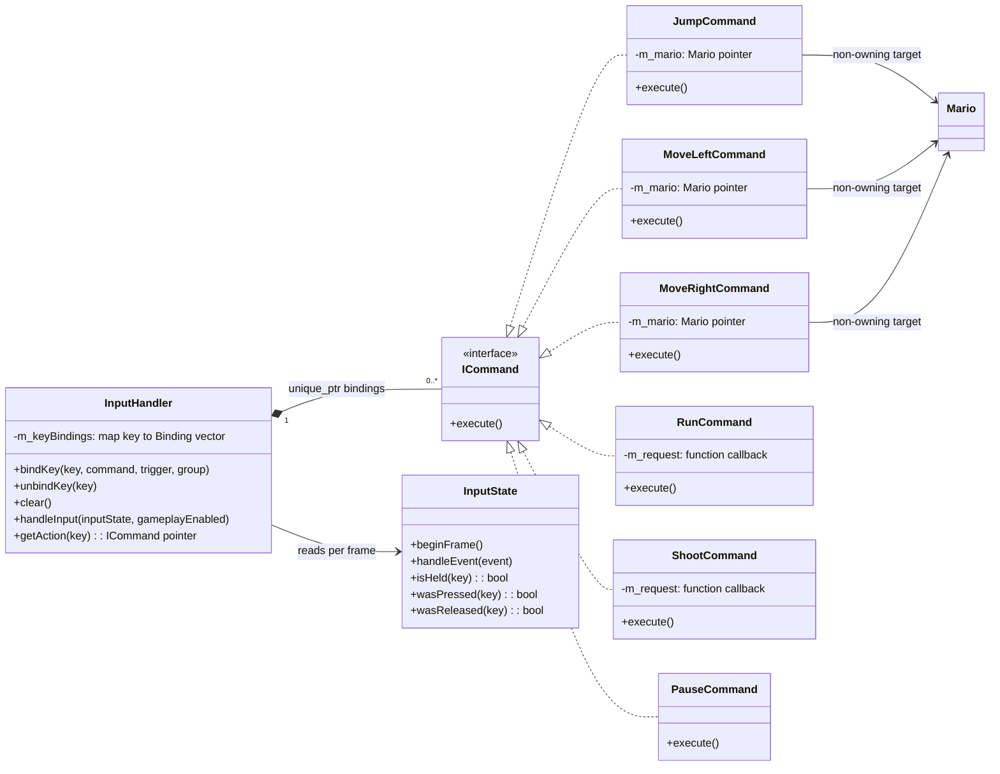

# Sơ đồ lớp hiện tại của game

Tài liệu này mô tả các lớp và đường biên runtime được suy ra từ mã nguồn hiện
tại trong `include/` và `src/`. Các sơ đồ được tách theo trách nhiệm để có thể
đọc từng lát cắt mà không nhầm quan hệ sở hữu với quan hệ sử dụng.

## Phạm vi và cách đọc

- `*--` là composition: đối tượng bên trái sở hữu vòng đời thành phần (thường
  là member theo giá trị hoặc `std::unique_ptr`).
- `o--` là aggregation/ghi nhận không sở hữu; `-->` và `..>` là tham chiếu,
  lời gọi hoặc kiểu trả về, không chuyển quyền sở hữu.
- Nhãn cardinality (`1`, `0..1`, `0..*`, `2`) phản ánh member/collection ở
  thời điểm runtime, không phải số lượng lớp C++ được tạo tĩnh.
- `<<interface>>`, `<<abstract>>`, `<<Singleton>>`, `<<utility>>` và
  `<<RAII token>>` là vai trò được khai báo hoặc thể hiện trực tiếp trong mã.
  `SaveManager` cố ý không mang nhãn Singleton.
- Tên lớp, enum và method giữ nguyên tiếng Anh như C++; phần giải thích bằng
  tiếng Việt. Các template dài được rút gọn trong ô lớp để Mermaid ổn định;
  kiểu sở hữu chính xác được ghi trong chú thích và bảng bằng chứng.

Bảng màu dùng nhất quán giữa các block: cam = core/owner, xanh dương = state
hoặc physics, xanh lá = gameplay/entity, tím = pattern/event và đỏ nhạt =
enemy. Màu chỉ giúp định hướng thị giác; semantics vẫn do mũi tên và chú thích
quyết định.

## Điều hướng

1. [Vòng lặp ứng dụng và state stack](#runtime)
2. [Biên sở hữu của các state gameplay](#state-boundary)
3. [Level, vật lý và collection entity](#world)
4. [Đường biên callback va chạm](#collision)
5. [Cây kế thừa entity](#entity-hierarchy)
6. [State power-up của Mario](#mario-state)
7. [Factory Method](#factory)
8. [EventBus và Observer](#observer)
9. [Command và input](#command)
10. [Bằng chứng nguồn](#evidence)

## 1. Vòng lặp ứng dụng và state stack

Đây là đường đi của một frame: `Game` nhận event và giữ `InputState`, sau đó
ủy quyền input, update và render cho `GameManager`. `GameManager` là Singleton
điều phối một stack các `unique_ptr<IGameState>`; `SaveManager` chỉ là member
theo giá trị của manager, không phải Singleton độc lập.

```mermaid
classDiagram
    direction TB

    class Game {
        -m_window: RenderWindow
        -m_renderTexture: RenderTexture
        -m_inputState: InputState
        +run()
        -processEvents()
        -update(dt)
        -render()
    }

    class GameManager {
        <<Singleton>>
        -m_stateStack: vector unique_ptr IGameState
        -m_pendingOps: deferred StateOp collection
        -m_saveManager: SaveManager
        +getInstance(): GameManager
        +changeState(newState)
        +pushState(newState)
        +popState()
        +processEvents(event)
        +processInput(inputState)
        +update(dt)
        +render(target)
    }

    class SaveManager {
        -m_savePath: string
        -m_data: SaveData
        +load(): bool
        +save(): bool
        +resetToDefaults()
        +updateHighScore(score): bool
        +updateHighestUnlockedLevel(level): bool
        +updateAudioSettings(soundVolume, musicVolume): bool
    }

    class IGameState {
        <<interface>>
        +onEnter()
        +onExit()
        +onPause()
        +onResume()
        +processEvents(event)
        +processInput(inputState)
        +update(dt)
        +render(target)
        +isOverlay(): bool
    }

    class MenuState
    class LevelSelectState
    class CharacterSelectState
    class CoopCharacterSelectState
    class PvpCharacterSelectState
    class PlayState
    class PvpPlayState
    class PauseState {
        <<overlay>>
    }
    class GameOverState
    class WinState

    Game --> GameManager : delegates frame work
    GameManager "1" *-- "0..*" IGameState : owns stack entries
    GameManager "1" *-- "1" SaveManager : value member

    IGameState <|-- MenuState
    IGameState <|-- LevelSelectState
    IGameState <|-- CharacterSelectState
    IGameState <|-- CoopCharacterSelectState
    IGameState <|-- PvpCharacterSelectState
    IGameState <|-- PlayState
    IGameState <|-- PvpPlayState
    IGameState <|-- PauseState
    IGameState <|-- GameOverState
    IGameState <|-- WinState

    classDef core fill:#fff7ed,stroke:#c2410c,color:#431407
    classDef state fill:#eff6ff,stroke:#2563eb,color:#172554
    classDef contract fill:#f8fafc,stroke:#475569,color:#0f172a
    cssClass "Game,GameManager,SaveManager" core
    cssClass "IGameState" contract
    cssClass "MenuState,LevelSelectState,CharacterSelectState,CoopCharacterSelectState,PvpCharacterSelectState,PlayState,PvpPlayState,PauseState,GameOverState,WinState" state
```

`GameManager::changeState`, `pushState` và `popState` chỉ xếp `PendingOp`; cuối
`GameManager::update()` mới gọi `processPendingOps()`. `CHANGE` gọi `onExit()`
cho stack cũ rồi `onEnter()` state mới; `PUSH` gọi `onPause()` state dưới và
`POP` gọi `onResume()` state mới ở đỉnh. Khi state trên cùng là overlay,
`render()` vẽ state dưới trước. Các hành vi này là lifecycle thực, không phải
chỉ quan hệ kế thừa trên hình.

## 2. Biên sở hữu của các state gameplay

`PlayState` là state campaign duy nhất sở hữu level hiện tại, HUD, hai
`InputHandler` theo giá trị (handler thứ hai dùng cho co-op), progress phiên và
các token đăng ký event. `PvpPlayState` có một `Level` arena và hai handler
đầu vào. Cả hai state không sở hữu `Mario` trực tiếp; `Level` mới là owner.

```mermaid
classDiagram
    direction LR

    class IGameState {
        <<interface>>
        +onEnter()
        +onExit()
        +onPause()
        +onResume()
        +processEvents(event)
        +processInput(inputState)
        +update(dt)
        +render(target)
    }

    class IObserver {
        <<interface>>
        +onNotify(event)
    }

    class PlayState {
        -m_level: unique_ptr Level
        -m_inputHandler: InputHandler
        -m_inputHandler2: InputHandler
        -m_hud: unique_ptr HUD
        -m_progress: GameProgress
        -m_eventSubscriptions: vector Subscription
        +onEnter()
        +onExit()
        +onPause()
        +onResume()
        +processInput(inputState)
        +update(dt)
        +render(target)
        +onNotify(event)
        -loadLevel(levelNumber): bool
    }

    class PvpPlayState {
        -m_level: unique_ptr Level
        -m_p1Input: InputHandler
        -m_p2Input: InputHandler
        -m_phase: Phase
        +onEnter()
        +onExit()
        +onPause()
        +onResume()
        +processInput(inputState)
        +update(dt)
        +render(target)
    }

    class Level {
        +loadFromFile(path): bool
        +update(dt)
        +render(target)
    }

    class HUD {
        -m_mario: Mario reference
        -m_mario2: Mario pointer
        -m_eventSubscriptions: vector Subscription
        +onNotify(event)
        +update(dt, gameplayActive)
        +draw(target)
    }

    class InputHandler {
        -m_keyBindings: key to Binding collection
        +bindKey(key, command, trigger, group)
        +clear()
        +handleInput(inputState, gameplayEnabled)
    }

    class GameProgress {
        +currentLevel: int
        +score: int
        +coins: int
        +lives: int
    }

    class Subscription {
        <<RAII token>>
        +reset()
        +connected(): bool
    }

    class EventBus {
        <<Singleton>>
        +subscribe(event, observer): Subscription
        +notify(event)
    }

    class Mario
    class GameManager {
        <<Singleton>>
        +pushState(newState)
        +changeState(newState)
    }

    IGameState <|-- PlayState
    IGameState <|-- PvpPlayState
    IObserver <|.. PlayState
    IObserver <|.. HUD

    PlayState "1" *-- "0..1" Level : m_level
    PlayState "1" *-- "1" InputHandler : m_inputHandler
    PlayState "1" *-- "1" InputHandler : m_inputHandler2 co-op
    PlayState "1" *-- "0..1" HUD : m_hud
    PlayState "1" *-- "1" GameProgress : m_progress
    PlayState "1" *-- "0..*" Subscription : event tokens
    PlayState --> EventBus : subscribe and notify
    PlayState --> GameManager : queues transitions

    PvpPlayState "1" *-- "0..1" Level : arena
    PvpPlayState "1" *-- "2" InputHandler : p1 and p2
    HUD "1" --> "1" Mario : reads authoritative values

    classDef state fill:#eff6ff,stroke:#2563eb,color:#172554
    classDef contract fill:#f8fafc,stroke:#475569,color:#0f172a
    classDef gameplay fill:#ecfdf5,stroke:#059669,color:#064e3b
    classDef pattern fill:#fdf4ff,stroke:#a21caf,color:#701a75
    cssClass "IGameState,IObserver" contract
    cssClass "PlayState,PvpPlayState,GameManager" state
    cssClass "Level,HUD,Mario,GameProgress" gameplay
    cssClass "InputHandler,Subscription,EventBus" pattern
```

Trong `PlayState::onEnter()`, bốn subscription được giữ trong
`m_eventSubscriptions`; `onExit()` giải phóng chúng trước khi dừng nhạc. Khi
nhận `GAME_PAUSED`, state xếp `PauseState` qua `GameManager`, thay vì tự sở hữu
overlay. `HUD` giữ `const Mario&` và tùy chọn `const Mario*` thứ hai, vì vậy mũi
tên tới `Mario` là đọc dữ liệu chứ không phải ownership.

## 3. Level, vật lý và collection entity

`Level` là boundary ownership của một màn: world Box2D và listener là
`unique_ptr`, `TileMap`/`Camera` là member theo giá trị, Mario chính và Mario
thứ hai (co-op/PvP) là `unique_ptr`, còn các entity spawn được gom trong một
`vector<unique_ptr<Entity>>`. `TextureManager&` là reference lấy từ Singleton
toàn cục; Level không giải phóng nó. `m_pvpFireFlower` chỉ là raw handle tới
flower đã nằm trong `m_entities`.

```mermaid
classDiagram
    direction TB

    class Level {
        -m_world: unique_ptr b2World
        -m_contactListener: unique_ptr ContactListener
        -m_tileMap: TileMap
        -m_camera: Camera
        -m_textureManager: TextureManager reference
        -m_mario: unique_ptr Mario
        -m_mario2: optional unique_ptr Mario
        -m_entities: vector unique_ptr Entity
        -m_pvpFireFlower: FireFlower pointer
        -m_backgroundRenderer: unique_ptr BackgroundRenderer
        +loadFromFile(path, characterType): bool
        +loadPvpArena(path, playerOne, playerTwo): bool
        +update(dt)
        +render(target)
        +requestFireBallShot(mario): bool
        +getEntities(): EntityView
    }

    class b2World {
        <<external Box2D>>
    }

    class ContactListener {
        +BeginContact(contact)
        +EndContact(contact)
        +PreSolve(contact, oldManifold)
    }

    class TileMap {
        -m_physicsWorld: b2World pointer
        -m_grid: vector string
        +loadFromFile(path, mode): bool
        +createPhysicsBodies(world)
        +destroyPhysicsBodies()
        +update(dt)
        +render(target)
    }

    class Camera {
        -m_view: View
        -m_verticalMode: CameraVerticalMode
        +init(viewSize, levelBounds)
        +update(dt, targetPosition)
        +shake(duration, magnitude)
    }

    class TextureManager {
        <<Singleton>>
        +getInstance(): TextureManager
        +loadTexture(id, filename): bool
        +getTexture(id): Texture
    }

    class BackgroundRenderer {
        +setTheme(theme)
        +draw(target, camera)
    }

    class Mario
    class Entity
    class FireFlower

    class EntityView {
        <<read-only non-owning view>>
        +find(type): const Entity pointer
        +count(type): size_t
    }

    Level "1" *-- "0..1" b2World : m_world while loaded
    Level "1" *-- "0..1" ContactListener : m_contactListener while loaded
    Level "1" *-- "1" TileMap : value member
    Level "1" *-- "1" Camera : value member
    Level "1" --> "1" TextureManager : reference not owner
    Level "1" *-- "0..1" Mario : m_mario while loaded
    Level "1" *-- "0..1" Mario : m_mario2
    Level "1" *-- "0..*" Entity : m_entities owns
    Level "1" --> "0..1" FireFlower : raw handle only
    Level "1" *-- "0..1" BackgroundRenderer : unique_ptr
    Level --> EntityView : returns view
    EntityView "1" --> "0..*" Entity : non-owning pointers
    TileMap "1" --> "0..1" b2World : physics pointer
    ContactListener --> TileMap : constructor reference

    classDef owner fill:#ecfdf5,stroke:#059669,color:#064e3b
    classDef physics fill:#eff6ff,stroke:#2563eb,color:#172554
    classDef service fill:#fff7ed,stroke:#c2410c,color:#431407
    classDef view fill:#f8fafc,stroke:#64748b,color:#1e293b
    cssClass "Level,Mario,Entity,FireFlower,BackgroundRenderer" owner
    cssClass "b2World,ContactListener,TileMap,Camera" physics
    cssClass "TextureManager" service
    cssClass "EntityView" view
```

`Level::spawnEntitiesFromTileMap()` tạo `EntityFactory` cục bộ, gọi
`create(SpawnRequest, SpawnContext)`, gắn `TextureManager` và đẩy kết quả vào
`m_entities`; Mario được tạo riêng trước đó. Vì vậy quan hệ `Level`--`Entity`
trên hình là ownership thật, còn `getEntities()` chỉ trả view hết hạn khi Level
load/update/mutate.

## 4. Đường biên callback va chạm

Box2D gọi `ContactListener`; listener chuyển callback cho
`CollisionManager`. Utility này tạo/nhận `CollisionContext` gồm hai
`CollisionParticipant` đã kiểm tra kiểu. Các participant chỉ trỏ tới entity và
body đang sống; chúng không thay đổi owner của Level.

```mermaid
classDiagram
    direction LR

    class ContactListener {
        -m_tileMap: TileMap reference
        +BeginContact(contact)
        +EndContact(contact)
        +PreSolve(contact, oldManifold)
    }

    class CollisionManager {
        <<utility>>
        +resolve(contact, tileMap)
        +dispatch(context, tileMap)
        +end(contact)
        +preSolve(contact, tileMap)
        +defeatEnemy(victim, cause, owner): bool
    }

    class CollisionContext {
        -m_first: CollisionParticipant
        -m_second: CollisionParticipant
        -m_contact: b2Contact pointer
        +first(): CollisionParticipant
        +second(): CollisionParticipant
        +normalFrom(participant): b2Vec2
        +other(participant): CollisionParticipant
    }

    class CollisionParticipant {
        -m_entity: Entity pointer
        -m_body: b2Body pointer
        +type(): EntityType
        +subtype(): EntitySubtype
        +has(capability): bool
        +mario(): Mario pointer
        +enemy(): Enemy pointer
        +item(): Item pointer
    }

    class TileMap
    class Entity
    class Mario
    class Enemy
    class Item

    ContactListener --> CollisionManager : forwards Box2D callbacks
    ContactListener --> TileMap : borrowed reference
    CollisionManager --> TileMap : dispatch target
    CollisionManager ..> CollisionContext : typed dispatch
    CollisionContext "1" *-- "2" CollisionParticipant : value participants
    CollisionParticipant --> Entity : non-owning pointer
    CollisionManager ..> Mario : collision policy
    CollisionManager ..> Enemy : defeat policy
    CollisionManager ..> Item : pickup policy

    classDef physics fill:#eff6ff,stroke:#2563eb,color:#172554
    classDef contract fill:#f8fafc,stroke:#475569,color:#0f172a
    classDef entity fill:#ecfdf5,stroke:#059669,color:#064e3b
    cssClass "ContactListener,CollisionManager,TileMap" physics
    cssClass "CollisionContext,CollisionParticipant" contract
    cssClass "Entity,Mario,Enemy,Item" entity
```

Đây là dependency/callback, không phải một object graph mới: constructor của
`ContactListener` nhận `TileMap&`; `CollisionManager` có constructor bị xóa và
chỉ cung cấp static helper. Các overload compatibility kiểu `isMario()` hay
`isItem()` của `Entity` không được vẽ như các subclass mới.

## 5. Cây kế thừa entity

Sơ đồ này tách hierarchy khỏi ownership của Level. Các nhánh enemy và item
được liệt kê theo các header concrete hiện tại; những world object trực tiếp
khác như `Elevator`, `Springboard`, `Toad`, `ScorePopup`, `BlockDebris`,
`BowserAxe` và `BulletBillLauncher` vẫn là `Entity` nhưng được lược khỏi lát
cắt enemy/item.

```mermaid
classDiagram
    direction LR

    class Entity {
        <<abstract>>
        -m_body: b2Body pointer
        -m_textureManager: TextureManager pointer
        -m_animationSystem: unique_ptr AnimationSystem
        +update(dt)
        +initPhysics(world, type, size, sensor)
        +syncPhysics()
        +getType(): EntityType
        +getSubtype(): EntitySubtype
        +takePendingSpawns(): entity collection
    }

    class Character {
        <<abstract>>
        -m_facingDirection: Direction
        -m_health: int
        -m_isGrounded: bool
        +takeDamage(amount)
        +isDead(): bool
        +isGrounded(): bool
    }

    class Mario {
        -m_marioState: MarioState
        -m_statePattern: unique_ptr IMarioState
        -m_score: int
        -m_lives: int
        +powerUp(state)
        +powerDown()
        +tryStartFireBallShot(): bool
        +loseLife()
        +respawn(position)
    }

    class Enemy {
        <<abstract>>
        +patrol()
        +onStomp()
        +onWallCollision()
        +onFireHit()
        +onStarHit()
        +tryCommitDefeat(): bool
    }

    class Item {
        <<abstract>>
        +onCollect(mario)
        +checkOverlap(other): bool
        +isCollectible(): bool
    }

    class EnemyProjectile {
        +update(dt)
    }

    class Goomba
    class Koopa
    class PiranhaPlant
    class CheepCheep
    class Blooper
    class Podoboo
    class BulletBill
    class Lakitu
    class SpinyEgg
    class Spiny
    class HammerBro
    class Bowser
    class Firebar
    class BuzzyBeetle
    class RedKoopa
    class Paratroopa
    class Hammer
    class BowserFire

    class Coin
    class Mushroom
    class FireFlower
    class Star

    class FireBall
    class QuestionBlock
    class FireballExplosion

    Entity <|-- Character
    Character <|-- Mario
    Character <|-- Enemy
    Entity <|-- Item
    Entity <|-- EnemyProjectile
    EnemyProjectile <|-- Hammer
    EnemyProjectile <|-- BowserFire

    Enemy <|-- Goomba
    Enemy <|-- Koopa
    Enemy <|-- PiranhaPlant
    Enemy <|-- CheepCheep
    Enemy <|-- Blooper
    Enemy <|-- Podoboo
    Enemy <|-- BulletBill
    Enemy <|-- Lakitu
    Enemy <|-- SpinyEgg
    Enemy <|-- Spiny
    Enemy <|-- HammerBro
    Enemy <|-- Bowser
    Enemy <|-- Firebar
    Koopa <|-- BuzzyBeetle
    Koopa <|-- RedKoopa
    Koopa <|-- Paratroopa

    Item <|-- Coin
    Item <|-- Mushroom
    Item <|-- FireFlower
    Item <|-- Star

    Entity <|-- FireBall
    Entity <|-- QuestionBlock
    Entity <|-- FireballExplosion
    Item --> Mario : onCollect reference
    FireBall --> Mario : owner pointer not owner

    classDef base fill:#f8fafc,stroke:#475569,color:#0f172a
    classDef player fill:#fff7ed,stroke:#c2410c,color:#431407
    classDef enemy fill:#fef2f2,stroke:#dc2626,color:#7f1d1d
    classDef item fill:#f0fdf4,stroke:#16a34a,color:#14532d
    classDef projectile fill:#eff6ff,stroke:#2563eb,color:#172554
    cssClass "Entity,Character,Enemy,Item,QuestionBlock,FireballExplosion" base
    cssClass "Mario" player
    cssClass "Goomba,Koopa,PiranhaPlant,CheepCheep,Blooper,Podoboo,BulletBill,Lakitu,SpinyEgg,Spiny,HammerBro,Bowser,Firebar,BuzzyBeetle,RedKoopa,Paratroopa" enemy
    cssClass "Coin,Mushroom,FireFlower,Star" item
    cssClass "EnemyProjectile,FireBall,Hammer,BowserFire" projectile
```

`Entity` nhận `TextureManager*` không sở hữu; `AnimationSystem` mới là state
được entity giữ bằng `unique_ptr`. `Enemy` và `Item` là các interface hành vi
đa hình (patrol/defeat và onCollect), còn identity va chạm runtime vẫn dựa vào
`EntityType`, `EntitySubtype` và capability bits. Vì vậy enum identity không
được diễn giải thành thêm một tầng kế thừa.

## 6. State power-up của Mario

Ngoài state stack của game, Mario có State Pattern riêng. Mario giữ một state
hiện hành bằng `std::unique_ptr<IMarioState>` và thay implementation khi
`applyStateTransition()` đổi `MarioState`; bốn state cụ thể chỉ cung cấp luật
hitbox, fireball và phá gạch.

```mermaid
classDiagram
    direction LR

    class Mario {
        -m_marioState: MarioState
        -m_statePattern: unique_ptr IMarioState
        +powerUp(state)
        +powerDown()
        +canShootFireBall(): bool
        +canBreakBricks(): bool
    }

    class MarioState {
        <<enumeration>>
        SMALL
        SUPER
        FIRE_SMALL
        FIRE_SUPER
    }

    class IMarioState {
        <<interface>>
        +onEnter(mario)
        +onExit(mario)
        +update(mario, dt)
        +getStateType(): MarioState
        +getHitboxSize(): Vector2f
        +canShootFireBall(): bool
        +canBreakBricks(): bool
    }

    class SmallMarioState
    class SuperMarioState
    class SmallFireMarioState
    class SuperFireMarioState

    Mario "1" *-- "1" IMarioState : current state
    Mario --> MarioState : enum value
    IMarioState ..> MarioState : reports type
    Mario --> IMarioState : canBreakBricks runtime delegation
    IMarioState <|.. SmallMarioState
    IMarioState <|.. SuperMarioState
    IMarioState <|.. SmallFireMarioState
    IMarioState <|.. SuperFireMarioState
    IMarioState ..> Mario : interface signature dependency only

    classDef player fill:#fff7ed,stroke:#c2410c,color:#431407
    classDef contract fill:#f8fafc,stroke:#475569,color:#0f172a
    cssClass "Mario,SmallMarioState,SuperMarioState,SmallFireMarioState,SuperFireMarioState" player
    cssClass "MarioState,IMarioState" contract
```

Đây là hai state seam khác nhau: `IGameState` điều khiển lifecycle của màn hình
game; `IMarioState` điều khiển luật power-up của một Mario. Các method
`onEnter`, `onExit`, `update`, `getHitboxSize` và `canShootFireBall` vẫn là
interface signatures, nhưng không có production call qua `m_statePattern` trong
`Mario.cpp` hiện tại. Mũi tên nét đứt tới `Mario` vì vậy chỉ là dependency của
kiểu tham số; mũi tên runtime duy nhất ở lát cắt này là
`Mario::canBreakBricks()` gọi `m_statePattern->canBreakBricks()`. Không gộp hai
state seam vào một hierarchy chung và cũng không gán `SaveManager` vào State
Pattern.

## 7. Factory Method: request → creator → entity

`EntityFactory::create()` là entry point canonical. `SpawnRequest` có payload
variant đúng một trong `EnemyType`, `ItemType` hoặc tile code; `SpawnContext`
chỉ truyền `b2World*` và theme không sở hữu. `EntityFactory` giữ ba creator
theo giá trị; `WorldObjectCreator` lại giữ hai creator stateless theo giá trị.
Không có nhãn Singleton trên factory: các static helper cũ chỉ forward về
default orchestrator.

```mermaid
classDiagram
    direction TB

    class EntityFactory {
        -m_enemyCreator: EnemyCreator
        -m_itemCreator: ItemCreator
        -m_worldObjectCreator: WorldObjectCreator
        +create(request, context): unique_ptr Entity
        +createEnemy(type, position, world, theme): unique_ptr Entity
        +createItem(type, position, world, theme): unique_ptr Entity
        +createFromTileCode(tileCode, position, world, theme): unique_ptr Entity
    }

    class EntityCreator {
        <<abstract>>
        +create(request, context): unique_ptr Entity
    }

    class EnemyCreator {
        +create(request, context): unique_ptr Entity
    }

    class ItemCreator {
        +create(request, context): unique_ptr Entity
    }

    class WorldObjectCreator {
        -m_enemyCreator: EnemyCreator
        -m_itemCreator: ItemCreator
        +create(request, context): unique_ptr Entity
    }

    class SpawnRequest {
        +position: Vector2f
        +payload: variant payload
        +isEnemy(): bool
        +isItem(): bool
        +isTileCode(): bool
    }

    class SpawnContext {
        +world: b2World pointer
        +theme: LevelTheme
    }

    class Entity
    class Level

    EntityCreator <|-- EnemyCreator
    EntityCreator <|-- ItemCreator
    EntityCreator <|-- WorldObjectCreator
    EntityFactory "1" *-- "1" EnemyCreator : value member
    EntityFactory "1" *-- "1" ItemCreator : value member
    EntityFactory "1" *-- "1" WorldObjectCreator : value member
    WorldObjectCreator "1" *-- "1" EnemyCreator : delegation member
    WorldObjectCreator "1" *-- "1" ItemCreator : delegation member
    EntityFactory ..> SpawnRequest : reads payload
    EntityFactory ..> SpawnContext : borrows context
    EntityFactory --> Entity : returns unique_ptr
    EntityCreator --> Entity : factory method result
    Level ..> EntityFactory : local orchestrator

    classDef factory fill:#fdf4ff,stroke:#a21caf,color:#701a75
    classDef contract fill:#f8fafc,stroke:#475569,color:#0f172a
    classDef value fill:#fff7ed,stroke:#c2410c,color:#431407
    cssClass "EntityFactory,EnemyCreator,ItemCreator,WorldObjectCreator" factory
    cssClass "EntityCreator" contract
    cssClass "SpawnRequest,SpawnContext,Entity,Level" value
```

Trong `Level::spawnEntitiesFromTileMap()`, factory tạo object rồi Level mới
gắn texture, tile map cho enemy và chuyển `unique_ptr` vào collection. Chỉ
Level nhận ownership kết quả; creator không giữ entity sau khi trả về.

## 8. EventBus và Observer với token RAII

`EventBus` thực thi `ISubject` và là Singleton. `subscribe()` trả một
`Subscription` move-only; token giữ `shared_ptr<SubscriptionLease>`, còn
state EventBus chỉ lưu weak lease records. `IObserver*` trong lease là pointer
không sở hữu. Khi token cuối cùng bị hủy hoặc `reset()`, registration bị ngắt.

```mermaid
classDiagram
    direction LR

    class ISubject {
        <<interface>>
        +subscribe(event, observer): Subscription
        +unsubscribe(event, observer)
        +notify(event)
    }

    class IObserver {
        <<interface>>
        +onNotify(event)
    }

    class EventBus {
        <<Singleton>>
        -m_state: shared_ptr EventBusState
        +getInstance(): EventBus
        +subscribe(event, observer): Subscription
        +unsubscribe(event, observer)
        +notify(gameEvent)
        +notify(eventType)
    }

    class Subscription {
        <<RAII token>>
        -m_lease: shared_ptr SubscriptionLease
        +reset()
        +connected(): bool
    }

    class EventBusState {
        <<internal>>
        -listeners: weak lease records
    }

    class SubscriptionLease {
        <<internal>>
        -bus: weak_ptr EventBusState
        -observer: IObserver pointer
        -tokenCount: size_t
        +disconnect()
        +connected(): bool
    }

    class GameEvent {
        +type: EventType
        +context: value variant
    }

    class PlayState
    class HUD
    class SoundManager {
        <<Singleton>>
        -m_eventSubscriptions: vector Subscription
        +getInstance(): SoundManager
        +onNotify(event)
    }

    ISubject <|.. EventBus
    IObserver <|.. PlayState
    IObserver <|.. HUD
    IObserver <|.. SoundManager
    EventBus "1" *-- "1" EventBusState : shared state
    EventBus ..> Subscription : returns token
    Subscription "1" *-- "0..1" SubscriptionLease : shared_ptr token lease
    EventBusState "1" o-- "0..*" SubscriptionLease : weak records
    SubscriptionLease --> EventBusState : weak bus link
    SubscriptionLease --> IObserver : non-owning pointer
    EventBus --> IObserver : dispatches callbacks
    EventBus ..> GameEvent : copies value event
    PlayState "1" *-- "0..*" Subscription : vector tokens
    HUD "1" *-- "0..*" Subscription : vector tokens
    SoundManager "1" *-- "0..*" Subscription : vector tokens
    SoundManager --> EventBus : subscribes in constructor

    classDef contract fill:#f8fafc,stroke:#475569,color:#0f172a
    classDef event fill:#fdf4ff,stroke:#a21caf,color:#701a75
    classDef subscriber fill:#eff6ff,stroke:#2563eb,color:#172554
    cssClass "ISubject,IObserver" contract
    cssClass "EventBus,Subscription,EventBusState,SubscriptionLease,GameEvent" event
    cssClass "PlayState,HUD,SoundManager" subscriber
```

`EventBus::notify(const GameEvent&)` chụp snapshot listener và kiểm tra lại
lease trước từng callback, nên callback có thể `reset()` token khác mà không
làm hỏng vòng lặp. `PlayState::onEnter()` đăng ký bốn event; `HUD` cũng là
observer và giữ token riêng. `SoundManager` là Singleton `IObserver` thứ ba:
`Game` lấy instance ở composition root, constructor đăng ký 21 event với
`EventBus` và giữ các token để `onNotify()` phát SFX. EventType-only `notify`
vẫn là overload tương thích, còn payload canonical là `GameEvent` value-only.

## 9. Command và input rebinding

`InputHandler` sở hữu các command bằng `unique_ptr` trong binding; việc bind
lại cùng key/trigger/group thay object cũ. `handleInput()` đọc `InputState`,
thực thi command Pressed/Released/Held và chọn lệnh horizontal/vertical mới
nhất. Concrete command giữ Mario pointer không sở hữu hoặc nhận callback;
đặc biệt `ShootCommand` chỉ phát request, không tự tạo `FireBall`.

```mermaid
classDiagram
    direction LR

    class InputHandler {
        -m_keyBindings: map key to Binding vector
        +bindKey(key, command, trigger, group)
        +unbindKey(key)
        +clear()
        +handleInput(inputState, gameplayEnabled)
        +getAction(key): ICommand pointer
    }

    class ICommand {
        <<interface>>
        +execute()
    }

    class InputState {
        +beginFrame()
        +handleEvent(event)
        +isHeld(key): bool
        +wasPressed(key): bool
        +wasReleased(key): bool
    }

    class JumpCommand {
        -m_mario: Mario pointer
        +execute()
    }

    class MoveLeftCommand {
        -m_mario: Mario pointer
        +execute()
    }

    class MoveRightCommand {
        -m_mario: Mario pointer
        +execute()
    }

    class RunCommand {
        -m_request: function callback
        +execute()
    }

    class ShootCommand {
        -m_request: function callback
        +execute()
    }

    class PauseCommand {
        +execute()
    }

    class Mario

    InputHandler "1" *-- "0..*" ICommand : unique_ptr bindings
    InputHandler --> InputState : reads per frame
    ICommand <|.. JumpCommand
    ICommand <|.. MoveLeftCommand
    ICommand <|.. MoveRightCommand
    ICommand <|.. RunCommand
    ICommand <|.. ShootCommand
    ICommand <|.. PauseCommand
    JumpCommand --> Mario : non-owning target
    MoveLeftCommand --> Mario : non-owning target
    MoveRightCommand --> Mario : non-owning target

    classDef contract fill:#f8fafc,stroke:#475569,color:#0f172a
    classDef input fill:#eff6ff,stroke:#2563eb,color:#172554
    classDef command fill:#fdf4ff,stroke:#a21caf,color:#701a75
    cssClass "InputHandler,InputState,Mario" input
    cssClass "ICommand" contract
    cssClass "JumpCommand,MoveLeftCommand,MoveRightCommand,RunCommand,ShootCommand,PauseCommand" command
```

`PlayState::rebindCommands()` tạo concrete command với `m_level->getMario()`
và map shoot callback tới `Level::requestFireBallShot()`. Đây là dependency
được tạo ở call site, không phải field ownership của command tới Level.

## 10. Bằng chứng nguồn và giới hạn biểu diễn

| Quan hệ/contract trong sơ đồ | Bằng chứng hiện hành |
| --- | --- |
| Vòng lặp `Game` ủy quyền cho manager | [`include/core/Game.h:14`](../include/core/Game.h#L14), [`src/core/Game.cpp:78`](../src/core/Game.cpp#L78), [`src/core/Game.cpp:105`](../src/core/Game.cpp#L105), [`src/core/Game.cpp:124`](../src/core/Game.cpp#L124) |
| Singleton, deferred state stack, value `SaveManager` | [`include/core/GameManager.h:23`](../include/core/GameManager.h#L23), [`include/core/GameManager.h:72`](../include/core/GameManager.h#L72), [`include/core/GameManager.h:74`](../include/core/GameManager.h#L74), [`include/core/SaveManager.h:22`](../include/core/SaveManager.h#L22), [`src/core/GameManager.cpp:27`](../src/core/GameManager.cpp#L27), [`src/core/GameManager.cpp:76`](../src/core/GameManager.cpp#L76), [`src/core/GameManager.cpp:88`](../src/core/GameManager.cpp#L88) |
| Lifecycle change/push/pop và overlay render | [`src/core/GameManager.cpp:44`](../src/core/GameManager.cpp#L44), [`src/core/GameManager.cpp:57`](../src/core/GameManager.cpp#L57), [`src/core/GameManager.cpp:64`](../src/core/GameManager.cpp#L64), [`src/core/GameManager.cpp:109`](../src/core/GameManager.cpp#L109) |
| Concrete game states và state contract | [`include/states/IGameState.h:19`](../include/states/IGameState.h#L19), [`include/states/PlayState.h:23`](../include/states/PlayState.h#L23), [`include/states/PvpPlayState.h:24`](../include/states/PvpPlayState.h#L24), [`include/states/PauseState.h:13`](../include/states/PauseState.h#L13) |
| `PlayState` owns Level/HUD/handlers/tokens | [`include/states/PlayState.h:77`](../include/states/PlayState.h#L77), [`include/states/PlayState.h:78`](../include/states/PlayState.h#L78), [`include/states/PlayState.h:82`](../include/states/PlayState.h#L82), [`include/states/PlayState.h:106`](../include/states/PlayState.h#L106), [`include/ui/HUD.h:37`](../include/ui/HUD.h#L37), [`src/states/PlayState.cpp:224`](../src/states/PlayState.cpp#L224) |
| Level ownership and non-owning handles | [`include/level/Level.h:30`](../include/level/Level.h#L30), [`include/level/Level.h:192`](../include/level/Level.h#L192), [`include/level/Level.h:194`](../include/level/Level.h#L194), [`include/level/Level.h:196`](../include/level/Level.h#L196), [`include/level/Level.h#L200`](../include/level/Level.h#L200), [`include/level/Level.h:209`](../include/level/Level.h#L209), [`src/level/Level.cpp:148`](../src/level/Level.cpp#L148), [`src/level/Level.cpp:157`](../src/level/Level.cpp#L157) |
| Level factory call and entity adoption | [`src/level/Level.cpp:625`](../src/level/Level.cpp#L625), [`src/level/Level.cpp:658`](../src/level/Level.cpp#L658), [`src/level/Level.cpp:665`](../src/level/Level.cpp#L665), [`src/level/Level.cpp#L674`](../src/level/Level.cpp#L674) |
| Entity/Character/Mario/Enemy hierarchy | [`include/entities/Entity.h:31`](../include/entities/Entity.h#L31), [`include/entities/Character.h:17`](../include/entities/Character.h#L17), [`include/entities/Mario.h:54`](../include/entities/Mario.h#L54), [`include/entities/Enemy.h:21`](../include/entities/Enemy.h#L21), [`include/entities/Goomba.h:17`](../include/entities/Goomba.h#L17), [`include/entities/Koopa.h:26`](../include/entities/Koopa.h#L26), [`include/entities/PiranhaPlant.h:15`](../include/entities/PiranhaPlant.h#L15), [`include/entities/BuzzyBeetle.h:13`](../include/entities/BuzzyBeetle.h#L13) |
| Item hierarchy and collection contract | [`include/items/Item.h:14`](../include/items/Item.h#L14), [`include/items/Item.h:26`](../include/items/Item.h#L26), [`include/items/Coin.h:18`](../include/items/Coin.h#L18), [`include/items/Mushroom.h:19`](../include/items/Mushroom.h#L19), [`include/items/FireFlower.h:12`](../include/items/FireFlower.h#L12), [`include/items/Star.h:13`](../include/items/Star.h#L13) |
| Mario power-up State Pattern | [`include/states/IMarioState.h:17`](../include/states/IMarioState.h#L17), [`include/entities/Mario.h:205`](../include/entities/Mario.h#L205), [`src/entities/Mario.cpp:252`](../src/entities/Mario.cpp#L252), [`src/entities/Mario.cpp:937`](../src/entities/Mario.cpp#L937), [`src/entities/Mario.cpp:1461`](../src/entities/Mario.cpp#L1461), [`src/entities/Mario.cpp:1465`](../src/entities/Mario.cpp#L1465) |
| Read-only `EntityView` lookup results | [`include/level/EntityView.h:25`](../include/level/EntityView.h#L25), [`include/level/EntityView.h:133`](../include/level/EntityView.h#L133), [`include/level/EntityView.h:143`](../include/level/EntityView.h#L143), [`include/level/EntityView.h:156`](../include/level/EntityView.h#L156), [`include/level/EntityView.h:171`](../include/level/EntityView.h#L171) |
| Collision callback and typed context | [`include/physics/ContactListener.h:14`](../include/physics/ContactListener.h#L14), [`include/physics/CollisionManager.h:33`](../include/physics/CollisionManager.h#L33), [`include/physics/CollisionManager.h:61`](../include/physics/CollisionManager.h#L61), [`include/physics/CollisionManager.h:95`](../include/physics/CollisionManager.h#L95), [`src/physics/ContactListener.cpp:10`](../src/physics/ContactListener.cpp#L10), [`src/physics/ContactListener.cpp:14`](../src/physics/ContactListener.cpp#L14) |
| Factory Method creator composition | [`include/patterns/EntityFactory.h:20`](../include/patterns/EntityFactory.h#L20), [`include/patterns/EntityFactory.h:48`](../include/patterns/EntityFactory.h#L48), [`include/patterns/EntityCreator.h:14`](../include/patterns/EntityCreator.h#L14), [`include/patterns/WorldObjectCreator.h:13`](../include/patterns/WorldObjectCreator.h#L13), [`src/patterns/EntityFactory.cpp:19`](../src/patterns/EntityFactory.cpp#L19) |
| EventBus, Observer và RAII token | [`include/patterns/EventBus.h:36`](../include/patterns/EventBus.h#L36), [`include/patterns/IObserver.h:17`](../include/patterns/IObserver.h#L17), [`include/patterns/Subscription.h:23`](../include/patterns/Subscription.h#L23), [`src/patterns/EventBus.cpp:17`](../src/patterns/EventBus.cpp#L17), [`src/patterns/EventBus.cpp:51`](../src/patterns/EventBus.cpp#L51), [`src/patterns/EventBus.cpp:196`](../src/patterns/EventBus.cpp#L196), [`src/patterns/EventBus.cpp:210`](../src/patterns/EventBus.cpp#L210), [`src/patterns/EventBus.cpp:242`](../src/patterns/EventBus.cpp#L242) |
| `SoundManager` Singleton observer và subscription seam | [`include/core/SoundManager.h:116`](../include/core/SoundManager.h#L116), [`include/core/SoundManager.h:127`](../include/core/SoundManager.h#L127), [`include/core/SoundManager.h:251`](../include/core/SoundManager.h#L251), [`src/core/SoundManager.cpp:40`](../src/core/SoundManager.cpp#L40), [`src/core/SoundManager.cpp:45`](../src/core/SoundManager.cpp#L45), [`src/core/SoundManager.cpp:48`](../src/core/SoundManager.cpp#L48), [`src/core/SoundManager.cpp:105`](../src/core/SoundManager.cpp#L105), [`src/core/SoundManager.cpp:109`](../src/core/SoundManager.cpp#L109), [`src/core/Game.cpp:62`](../src/core/Game.cpp#L62), [`src/core/Game.cpp:65`](../src/core/Game.cpp#L65) |
| Command ownership và dispatch | [`include/patterns/InputHandler.h:40`](../include/patterns/InputHandler.h#L40), [`include/patterns/InputHandler.h:86`](../include/patterns/InputHandler.h#L86), [`include/patterns/ICommand.h:16`](../include/patterns/ICommand.h#L16), [`src/patterns/InputHandler.cpp:18`](../src/patterns/InputHandler.cpp#L18), [`src/patterns/InputHandler.cpp:46`](../src/patterns/InputHandler.cpp#L46), [`src/states/PlayState.cpp:62`](../src/states/PlayState.cpp#L62) |

Các sơ đồ không cố ý liệt kê mọi field private, mọi tile object hay mọi enum
gameplay. Phần bị lược bỏ là chi tiết triển khai không làm thay đổi boundary
ownership/contract đã vẽ; không nên suy ra rằng một lớp không xuất hiện là
không tồn tại. Mermaid parser/renderer không được cài sẵn trong workspace, nên
việc kiểm tra cục bộ của tài liệu dựa trên block `classDiagram` chuẩn, ID lớp
không có ký tự namespace/generic nguy hiểm, và kiểm tra cân bằng delimiter.
