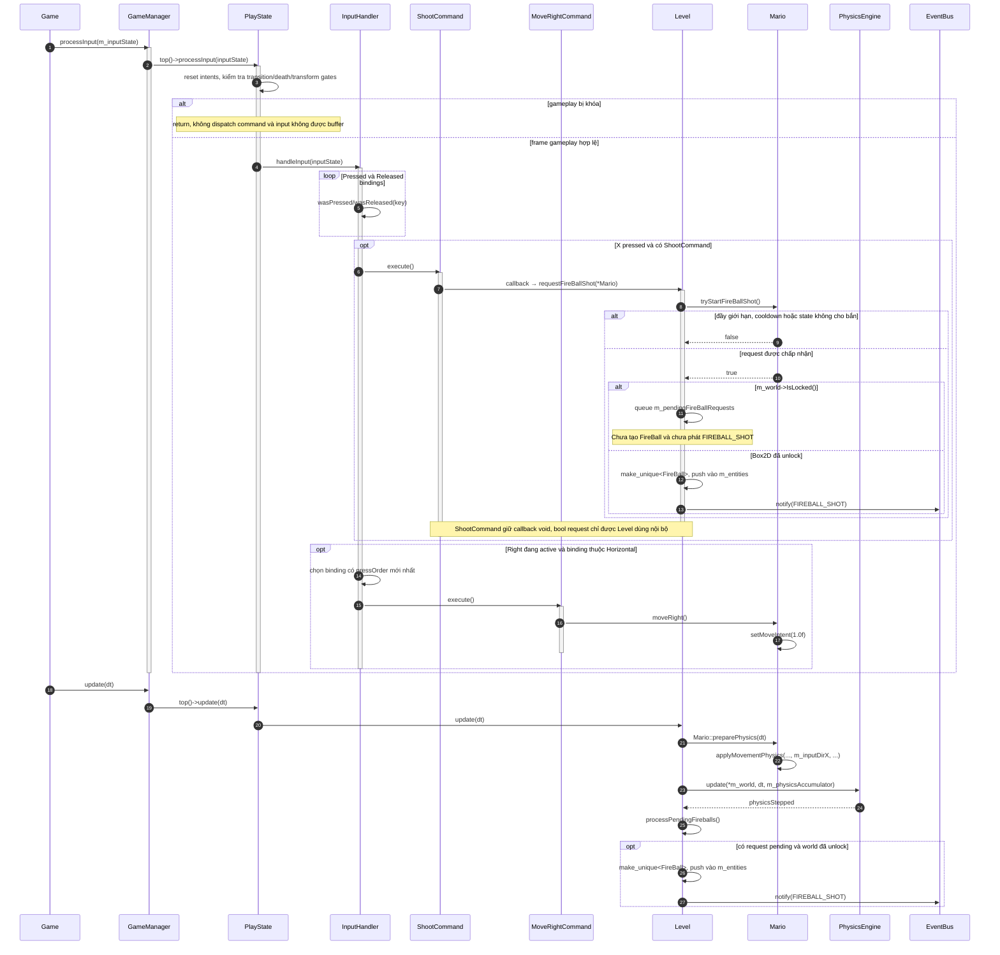
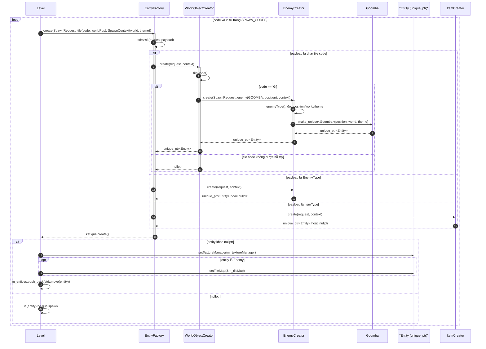
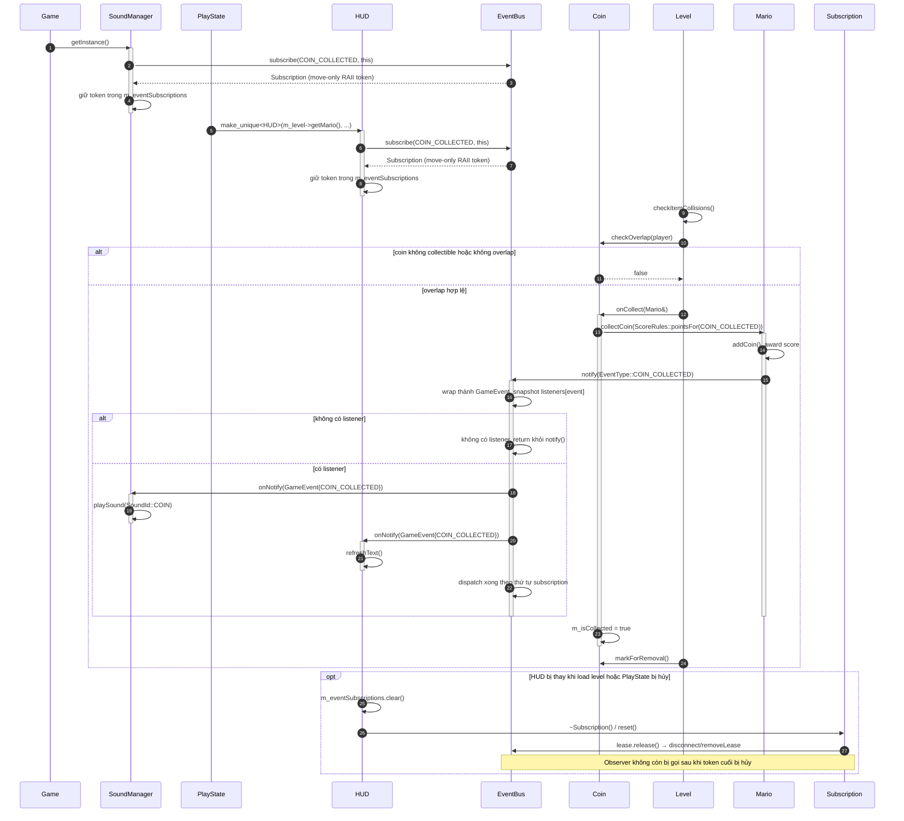
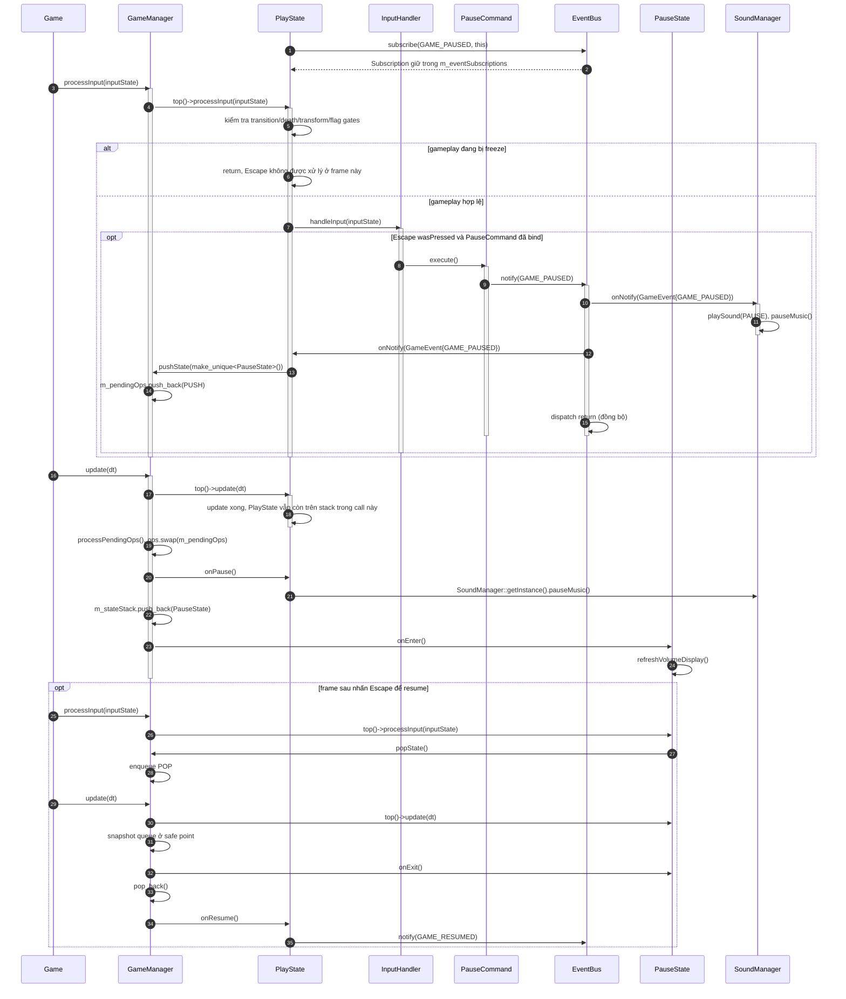
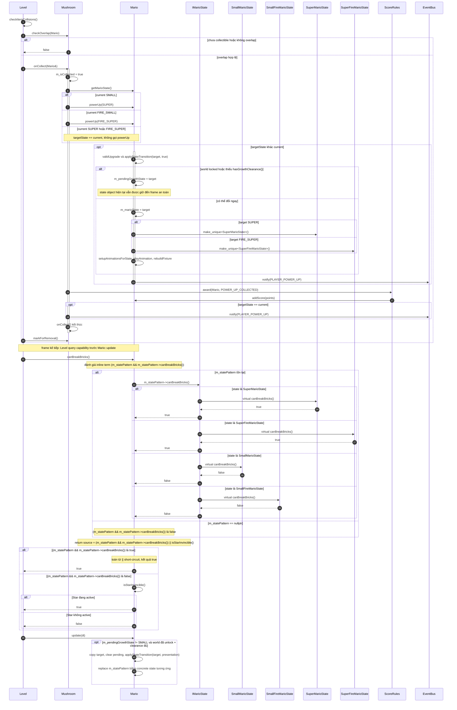
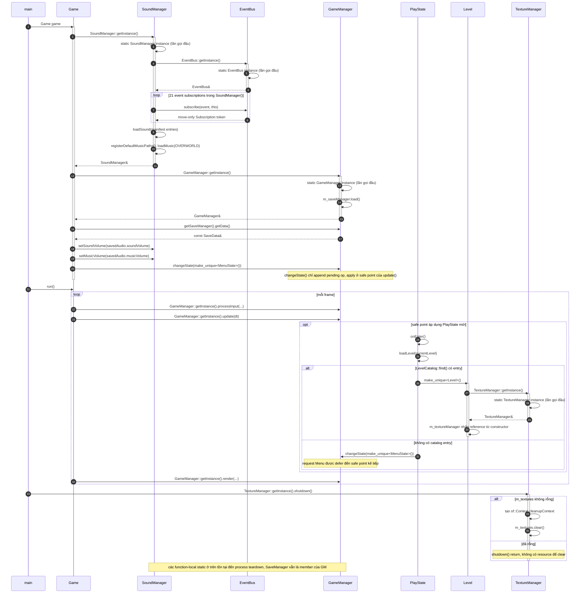

# Design patterns đang chạy trong Super Mario

## Phạm vi và cách đọc

Tài liệu này mô tả **luồng runtime đang có trong source hiện tại**, không phải
một danh sách quan hệ lớp lý thuyết. Mỗi phần bắt đầu bằng một tình huống có
thật, sau đó dùng sequence diagram để giữ đúng thứ tự gọi hàm, nhánh và vòng
đời đối tượng. Tên lớp, hàm và enum được giữ nguyên tiếng Anh để có thể tra
ngược vào code.

| Ký hiệu | Cách hiểu trong diagram |
| --- | --- |
| `->>` | Lời gọi đồng bộ; bên gọi chờ hàm/event dispatch xử lý xong. |
| `-->>` | Giá trị trả về hoặc kết quả có ý nghĩa (`bool`, `unique_ptr`, token). |
| `activate` / `deactivate` | Khoảng thời gian đối tượng đang ở trên call stack. |
| `alt` | Nhánh `if`/`switch` có trong code. |
| `opt` | Nhánh tùy chọn, chỉ xảy ra khi điều kiện runtime đúng. |
| `loop` | Vòng lặp thật trong code, ví dụ các binding hoặc mã tile. |

Các mũi tên trong tài liệu đều là lời gọi/event có thể tìm thấy trong source;
một self-call dùng để ghi rõ phép kiểm tra hoặc mutation nội bộ. `EventBus`
dispatch **đồng bộ**: `notify()` gọi `IObserver::onNotify()` ngay trong cùng
call stack. Ngược lại, các thao tác state của `GameManager` được **defer** đến
điểm an toàn cuối `update()`.

## Bản đồ nhanh các scenario

| Pattern được theo dõi | Scenario runtime | Seam chính |
| --- | --- | --- |
| Command | Một frame gameplay: phím di chuyển held và phím bắn pressed | `InputHandler → ICommand → Mario/Level` |
| Factory Method | `Level` đọc tile `G` và tạo một `Goomba` | `EntityFactory → EntityCreator → EnemyCreator` |
| Observer | Nhặt coin cập nhật HUD và phát SFX | `EventBus → HUD/SoundManager` |
| Game State | `Escape` mở `PauseState` bằng state stack | `IGameState → GameManager` |
| Mario State | Nhặt Mushroom, thay state power-up hoặc chờ clearance | `Mario → IMarioState` |
| Singleton (hạ tầng có thật) | Composition root lấy manager dùng chung; `Level` lấy resource manager | `getInstance() → function-local static` |

Singleton được trace riêng ở phần 6 vì đây là hạ tầng lifetime/access, không phải
seam gameplay chính của năm pattern trên. `GameManager`, `EventBus`,
`SoundManager` và `TextureManager` đều có `getInstance()`/constructor private
hoặc copy guard tương ứng. Đặc biệt, `SaveManager` **không phải Singleton**:
constructor của nó là public (`include/core/SaveManager.h:22-26`) và
`GameManager` value-own một đối tượng tại `include/core/GameManager.h:72-75`.

---

## 1. Command — input thành intent gameplay

### Scenario: một frame có `X` pressed và `Right` held

`Game` tích lũy `InputState` từ SFML rồi chuyển frame input cho state trên cùng.
`PlayState` kiểm tra các gate gameplay trước khi giao cho `InputHandler`.
`InputHandler` không biết Mario hay projectile là gì; nó chỉ chọn
`ICommand::execute()` theo trigger/group. Trong cùng frame, `ShootCommand` gửi
request cho `Level`, còn `MoveRightCommand` gửi intent cho `Mario`.

### Vai trò và điểm đặt trong source

| Vai trò Command | Đối tượng thực tế | Trách nhiệm |
| --- | --- | --- |
| Invoker | `InputHandler` | Giữ `unique_ptr<ICommand>`, kiểm tra trigger/group và gọi `execute()`. |
| Command | `ICommand` | Hợp đồng duy nhất `execute()`. |
| Concrete Command | `MoveRightCommand`, `ShootCommand`, `PauseCommand`, `RunCommand` | Đóng gói một hành động hoặc callback; không sở hữu `Mario`/`Level`. |
| Receiver | `Mario`, `Level` | Nhận intent hoặc request và quyết định gameplay/physics thật sự. |

`PlayState::rebindCommands()` đặt các binding (`src/states/PlayState.cpp:62-132`),
`Game::update()` và `GameManager::processInput()` truyền input xuống
(`src/core/Game.cpp:124-126`, `src/core/GameManager.cpp:103-106`). Vòng dispatch,
nhánh `gameplayEnabled` và chọn `pressOrder` nằm ở
`src/patterns/InputHandler.cpp:43-102`. `MoveRightCommand::execute()` gọi
`Mario::moveRight()` (`src/patterns/MoveRightCommand.cpp:17-21`), còn callback
`ShootCommand` đi đến `Level::requestFireBallShot()`
(`src/states/PlayState.cpp:123-129`, `src/level/Level.cpp:1708-1749`).
Trong `Level::update()`, nhịp physics sau đó giữ đúng thứ tự
`m_mario->preparePhysics(dt) → PhysicsEngine::update(...) →
processPendingFireballs()` (`src/level/Level.cpp:1169-1189`); diagram gọi rõ
`Mario::preparePhysics()` để không biến nó thành một phương thức không tồn tại
của `Level`.

### Vì sao pattern giúp ích

Key mapping thay đổi mà không sửa `Mario` hoặc `Level`; cùng một action cũng có
thể bind cho keyboard khác, player 2 hoặc mode co-op. Trigger `Pressed`,
`Held`, `Released` và group horizontal/vertical giữ logic input ở một nơi.
Trade-off là command giữ con trỏ/callback không sở hữu receiver; owner phải
đảm bảo `Mario`/`Level` còn sống. `ShootCommand` cũng chỉ yêu cầu bắn: giới
hạn hai FireBall, cooldown, Box2D lock và ownership entity vẫn thuộc `Level`.

---

## 2. Factory Method — tạo entity theo request polymorphic

### Scenario: tile `G` tạo `Goomba`

`Level` dùng seam không-static `EntityFactory::create()` cho vòng spawn. Request
có đúng một payload trong `std::variant`: `EnemyType`, `ItemType` hoặc `char`.
Với tile `G`, `WorldObjectCreator` đổi tile thành request enemy rồi ủy quyền cho
`EnemyCreator`; concrete creator mới biết phải gọi constructor nào.

Nhánh `EnemyType`/`ItemType` trong diagram là đường dùng chung cho các caller
trực tiếp hoặc compatibility helper; production tile-map path chủ yếu đi qua
payload `char` rồi `WorldObjectCreator`.

### Vai trò và điểm đặt trong source

| Vai trò Factory Method | Đối tượng thực tế | Bằng chứng |
| --- | --- | --- |
| Product | `Entity` | `std::unique_ptr<Entity>` là kiểu trả về chung. |
| Concrete Products | `Goomba`, `Koopa`, `Mushroom`, `QuestionBlock`, ... | Được khởi tạo trong các creator. |
| Creator seam | `EntityCreator::create()` | Virtual factory method thuần ảo tại `include/patterns/EntityCreator.h:12-19`. |
| Concrete Creators | `EnemyCreator`, `ItemCreator`, `WorldObjectCreator` | Override method; `WorldObjectCreator` còn delegate enemy/item. |
| Orchestrator | `EntityFactory` | `std::visit` chọn creator tại `src/patterns/EntityFactory.cpp:19-35`. |

Call-site thật là `Level::spawnEntitiesFromTileMap()`
(`src/level/Level.cpp:625-677`). Mapping `G → Goomba` nằm ở
`src/patterns/WorldObjectCreator.cpp:32-47`, sau đó
`src/patterns/EnemyCreator.cpp:24-78` mới gọi constructor concrete. Mapping
item (`COIN`, `MUSHROOM`, `FIRE_FLOWER`, `STAR`) nằm ở
`src/patterns/ItemCreator.cpp:13-35`.

`EntityFactory::createEnemy()`, `createItem()` và `createFromTileCode()` là
**compatibility static helpers**, không phải seam canonical mới. Chúng tạo
`SpawnRequest`/`SpawnContext` rồi forward về `defaultFactory().create()` tại
`src/patterns/EntityFactory.cpp:37-59`; vì vậy không được diễn giải thành một
`EntityFactory` Singleton mà caller phải lấy qua `getInstance()`.

### Vì sao pattern giúp ích

`Level` chỉ biết request, context và product base; thêm một loại enemy/item có
thể tập trung ở concrete creator thay vì rải `new Goomba`, `new Koopa` khắp
loader. `std::variant` cũng làm payload hợp lệ rõ ràng và creator trả `nullptr`
khi type/tile không hỗ trợ. Đổi lại, mapping enum/tile vẫn là switch tập trung;
đây là Factory Method có creator seam, không phải lời hứa rằng mọi entity đều
tự đăng ký động.

---

## 3. Observer — event gameplay đến HUD và âm thanh

### Scenario: nhặt coin, dispatch đồng bộ đến hai subscriber

Trong production, `Game` chạm `SoundManager::getInstance()` trước khi gameplay
được tạo, nên `SoundManager` đăng ký event. Khi `PlayState::loadLevel()` tạo
`HUD`, HUD đăng ký cùng `COIN_COLLECTED`. Một lần nhặt coin thay đổi dữ liệu
authoritative trong `Mario`, rồi `EventBus` gọi từng observer ngay lập tức.

### Vai trò và điểm đặt trong source

| Vai trò Observer | Đối tượng thực tế | Trách nhiệm |
| --- | --- | --- |
| Subject | `EventBus : ISubject` | Lưu listener theo `EventType`, snapshot và gọi `onNotify`. |
| Observer | `IObserver` | Hợp đồng `onNotify(const GameEvent&)`. |
| Concrete Observers | `HUD`, `SoundManager`, `PlayState` | Phản ứng độc lập với cùng value event. |
| Registration lifetime | `Subscription` | Move-only RAII token; hủy/reset sẽ disconnect registration. |
| Publisher | `Mario`, `Coin`, `Level`, command/collision code | Chỉ phát event value; không giữ reference đến HUD/audio. |

Đăng ký HUD và lifecycle token nằm ở `src/ui/HUD.cpp:112-142`; audio đăng ký
`COIN_COLLECTED` tại `src/core/SoundManager.cpp:45-91`. `HUD::onNotify()` refresh
display tại `src/ui/HUD.cpp:146-190`, còn SoundManager map event sang SFX tại
`src/core/SoundManager.cpp:109-184`. Luồng nhặt coin được gọi từ
`src/level/Level.cpp:1504-1550` (và có fallback Box2D tại
`src/physics/CollisionManager.cpp:938-949`), sau đó
`Coin::awardTo()` → `Mario::collectCoin()` tại `src/items/Coin.cpp:147-168` và
`src/entities/Mario.cpp:1367-1377`.

`EventBus::notify()` chụp snapshot rồi revalidate lease trước từng callback
(`src/patterns/EventBus.cpp:242-272`), nên callback có thể reset subscription
mà không làm hỏng vòng lặp. Nếu không có listener, dispatch chỉ return; tài
liệu không giả định một subscriber chưa được source xác nhận.

Trong diagram, `SoundManager` đứng trước `HUD` vì composition root gọi
`SoundManager::getInstance()` trước khi `PlayState::loadLevel()` tạo HUD. Đây là
thứ tự đăng ký của production path; EventBus không xem các observer là chạy
song song.

### Vì sao pattern giúp ích

Gameplay không cần include hay gọi trực tiếp HUD/SoundManager; thêm observer mới
không đổi `Mario::collectCoin()`. Event payload là value-only nên publisher không
trao ownership. Chi phí là luồng điều khiển gián tiếp và thứ tự callback phụ
thuộc thứ tự đăng ký; dispatch vẫn synchronous, không phải message queue hay
thread nền. Token phải sống ít nhất bằng observer và được giữ trong owner thích
hợp.

---

## 4. Game State — state stack với chuyển đổi deferred

### Scenario: `Escape` mở `PauseState` ở safe point

`PlayState` không tự hủy hoặc thay thế chính mình trong lúc đang chạy input.
`PauseCommand` phát `GAME_PAUSED`; `PlayState::onNotify()` chỉ enqueue
`pushState()`. Cuối `GameManager::update()`, queue được snapshot và `PauseState`
mới được đưa lên stack. Vì `PauseState::isOverlay()` là `true`, frame render sau
đó vẫn có thể vẽ `PlayState` bên dưới.

### Vai trò và điểm đặt trong source

| Vai trò State | Đối tượng thực tế | Trách nhiệm |
| --- | --- | --- |
| State interface | `IGameState` | Lifecycle `onEnter/onExit/onPause/onResume` và frame methods. |
| Concrete states | `MenuState`, `PlayState`, `PauseState`, `GameOverState`, `WinState`, ... | Đóng gói behavior từng mode. |
| Context/owner | `GameManager` | Chuyển tiếp event/input/update đến top state và sở hữu stack. |
| Transition policy | `PendingOp { CHANGE, PUSH, POP }` | Tách yêu cầu chuyển state khỏi thời điểm hủy object. |

`GameManager::changeState/pushState/popState()` chỉ append pending operation
(`src/core/GameManager.cpp:32-42`). `update()` gọi top state trước rồi mới
`processPendingOps()` (`src/core/GameManager.cpp:76-95`); `applyOp(PUSH)` gọi
`onPause`, push object và gọi `onEnter` (`src/core/GameManager.cpp:44-73`).
`PlayState` đăng ký `GAME_PAUSED`/enqueue push tại
`src/states/PlayState.cpp:224-237` và `src/states/PlayState.cpp:272-332`; `PauseState` resume bằng
`popState()` tại `src/states/PauseState.cpp:276-281`.

`Bus → SoundManager → PlayState` trong diagram phản ánh production registration
order: `SoundManager` nhận `GAME_PAUSED` trước, sau đó `PlayState` enqueue
`PUSH`. `PlayState::onPause()` còn gọi `pauseMusic()` lần nữa khi operation được
apply; hai lời gọi là có thật và không được rút gọn thành một transition đồng bộ.

Queue được snapshot bằng `ops.swap(m_pendingOps)`. Vì vậy nếu callback lifecycle
tạo thêm operation, operation mới nằm trong queue rỗng và chờ safe point kế
tiếp; không được mô tả như một transition tức thời giữa call stack hiện tại.

### Vì sao pattern giúp ích

`GameManager` không cần một `switch` khổng lồ cho menu/play/pause/game-over;
state tự sở hữu behavior và lifecycle. Stack cho phép overlay pause mà vẫn giữ
play state bên dưới. Trade-off là cần hiểu rõ `CHANGE` (xóa toàn stack), `PUSH`
(overlay) và `POP` (resume state dưới); mọi state operation có độ trễ ít nhất
đến cuối `update()`.

---

## 5. Mario State — power-up state thay đổi capability

### Scenario: nhặt Mushroom, có thể grow ngay hoặc chờ clearance

`Mushroom::onCollect()` đọc `MarioState` hiện tại và chọn state đích. Với
`SMALL → SUPER` hoặc `FIRE_SMALL → FIRE_SUPER`, `Mario::powerUp()` thay
`m_statePattern` bằng concrete `IMarioState`. Nếu Box2D đang lock hoặc khoảng
trống phía trên không đủ, `applyStateTransition()` giữ
`m_pendingGrowthState`; event pickup vẫn được phát, nhưng state object chưa đổi
trong frame đó. Đây là deferred growth riêng của Mario, không phải queue state
của `GameManager`.

### Vai trò và điểm đặt trong source

| Vai trò State | Đối tượng thực tế | Trách nhiệm |
| --- | --- | --- |
| Context | `Mario` | Giữ `m_marioState` và `unique_ptr<IMarioState>`. |
| State interface | `IMarioState` | Interface khai báo capability và lifecycle hooks; production hiện chỉ delegate `canBreakBricks()` qua con trỏ state. |
| Concrete states | `SmallMarioState`, `SuperMarioState`, `SmallFireMarioState`, `SuperFireMarioState` | Trả capability khác nhau và đại diện power tier. |
| Transition policy | `Mario::applyStateTransition()` | Kiểm tra body/clearance, dựng state object, fixture và presentation. |

Đường nhặt item nằm ở `src/level/Level.cpp:1523-1548`; target state và nhánh
re-entry nằm ở `src/items/Mushroom.cpp:106-140`. Việc tạo concrete state,
growth defer và fixture rebuild nằm ở `src/entities/Mario.cpp:937-1047`; vòng
frame sau flush pending growth ở `src/entities/Mario.cpp:443-468`. Level hỏi
capability trước khi xử lý tile hit tại `src/level/Level.cpp:1197-1204`, còn
`Mario::canBreakBricks()` delegate vào `m_statePattern` tại
`src/entities/Mario.cpp:1465-1467`. Ngược lại, `Mario::canShootFireBall()`
không gọi `IMarioState::canShootFireBall()`; nó kiểm tra `usesFire(m_marioState)`
và `m_fireCooldown <= 0.0f` trực tiếp (`src/entities/Mario.cpp:1461-1463`).

`IMarioState` có `onEnter`, `onExit` và `update` trong interface
(`include/states/IMarioState.h:17-33`), nhưng transition hiện tại **không gọi
trực tiếp các callback đó**; source chỉ tạo/replaces `unique_ptr`, cập nhật
animation/fixture và dùng capability virtual. Cùng lý do, production chưa có
call-site cho `IMarioState::getHitboxSize()`, `canShootFireBall()`, `onEnter()`,
`onExit()` hoặc `update()`; đây là các hook/contract đã khai báo, không phải
runtime delegation đang được trace. Vì vậy diagram không bịa ra các lời gọi đó.

### Re-entry và damage đã được giữ đúng

Mushroom khi Mario đã `SUPER`/`FIRE_SUPER` không gọi `powerUp`; nó vẫn award
điểm và phát một `PLAYER_POWER_UP` duy nhất (`src/items/Mushroom.cpp:127-139`).
FireFlower có cùng nguyên tắc cho `SMALL/SUPER` và fire tier
(`src/items/FireFlower.cpp:51-75`). Với damage, `Mario::powerDown()` bỏ qua khi
đang immune/star/dying/transforming; các transition hợp lệ là
`FIRE_SUPER → SUPER`, `FIRE_SMALL → SMALL`, `SUPER → SMALL`, còn `SMALL` gọi
`loseLife()` (`src/entities/Mario.cpp:1111-1134`). Đây là lý do không nên diễn
giải mọi va chạm như một state change.

### Vì sao pattern giúp ích

Code gameplay delegate capability `canBreakBricks()` thay vì rải điều kiện theo
từng power tier; điều kiện bắn FireBall hiện vẫn là enum/cooldown trong `Mario`.
Thay state object cho phép thêm tier mới mà không đổi
caller. Trade-off là body/fixture và animation phải đồng bộ với state; growth
blocked cần pending marker để không sửa Box2D trong lúc world lock. State này
cũng không phải state machine async: việc đổi concrete object thường đồng bộ,
chỉ growth bị giữ lại đến `Mario::update()` an toàn.

---

## 6. Singleton — hạ tầng dùng chung, lifetime có điểm kết thúc

### Scenario: composition root lấy manager, rồi `Level` lấy resource manager

Đây là scenario Singleton thật, tách khỏi các seam gameplay ở phần 1–5.
`Game::Game()` gọi `SoundManager::getInstance()` trước để chạy constructor đăng
ký observer và preload asset, sau đó lấy `GameManager::getInstance()` để đọc
`SaveManager` và xếp `MenuState`. Khi `PlayState::loadLevel()` tạo `Level`,
constructor của `Level` lấy cùng `TextureManager` reference. Cuối process,
`main()` gọi `TextureManager::shutdown()` khi context đồ họa còn sống.

### Vai trò và điểm đặt trong source

| Vai trò Singleton | Đối tượng thực tế | Trách nhiệm và bằng chứng |
| --- | --- | --- |
| Instance/accessor | `GameManager`, `SoundManager`, `TextureManager`, `EventBus` | `getInstance()` trả function-local `static` tại `src/core/GameManager.cpp:27-30`, `src/core/SoundManager.cpp:40-43`, `src/core/TextureManager.cpp:15-18`, `src/patterns/EventBus.cpp:196-208`. |
| Construction/copy guard | Bốn participant ở trên | `GameManager` có constructor/destructor private và copy delete (`include/core/GameManager.h:23-50`); `SoundManager` có accessor, copy/move delete và constructor/destructor private (`include/core/SoundManager.h:116-125`, `include/core/SoundManager.h:211-214`); `TextureManager` có copy delete và constructor/destructor private (`include/core/TextureManager.h:25-35`, `include/core/TextureManager.h:70-80`); `EventBus` có constructor/destructor private và copy delete (`include/patterns/EventBus.h:36-55`). |
| Client của instance | `Game`, `PlayState`, `Level`, `main` | `Game` lấy Sound/Game manager và state đầu tiên (`src/core/Game.cpp:62-76`); `PlayState::onEnter()` gọi `loadLevel()` (`src/states/PlayState.cpp:224-247`), rồi tạo `Level` (`src/states/PlayState.cpp:490-504`); `Level` lấy texture reference (`src/level/Level.cpp:148-150`); `main` gọi shutdown (`src/main.cpp:10-16`). |
| Lifetime/resource boundary | `SoundManager`, `TextureManager` | Sound destructor clear subscription tokens (`src/core/SoundManager.cpp:105-107`); `TextureManager::shutdown()` clear GPU resources dưới `sf::Context` (`src/core/TextureManager.cpp:123-132`). |

Luồng trên cho thấy lợi ích cụ thể: các state/entity không phải truyền một
registry toàn cục qua mọi constructor, còn `Level` giữ một reference đến resource
manager duy nhất. Trade-off là accessor toàn cục làm dependency ẩn và cần kiểm
soát test/lifetime; vì vậy việc cleanup GPU được gọi tường minh ở `main()`. Không
được suy ra từ đây rằng `SaveManager` là Singleton: constructor của nó public
(`include/core/SaveManager.h:22-26`), và `GameManager` value-own member
`m_saveManager` (`include/core/GameManager.h:69-75`).

---

## Các điểm không nên gán nhầm pattern

1. `SaveManager` không phải Singleton. Public constructor cho phép tạo instance
   độc lập trong test/session; production composition root để `GameManager` value-own
   một instance và state truy cập qua `getSaveManager()`.
2. `EntityFactory::createEnemy/createItem/createFromTileCode` là compatibility
   forwarding helpers. `defaultFactory()` dùng static local để tránh lặp mapping,
   nhưng API canonical vẫn là `EntityFactory::create(request, context)` và
   `EntityFactory` có constructor public.
3. `GameManager`, `EventBus`, `SoundManager` và `TextureManager` có singleton
   accessor thật; phần 6 trace lifetime/access này, nhưng singleton storage
   không thay thế Observer/Command/State seam được mô tả ở đây.
4. Các arrow trong diagrams không phải class-diagram relation: chỉ những lời
   gọi/event có call-site hiện hành mới được vẽ; subscriber, return value và
   ownership đều được ghi chú khi source có bằng chứng.
