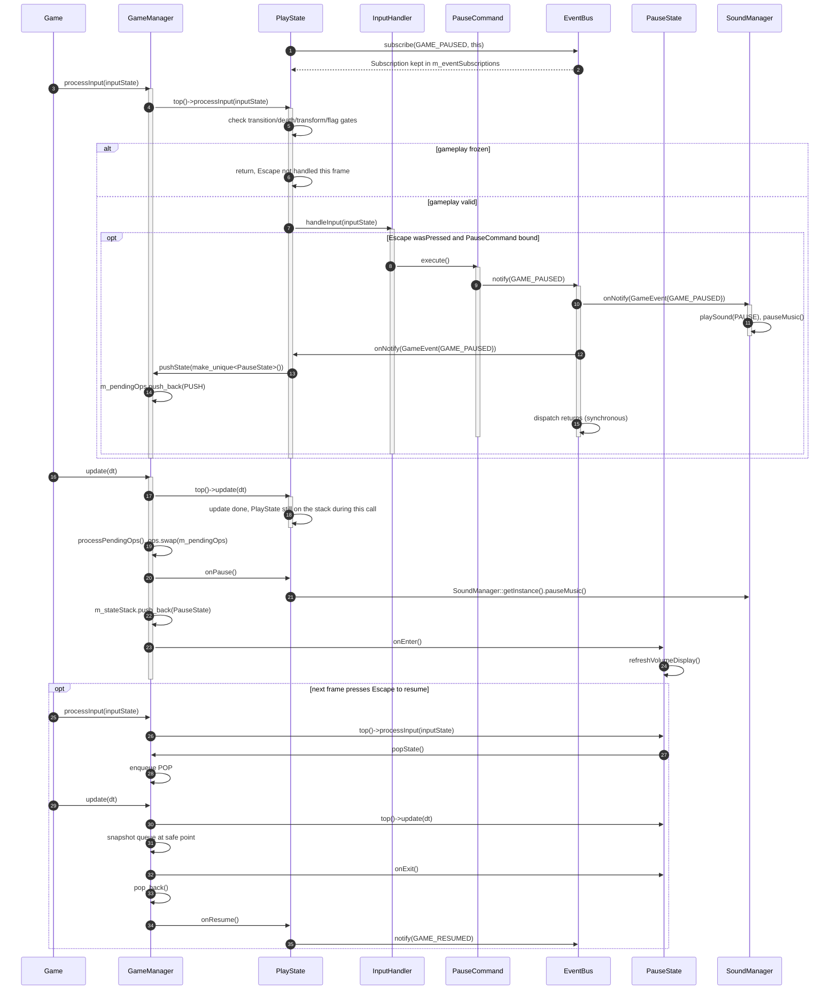

# Design patterns running in Super Mario

## Scope and how to read

This document describes the **runtime flows that exist in the current source**, not
a theoretical list of class relationships. Each section starts from a real
situation, then uses a sequence diagram to preserve the exact call order,
branches, and object lifetimes. Class, function, and enum names are kept in
English so they can be traced back into the code.

| Symbol | How to read it in the diagram |
| --- | --- |
| `->>` | Synchronous call; the caller waits until the function/event dispatch finishes. |
| `-->>` | Return value or meaningful result (`bool`, `unique_ptr`, token). |
| `activate` / `deactivate` | The span during which an object is on the call stack. |
| `alt` | An `if`/`switch` branch present in the code. |
| `opt` | An optional branch that only happens when a runtime condition holds. |
| `loop` | A real loop in the code, e.g. bindings or tile codes. |

Every arrow in this document is a call/event that can be found in the source;
a self-call is used to spell out an internal check or mutation. `EventBus`
dispatch is **synchronous**: `notify()` invokes `IObserver::onNotify()` in the
same call stack. In contrast, `GameManager` state operations are **deferred**
to the safe point at the end of `update()`.

## Quick map of the scenarios

| Tracked pattern | Runtime scenario | Main seam |
| --- | --- | --- |
| Command | One gameplay frame: a held movement key and a pressed fire key | `InputHandler -> ICommand -> Mario/Level` |
| Factory Method | `Level` reads tile `G` and creates a `Goomba` | `EntityFactory -> EntityCreator -> EnemyCreator` |
| Observer | Coin pickup updates the HUD and plays an SFX | `EventBus -> HUD/SoundManager` |
| Game State | `Escape` opens `PauseState` via the state stack | `IGameState -> GameManager` |
| Mario State | Picking up a Mushroom swaps the power-up state or waits for clearance | `Mario -> IMarioState` |
| Singleton (real infrastructure) | The composition root grabs shared managers; `Level` gets the resource manager | `getInstance() -> function-local static` |

Singleton is traced separately in section 6 because it is lifetime/access
infrastructure, not a primary gameplay seam like the five patterns above.
`GameManager`, `EventBus`, `SoundManager`, and `TextureManager` each have
`getInstance()`/private constructors or the corresponding copy guards.
Notably, `SaveManager` is **not a Singleton**: its constructor is public
(`include/core/SaveManager.h:22-26`) and `GameManager` value-owns one object at
`include/core/GameManager.h:72-75`.

---

## 1. Command — turning input into gameplay intent

### Scenario: one frame with `X` pressed and `Right` held

`Game` accumulates the `InputState` from SFML then hands the frame input to the
top state. `PlayState` checks the gameplay gates before passing it to
`InputHandler`. `InputHandler` knows nothing about Mario or projectiles; it only
picks an `ICommand::execute()` by trigger/group. In the same frame,
`ShootCommand` sends a request to `Level` while `MoveRightCommand` sends an
intent to `Mario`.

```mermaid
sequenceDiagram
    autonumber
    participant Game as Game
    participant GM as GameManager
    participant PS as PlayState
    participant IH as InputHandler
    participant Shoot as ShootCommand
    participant Move as MoveRightCommand
    participant Level as Level
    participant Mario as Mario
    participant Physics as PhysicsEngine
    participant Bus as EventBus

    Game->>GM: processInput(m_inputState)
    activate GM
    GM->>PS: top()->processInput(inputState)
    activate PS
    PS->>PS: reset intents, check transition/death/transform gates
    alt gameplay locked
        Note over PS: return, no command dispatched and input is not buffered
    else valid gameplay frame
        PS->>IH: handleInput(inputState)
        activate IH
        loop Pressed and Released bindings
            IH->>IH: wasPressed/wasReleased(key)
        end
        opt X pressed and ShootCommand bound
            IH->>Shoot: execute()
            activate Shoot
            Shoot->>Level: callback -> requestFireBallShot(*Mario)
            activate Level
            Level->>Mario: tryStartFireBallShot()
            alt at fireball limit, on cooldown, or state forbids shooting
                Mario-->>Level: false
            else request accepted
                Mario-->>Level: true
                alt m_world->IsLocked()
                    Level->>Level: queue m_pendingFireBallRequests
                    Note over Level: FireBall not created yet, FIREBALL_SHOT not fired
                else Box2D unlocked
                    Level->>Level: make_unique<FireBall>, push into m_entities
                    Level->>Bus: notify(FIREBALL_SHOT)
                end
            end
            Note over Shoot,Level: ShootCommand holds a void callback; the bool request is internal to Level
            deactivate Level
            deactivate Shoot
        end
        opt Right active and binding belongs to Horizontal group
            IH->>IH: pick binding with the newest pressOrder
            IH->>Move: execute()
            activate Move
            Move->>Mario: moveRight()
            Mario->>Mario: setMoveIntent(1.0f)
            deactivate Move
        end
        deactivate IH
    end
    deactivate PS
    deactivate GM

    Game->>GM: update(dt)
    GM->>PS: top()->update(dt)
    PS->>Level: update(dt)
    Level->>Mario: Mario::preparePhysics(dt)
    Mario->>Mario: applyMovementPhysics(..., m_inputDirX, ...)
    Level->>Physics: update(*m_world, dt, m_physicsAccumulator)
    Physics-->>Level: physicsStepped
    Level->>Level: processPendingFireballs()
    opt pending request and world unlocked
        Level->>Level: make_unique<FireBall>, push into m_entities
        Level->>Bus: notify(FIREBALL_SHOT)
    end
```

### Roles and where they live in the source

| Command role | Actual object | Responsibility |
| --- | --- | --- |
| Invoker | `InputHandler` | Holds `unique_ptr<ICommand>`, checks trigger/group, and calls `execute()`. |
| Command | `ICommand` | The single `execute()` contract. |
| Concrete Command | `MoveRightCommand`, `ShootCommand`, `PauseCommand`, `RunCommand` | Encapsulates one action or callback; does not own `Mario`/`Level`. |
| Receiver | `Mario`, `Level` | Receive the intent or request and decide the actual gameplay/physics. |

`PlayState::rebindCommands()` installs the bindings (`src/states/PlayState.cpp:62-134`),
`Game::update()` and `GameManager::processInput()` push input down
(`src/core/Game.cpp:129-130`, `src/core/GameManager.cpp:103-106`). The dispatch
loop, the `gameplayEnabled` branch, and the `pressOrder` selection live at
`src/patterns/InputHandler.cpp:43-102`. `MoveRightCommand::execute()` calls
`Mario::moveRight()` (`src/patterns/MoveRightCommand.cpp:17-21`), while the
`ShootCommand` callback goes to `Level::requestFireBallShot()`
(`src/states/PlayState.cpp:123-129`, `src/level/Level.cpp:2000-2042`).
Inside `Level::update()`, the subsequent physics beat preserves the order
`m_mario->preparePhysics(dt) -> PhysicsEngine::update(...) ->
processPendingFireballs()` (`src/level/Level.cpp:1294-1317`); the diagram calls
`Mario::preparePhysics()` explicitly so it is not mistaken for a non-existent
method of `Level`.

### Why the pattern helps

Key mappings can change without touching `Mario` or `Level`; the same action
can also be bound to another keyboard, player 2, or a co-op mode. The
`Pressed`, `Held`, `Released` triggers and the horizontal/vertical groups keep
the input logic in one place. The trade-off is that commands hold non-owning
pointers/callbacks to the receiver; the owner must guarantee `Mario`/`Level`
stay alive. `ShootCommand` also only requests a shot: the two-FireBall limit,
cooldown, Box2D lock, and entity ownership remain with `Level`.

---

## 2. Factory Method — creating entities from a polymorphic request

### Scenario: tile `G` creates a `Goomba`

`Level` uses the non-static `EntityFactory::create()` seam for the spawn loop.
A request carries exactly one payload inside a `std::variant`: `EnemyType`,
`ItemType`, or `char`. For tile `G`, `WorldObjectCreator` converts the tile
into an enemy request then delegates to `EnemyCreator`; only the concrete
creator knows which constructor to call.


The `EnemyType`/`ItemType` branches in the diagram are the shared path for
direct callers or compatibility helpers; the production tile-map path mainly
goes through the `char` payload and then `WorldObjectCreator`.

### Roles and where they live in the source

| Factory Method role | Actual object | Evidence |
| --- | --- | --- |
| Product | `Entity` | `std::unique_ptr<Entity>` is the common return type. |
| Concrete Products | `Goomba`, `Koopa`, `Mushroom`, `QuestionBlock`, ... | Constructed inside the creators. |
| Creator seam | `EntityCreator::create()` | Pure virtual factory method at `include/patterns/EntityCreator.h:12-19`. |
| Concrete Creators | `EnemyCreator`, `ItemCreator`, `WorldObjectCreator` | Override the method; `WorldObjectCreator` also delegates enemy/item creation. |
| Orchestrator | `EntityFactory` | `std::visit` selects the creator at `src/patterns/EntityFactory.cpp:19-35`. |

The real call-site is `Level::spawnEntitiesFromTileMap()`
(`src/level/Level.cpp:685-750`). The `G -> Goomba` mapping lives at
`src/patterns/WorldObjectCreator.cpp:32-47`, after which
`src/patterns/EnemyCreator.cpp:24-78` calls the concrete constructor. The item
mapping (`COIN`, `MUSHROOM`, `FIRE_FLOWER`, `STAR`) lives at
`src/patterns/ItemCreator.cpp:13-35`.

`EntityFactory::createEnemy()`, `createItem()`, and `createFromTileCode()` are
**compatibility static helpers**, not the new canonical seam. They build a
`SpawnRequest`/`SpawnContext` then forward to `defaultFactory().create()` at
`src/patterns/EntityFactory.cpp:37-59`; therefore they must not be interpreted
as making `EntityFactory` a Singleton that callers must obtain via
`getInstance()`.

### Why the pattern helps

`Level` knows only the request, the context, and the product base; adding a
new enemy/item type can be centralized in a concrete creator instead of
sprinkling `new Goomba`, `new Koopa` across the loader. `std::variant` also
makes the valid payloads explicit, and creators return `nullptr` for
unsupported types/tiles. In exchange, the enum/tile mapping is still a
centralized switch; this is a Factory Method with a creator seam, not a
promise that every entity self-registers dynamically.

---

## 3. Observer — gameplay events reaching the HUD and audio

### Scenario: coin pickup, synchronous dispatch to two subscribers

In production, `Game` touches `SoundManager::getInstance()` before gameplay is
created, so `SoundManager` registers for events. When `PlayState::loadLevel()`
creates the `HUD`, the HUD subscribes to `COIN_COLLECTED` as well. One coin
pickup mutates the authoritative data inside `Mario`, then `EventBus` invokes
each observer immediately.


### Roles and where they live in the source

| Observer role | Actual object | Responsibility |
| --- | --- | --- |
| Subject | `EventBus : ISubject` | Stores listeners per `EventType`, snapshots, and calls `onNotify`. |
| Observer | `IObserver` | The `onNotify(const GameEvent&)` contract. |
| Concrete Observers | `HUD`, `SoundManager`, `PlayState` | React independently to the same value event. |
| Registration lifetime | `Subscription` | Move-only RAII token; destroying/resetting it disconnects the registration. |
| Publisher | `Mario`, `Coin`, `Level`, command/collision code | Only publish value events; hold no reference to HUD/audio. |

HUD registration and the token lifecycle live at `src/ui/HUD.cpp:112-142`;
audio registers for `COIN_COLLECTED` at `src/core/SoundManager.cpp:45-91`.
`HUD::onNotify()` refreshes the display at `src/ui/HUD.cpp:146-190`, while
SoundManager maps events to SFX at `src/core/SoundManager.cpp:109-184`. The
coin pickup flow is invoked from `src/level/Level.cpp:1714-1731` (with a Box2D
fallback at `src/physics/CollisionManager.cpp:938-949`), then
`Coin::awardTo()` -> `Mario::collectCoin()` at `src/items/Coin.cpp:147-168`
and `src/entities/Mario.cpp:1392-1402`.

`EventBus::notify()` snapshots then revalidates the lease before each callback
(`src/patterns/EventBus.cpp:242-272`), so a callback may reset a subscription
without corrupting the loop. If there is no listener, dispatch simply returns;
this document does not assume a subscriber that the source has not confirmed.

In the diagram, `SoundManager` comes before `HUD` because the composition root
calls `SoundManager::getInstance()` before `PlayState::loadLevel()` creates the
HUD. This is the registration order of the production path; EventBus does not
treat observers as running in parallel.

### Why the pattern helps

Gameplay code does not need to include or call HUD/SoundManager directly;
adding a new observer does not change `Mario::collectCoin()`. The event payload
is value-only, so publishers exchange no ownership. The costs are indirection
in the control flow and callback ordering that depends on registration order;
dispatch remains synchronous — it is not a message queue or a background
thread. The token must outlive its observer and be kept by a suitable owner.

---

## 4. Game State — state stack with deferred transitions

### Scenario: `Escape` opens `PauseState` at a safe point

`PlayState` does not destroy or replace itself in the middle of input
processing. `PauseCommand` publishes `GAME_PAUSED`; `PlayState::onNotify()`
only enqueues a `pushState()`. At the end of `GameManager::update()`, the
queue is snapshotted and the new `PauseState` is pushed onto the stack.
Because `PauseState::isOverlay()` is `true`, the next render frame can still
draw `PlayState` underneath.



### Roles and where they live in the source

| State role | Actual object | Responsibility |
| --- | --- | --- |
| State interface | `IGameState` | `onEnter/onExit/onPause/onResume` lifecycle and frame methods. |
| Concrete states | `MenuState`, `PlayState`, `PauseState`, `GameOverState`, `WinState`, ... | Encapsulate the behavior of each mode. |
| Context/owner | `GameManager` | Forwards event/input/update to the top state and owns the stack. |
| Transition policy | `PendingOp { CHANGE, PUSH, POP }` | Separates the state-change request from the moment objects are destroyed. |

`GameManager::changeState/pushState/popState()` only append a pending operation
(`src/core/GameManager.cpp:32-42`). `update()` calls the top state first and
only then `processPendingOps()` (`src/core/GameManager.cpp:76-95`);
`applyOp(PUSH)` calls `onPause`, pushes the object, and calls `onEnter`
(`src/core/GameManager.cpp:44-73`). `PlayState` registers `GAME_PAUSED`/enqueues
the push at `src/states/PlayState.cpp:281-296` and
`src/states/PlayState.cpp:349-410`; `PauseState` resumes via `popState()` at
`src/states/PauseState.cpp:287-291`.

`Bus -> SoundManager -> PlayState` in the diagram reflects the production
registration order: `SoundManager` receives `GAME_PAUSED` first, then
`PlayState` enqueues the `PUSH`. `PlayState::onPause()` also calls
`pauseMusic()` again when the operation is applied; both calls are real and
must not be collapsed into one synchronous transition.

The queue is snapshotted via `ops.swap(m_pendingOps)`. Consequently, if a
lifecycle callback creates additional operations, the new operations land in
the now-empty queue and wait for the next safe point; this must not be
described as an instantaneous transition inside the current call stack.

### Why the pattern helps

`GameManager` needs no giant `switch` for menu/play/pause/game-over; each state
owns its behavior and lifecycle. The stack allows a pause overlay while keeping
the play state underneath. The trade-off is understanding `CHANGE` (clears the
whole stack), `PUSH` (overlay), and `POP` (resumes the state below); every
state operation is delayed at least until the end of `update()`.

---

## 5. Mario State — power-up states change capabilities

### Scenario: picking up a Mushroom, either growing immediately or waiting for clearance

`Mushroom::onCollect()` reads the current `MarioState` and picks the target
state. For `SMALL -> SUPER` or `FIRE_SMALL -> FIRE_SUPER`,
`Mario::powerUp()` swaps `m_statePattern` for a concrete `IMarioState`. If
Box2D is locked or there is not enough headroom, `applyStateTransition()`
keeps `m_pendingGrowthState`; the pickup event is still published, but the
state object does not change in that frame. This is Mario's own deferred
growth, not the `GameManager` state queue.


### Roles and where they live in the source

| State role | Actual object | Responsibility |
| --- | --- | --- |
| Context | `Mario` | Holds `m_marioState` and the `unique_ptr<IMarioState>`. |
| State interface | `IMarioState` | Interface declaring capabilities and lifecycle hooks; production currently only delegates `canBreakBricks()` through the state pointer. |
| Concrete states | `SmallMarioState`, `SuperMarioState`, `SmallFireMarioState`, `SuperFireMarioState` | Return different capabilities and represent power tiers. |
| Transition policy | `Mario::applyStateTransition()` | Checks body/clearance, builds the state object, fixture, and presentation. |

The item pickup path lives at `src/level/Level.cpp:1714-1731`; the target
state and re-entry branches live at `src/items/Mushroom.cpp:106-140`. Building
the concrete state, growth deferral, and fixture rebuild live at
`src/entities/Mario.cpp:963-1074`; the next-frame loop flushes pending growth
at `src/entities/Mario.cpp:465-475`. Level asks for the capability before
handling the tile hit at `src/level/Level.cpp:1325-1329`, while
`Mario::canBreakBricks()` delegates to `m_statePattern` at
`src/entities/Mario.cpp:1490-1493`. In contrast,
`Mario::canShootFireBall()` does not call `IMarioState::canShootFireBall()`;
it checks `usesFire(m_marioState)` and `m_fireCooldown <= 0.0f` directly
(`src/entities/Mario.cpp:1486-1488`).

`IMarioState` declares `onEnter`, `onExit`, and `update` in the interface
(`include/states/IMarioState.h:17-33`), but the current transitions **do not
invoke those callbacks directly**; the source only creates/replaces the
`unique_ptr`, updates animation/fixture, and uses the virtual capabilities.
For the same reason, production has no call-sites for
`IMarioState::getHitboxSize()`, `canShootFireBall()`, `onEnter()`,
`onExit()`, or `update()`; these are declared hooks/contracts, not runtime
delegation being traced here. The diagrams therefore do not invent those
calls.

### Re-entry and damage are preserved correctly

A Mushroom picked up while Mario is already `SUPER`/`FIRE_SUPER` does not call
`powerUp`; it still awards points and publishes exactly one `PLAYER_POWER_UP`
(`src/items/Mushroom.cpp:127-139`). FireFlower follows the same principle for
`SMALL/SUPER` and the fire tier (`src/items/FireFlower.cpp:51-75`). For
damage, `Mario::powerDown()` is ignored while immune/star-powered/dying/
transforming; the valid transitions are `FIRE_SUPER -> SUPER`,
`FIRE_SMALL -> SMALL`, `SUPER -> SMALL`, while `SMALL` calls `loseLife()`
(`src/entities/Mario.cpp:1137-1161`). This is why not every collision should
be interpreted as a state change.

### Why the pattern helps

Gameplay code delegates the `canBreakBricks()` capability instead of
scattering per-tier conditionals; the FireBall firing condition currently
remains an enum/cooldown check inside `Mario`. Swapping the state object
allows new tiers without changing callers. The trade-off is that body/fixture
and animation must stay in sync with the state; blocked growth needs a
pending marker so Box2D is not mutated while the world is locked. This state
is also not an async state machine: swapping the concrete object is usually
synchronous — only growth is held back until a safe `Mario::update()`.

---

## 6. Singleton — shared infrastructure with a bounded lifetime

### Scenario: the composition root grabs managers, then `Level` gets the resource manager

This is a genuine Singleton scenario, kept apart from the gameplay seams in
sections 1-5. `Game::Game()` calls `SoundManager::getInstance()` first so its
constructor registers observers and preloads assets, then obtains
`GameManager::getInstance()` to read `SaveManager` and queue `MenuState`. When
`PlayState::loadLevel()` creates a `Level`, the `Level` constructor grabs the
same `TextureManager` reference. At process end, `main()` calls
`TextureManager::shutdown()` while the graphics context is still alive.

```mermaid
sequenceDiagram
    autonumber
    participant Main as main
    participant Game as Game
    participant Sound as SoundManager
    participant Bus as EventBus
    participant GM as GameManager
    participant PS as PlayState
    participant Level as Level
    participant Texture as TextureManager

    Main->>Game: Game game
    activate Game
    Game->>Sound: SoundManager::getInstance()
    activate Sound
    Sound->>Sound: static SoundManager instance (first call)
    Sound->>Bus: EventBus::getInstance()
    activate Bus
    Bus->>Bus: static EventBus instance (first call)
    Bus-->>Sound: EventBus&
    deactivate Bus
    loop 21 event subscriptions inside SoundManager()
        Sound->>Bus: subscribe(event, this)
        Bus-->>Sound: move-only Subscription token
    end
    Sound->>Sound: loadSound(manifest entries)
    Sound->>Sound: registerDefaultMusicPaths(), loadMusic(OVERWORLD)
    Sound-->>Game: SoundManager&
    deactivate Sound

    Game->>GM: GameManager::getInstance()
    activate GM
    GM->>GM: static GameManager instance (first call)
    GM->>GM: m_saveManager.load()
    GM-->>Game: GameManager&
    deactivate GM
    Game->>GM: getSaveManager().getData()
    GM-->>Game: const SaveData&
    Game->>Sound: setSoundVolume(savedAudio.soundVolume)
    Game->>Sound: setMusicVolume(savedAudio.musicVolume)
    Game->>GM: changeState(make_unique<MenuState>())
    Note over GM: changeState() only appends a pending op, applied at the safe point of update()
    deactivate Game

    Main->>Game: run()
    loop every frame
        Game->>GM: GameManager::getInstance().processInput(...)
        Game->>GM: GameManager::getInstance().update(dt)
        opt safe point applying the new PlayState
            PS->>PS: onEnter()
            PS->>PS: loadLevel(currentLevel)
            alt LevelCatalog::find() has an entry
                PS->>Level: make_unique<Level>()
                activate Level
                Level->>Texture: TextureManager::getInstance()
                activate Texture
                Texture->>Texture: static TextureManager instance (first call)
                Texture-->>Level: TextureManager&
                deactivate Texture
                Level->>Level: m_textureManager receives the reference from the constructor
                deactivate Level
            else no catalog entry
                PS->>GM: changeState(make_unique<MenuState>())
                Note over GM: Menu request deferred to the next safe point
            end
        end
        Game->>GM: GameManager::getInstance().render(...)
    end

    Main->>Texture: TextureManager::getInstance().shutdown()
    activate Texture
    alt m_textures not empty
        Texture->>Texture: create sf::Context cleanupContext
        Texture->>Texture: m_textures.clear()
    else already empty
        Note over Texture: shutdown() returns, nothing to clear
    end
    deactivate Texture
    Note over Sound,GM: the function-local statics above live until process teardown; SaveManager remains a member of GM
```

### Roles and where they live in the source

| Singleton role | Actual object | Responsibility and evidence |
| --- | --- | --- |
| Instance/accessor | `GameManager`, `SoundManager`, `TextureManager`, `EventBus` | `getInstance()` returns a function-local `static` at `src/core/GameManager.cpp:27-30`, `src/core/SoundManager.cpp:40-43`, `src/core/TextureManager.cpp:15-18`, `src/patterns/EventBus.cpp:196-208`. |
| Construction/copy guard | The four participants above | `GameManager` has a private constructor/destructor and deleted copies (`include/core/GameManager.h:23-50`); `SoundManager` has the accessor, deleted copy/move, and private constructor/destructor (`include/core/SoundManager.h:116-125`, `include/core/SoundManager.h:211-214`); `TextureManager` has deleted copies and a private constructor/destructor (`include/core/TextureManager.h:25-35`, `include/core/TextureManager.h:70-80`); `EventBus` has a private constructor/destructor and deleted copies (`include/patterns/EventBus.h:36-55`). |
| Instance clients | `Game`, `PlayState`, `Level`, `main` | `Game` gets the Sound/Game managers and the first state (`src/core/Game.cpp:62-76`); `PlayState::onEnter()` calls `loadLevel()` (`src/states/PlayState.cpp:281-304`) then creates `Level` (`src/states/PlayState.cpp:583-601`); `Level` takes the texture reference (`src/level/Level.cpp:174-175`); `main` calls shutdown (`src/main.cpp:10-16`). |
| Lifetime/resource boundary | `SoundManager`, `TextureManager` | The Sound destructor clears subscription tokens (`src/core/SoundManager.cpp:105-107`); `TextureManager::shutdown()` clears GPU resources under an `sf::Context` (`src/core/TextureManager.cpp:123-132`). |

The flow above shows the concrete benefit: states/entities do not have to
thread a global registry through every constructor, and `Level` keeps one
reference to the single resource manager. The trade-off is that a global
accessor hides dependencies and requires test/lifetime discipline; this is why
GPU cleanup is invoked explicitly in `main()`. Do not infer from this that
`SaveManager` is a Singleton: its constructor is public
(`include/core/SaveManager.h:22-26`), and `GameManager` value-owns the
`m_saveManager` member (`include/core/GameManager.h:69-75`).

---

## Places not to mislabel as patterns

1. `SaveManager` is not a Singleton. Its public constructor allows
   independent instances in tests/sessions; the production composition root
   lets `GameManager` value-own one instance accessed through
   `getSaveManager()`.
2. `EntityFactory::createEnemy/createItem/createFromTileCode` are
   compatibility forwarding helpers. `defaultFactory()` uses a static local to
   avoid duplicating the mapping, but the canonical API remains
   `EntityFactory::create(request, context)` and `EntityFactory` has a public
   constructor.
3. `GameManager`, `EventBus`, `SoundManager`, and `TextureManager` have real
   singleton accessors; section 6 traces this lifetime/access behavior, but
   singleton storage does not replace the Observer/Command/State seams
   described here.
4. The arrows in the diagrams are not class-diagram relations: only
   calls/events with live call-sites are drawn; subscribers, return values,
   and ownership are annotated wherever the source provides evidence.
