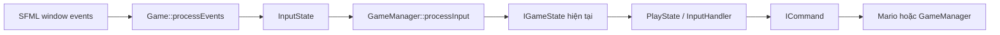
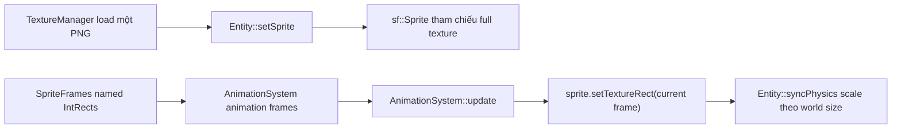

# TV5 implementation notes — reviewed Sprint 6

**Tác giả:** TV5 (Truyen)  
**Nhánh:** `feature/sound-input`  
**Mốc lịch sử:** `2727338 [TV5] First stable version`

Tài liệu giữ lại các ghi chú kỹ thuật đúng từ commit report chưa track, đồng
thời cập nhật theo implementation hiện tại và kết quả kiểm tra mới nhất.

Các nội dung lịch sử không còn đúng (ví dụ chỉ có ba CTest target, đường dẫn
asset source nằm trong runtime, hoặc `U/O` có mapping cũ) đã được loại bỏ.

## 1. Tóm tắt commit

| Commit | Mục đích | Kết quả chính |
| --- | --- | --- |
| `b3406fd` — `Add event-driven command input handling` | Thay việc đọc trực tiếp trạng thái bàn phím bằng trạng thái event theo từng frame. | Command nhận được input `press`/`hold` tin cậy, kể cả thao tác nhấn-thả rất nhanh. |
| `ad2bff6` — `Centralize coin collection state for HUD` | Đặt Mario làm nguồn dữ liệu duy nhất cho coin. | Score, coin count, HUD và event `COIN_COLLECTED` luôn đồng bộ. |
| `91ff2ea` — `Fix coin popup physics and sprite scaling` | Tách coin popup hiển thị khỏi coin có thể nhặt. | Coin popup không tạo sensor body không cần thiết; frame coin được scale đúng. |
| `38cf758` — `Stabilize Mario and tile collisions` | Cập nhật thứ tự Mario/Box2D, xử lý contact và collision body của tile. | Grounding, jump, khe giữa tile, block hit và damage an toàn hơn. |
| `f85dec9` — `Fix level layout and question block spawning` | Thêm mã spawn QuestionBlock theo item và sửa hiển thị level. | `?`, `U`, `O` spawn đúng nội dung; background tự canh theo chiều cao level. |
| `2727338` — `First stable version` | Thêm CMake setup tái lập được và regression tests. | Nền tảng lịch sử; trạng thái hiện tại được xác nhận lại ở mục kiểm thử cuối tài liệu. |

## 2. Input và Command pattern

### Vì sao thay đổi luồng input

Việc gọi trực tiếp `sf::Keyboard::isKeyPressed()` có thể bỏ lỡ một thao tác
nhấn-thả xảy ra giữa hai lần update. Nó cũng không phân biệt được lần nhấn mới
với event auto-repeat của SFML. [`InputState`](../../include/patterns/InputState.h)
ghi nhận event bàn phím một lần trong mỗi frame; sau đó
[`InputHandler`](../../include/patterns/InputHandler.h) quyết định command nào
cần chạy.



### API `InputState`

| Hàm | Cách hoạt động |
| --- | --- |
| `beginFrame()` | Chỉ xóa các cờ một-frame `pressed` và `released`. Phím đang giữ vẫn là held. Gọi một lần trước khi poll event của frame. |
| `handleEvent(const sf::Event&)` | Cập nhật trạng thái từ `KeyPressed` và `KeyReleased`; bỏ qua `KeyPressed` lặp lại khi phím đã held. `FocusLost` xóa toàn bộ trạng thái để Mario không bị kẹt phím di chuyển. |
| `isHeld(key)` | Trả về `true` khi phím vật lý vẫn đang được giữ. Dùng cho di chuyển liên tục. |
| `wasPressed(key)` / `wasReleased(key)` | Chỉ trả về `true` trong frame hiện tại. Dùng cho action một lần như jump, pause hoặc xác nhận menu. |
| `isActiveThisFrame(key)` | Là `isHeld(key) || wasPressed(key)`. Nhờ đó input vẫn nhận một short tap dù phím đã được thả trước lúc dispatch. |
| `getPressOrder(key)` | Trả về thứ tự tăng dần của lần nhấn vật lý gần nhất. Dùng để xác định hướng ngang được nhấn sau cùng. |
| `clear()` | Xóa held key, edge flag và press order khi window mất focus. |

### `InputHandler` và key binding

`bindKey` lưu `Binding` gồm `ICommand`, `InputTrigger` và `InputGroup`. Một
phím có thể có đồng thời binding `Pressed` và `Released`; cùng trigger/group
thì rebind thay binding cũ:

```cpp
void bindKey(sf::Keyboard::Key key,
             std::unique_ptr<ICommand> command,
             InputTrigger trigger = InputTrigger::Held,
             InputGroup group = InputGroup::None);
```

- `InputTrigger::Pressed`: command chạy một lần cho một lần nhấn mới. `W`,
  `Up`, `Space` dùng cho `JumpCommand`; `Escape` dùng cho `PauseCommand`.
- `InputTrigger::Held`: command chạy trong từng frame còn active. `A`/`Left`
  và `D`/`Right` dùng cho di chuyển.
- `InputTrigger::Released`: command chạy đúng frame có `KeyReleased`, dùng
  cho jump-cutoff hoặc các request cần biết thời điểm nhả phím.
- `InputGroup::Horizontal`: chỉ cho phép một command ngang chạy trong mỗi
  frame. Nếu giữ cả hai hướng, phím có `getPressOrder()` lớn hơn sẽ thắng.
  Khi thả phím đó, hướng còn được giữ sẽ tự hoạt động trở lại.

`PlayState::processInput()` đặt movement intent của Mario về `0`, rồi gọi
`m_inputHandler.handleInput(inputState)`. Vì vậy hướng di chuyển không bị giữ
lại từ frame trước khi không còn phím ngang nào active.

`RunCommand`, `ShootCommand` và `JumpReleaseCommand` chỉ gọi callback request;
chúng không sở hữu Mario và không tự tạo FireBall. Gameplay/physics owner có
thể nối callback khi consumer interface được bàn giao.

### Thay đổi interface State

`IGameState` có thêm hàm bắt buộc:

```cpp
virtual void processInput(const InputState& inputState) = 0;
```

Tất cả state hiện có đã implement hàm này. Menu, Game Over và Win phản ứng
với một lần nhấn `Enter`; Pause phản ứng với một lần nhấn `Escape`. Mouse action
vẫn được xử lý trong `processEvents`. Bất kỳ class mới nào kế thừa `IGameState`
phải implement `processInput`, nếu không sẽ không compile.

## 3. Coin, QuestionBlock và HUD

### Một nguồn dữ liệu duy nhất

`Mario` hiện sở hữu cả score lẫn coin count. TV5 dùng helper thống nhất là:

```cpp
void Coin::awardTo(Mario& mario);
int Mario::getCoinCount() const;
```

`collectCoin` tăng `m_coinCount`, cộng `scoreValue` vào `m_score`, rồi publish
`EventType::COIN_COLLECTED`. HUD không còn tự giữ một counter riêng mà đọc
`m_mario.getCoinCount()` khi refresh. Điều này tránh trường hợp score đã đổi
nhưng HUD cũ, hoặc hai counter bị lệch nhau.

Coin thường được phát hiện trong `Level::checkItemCollisions()` qua overlap của
Mario và item, sau đó gọi `Coin::onCollect`. `Coin::awardTo()` là score path
duy nhất của TV5: coin được +100 điểm, mỗi đủ 100 coin cộng một life và giữ
phần dư. QuestionBlock dùng cùng helper rồi mới tạo `CoinType::QUESTION_POPUP`;
popup không publish thêm event nên một lần hit block chỉ thưởng đúng một coin.

### Render và physics của Coin

- `CoinType::COLLECTIBLE` tạo static sensor body để tham gia vào item overlap
  thông thường.
- `CoinType::QUESTION_POPUP` không có physics body. Nó đi theo cung sine ngắn
  và tự đánh dấu để xóa khi hết popup duration.
- `scaleCoinSprite` scale texture frame hiện tại theo kích thước coin trong
  world. Điều này cần thiết vì frame gốc của coin là `8x16`, còn entity có
  kích thước world riêng.

## 4. Mario, Box2D và tile collision

### Thứ tự physics trong một frame

`Level::update()` hiện chạy theo thứ tự:

1. `Mario::preparePhysics(dt)` áp dụng movement/jump intent hiện tại trước
   Box2D step.
2. `PhysicsEngine::update(world, dt)` chạy fixed step và trả về `true` nếu có
   ít nhất một step xảy ra.
3. Nếu đã step, `Mario::refreshGroundedState()` tính lại grounded từ những
   contact còn tồn tại sau khi solver xử lý.
4. Game xử lý tile bump, queued block hit, rồi update entity và Mario cho
   animation/render.

`PhysicsEngine::update` hiện trả về `bool`. Caller nào cần dữ liệu được suy ra
từ contact phải dùng kết quả này thay vì giả định Box2D luôn chạy trong mỗi
visual frame.

### Các helper mới của Mario

| Hàm | Cách hoạt động |
| --- | --- |
| `setMoveIntent(float)` | Clamp input vào `[-1, 1]` và cập nhật hướng nhìn. Đây là input đích của mỗi frame khi dùng Command. |
| `preparePhysics(float dt)` | Áp dụng acceleration, friction, skidding và jump velocity trước Box2D simulation; sau đó xóa jump request đã dùng. |
| `refreshGroundedState()` | Duyệt active Box2D contact của Mario và chỉ đặt grounded khi normal chủ yếu hướng lên, không phải wall. Contact với enemy và item bị bỏ qua. |
| `clearGroundedState()` | Xóa grounded ngay khi jump hoặc bounce sau stomp, tránh việc Mario có thêm một frame grounded ngoài ý muốn. |
| `setRespawnPosition(position)` | Lưu vị trí `M` spawn của level để dùng lại khi respawn. |
| `queuePowerDown()` | Hoãn damage nếu Box2D world đang bị lock trong callback. `Mario::update()` sẽ power-down an toàn sau đó. |

Sau khi Super/Fire Mario nhận damage, game tạo một khoảng invincibility ngắn
sau fixture rebuild. Khi respawn, Mario trở về kích thước small, xóa grounded
state và dùng lại vị trí spawn của level.

### Xử lý contact

`ContactListener` vẫn gọi `CollisionManager::resolve` trong `BeginContact` để
xử lý gameplay, nhưng nay gọi `CollisionManager::preSolve` từ Box2D `PreSolve`.
`preSolve` chỉ đặt friction bằng 0 cho contact có Mario, nhờ đó hạn chế dính
wall giữa không trung mà không thay đổi contact của entity khác.

Khi Mario hit block từ dưới, `TileContactResolver::resolveCeilingTileContact`
đổi contact point Box2D về tọa độ tile. Hàm trừ một epsilon nhỏ hướng vào bên
trong trước khi `floor`, nhờ đó contact nằm đúng rìa tile vẫn chọn tile Mario
vừa hit thay vì tile kề bên.

### Gộp tile body và queued hit

[`buildHorizontalTileCollisionSpans`](../../include/level/TileCollisionSpans.h)
biến mỗi dãy tile solid nằm ngang liên tiếp thành một static Box2D body. Ví dụ
`111.11` thành hai span dài 3 và 2. Cách này xóa các vertical seam bên trong
sàn dài, giảm hiện tượng Mario mắc khi chạy ngang.

Vì một body có thể đại diện nhiều tile, `TileMap` không còn xóa một body riêng
khi phá brick. Nó rebuild collision bodies từ grid mới. Block hit được queue
kèm horizontal overlap; cuối physics step, `processPendingHits` chọn hit có
overlap lớn nhất. Nếu ô đó có entity QuestionBlock thì gọi
`QuestionBlock::onHit`; nếu không thì dùng đường xử lý tile bình thường.

## 5. Mã spawn của level và QuestionBlock

`Level` xem các ký tự sau là mã spawn entity độc lập:

| Ký tự level | Kết quả từ Factory | Nội dung |
| --- | --- | --- |
| `?` | `QuestionBlock` | Adaptive: SMALL nhận Mushroom, SUPER/FIRE nhận FireFlower |
| `U` | `QuestionBlock` | 1-Up Mushroom |
| `O` | `QuestionBlock` | Star |

`EntityFactory::createFromTileCode` tạo `QuestionBlockContent` phù hợp.
Content được resolve một lần khi hit; item spawn có emergence delay để không bị
collect xuyên block trong cùng frame.
Vị trí Y của background hiện được tính từ chiều cao level và chiều cao source
background rectangle, thay vì hardcode giá trị `304`. Hai row ngắn trong
`level1.txt` cũng đã được kéo dài để grid có cùng chiều rộng.

## 6. Cách `SpriteFrames.h` cắt sprite sheet

[`SpriteFrames.h`](../../include/core/SpriteFrames.h) là catalog trung tâm của
**source-image rectangle**. File này không load texture file và không thay đổi
kích thước Box2D của entity. Mỗi frame đặt tên là một SFML `IntRect`:

```cpp
sf::IntRect({sourceX, sourceY}, {frameWidth, frameHeight});
```

- Gốc `(0, 0)` của source image nằm ở góc trên-trái của PNG.
- `sourceX` và `sourceY` tính bằng pixel trong PNG, không phải tọa độ world.
- `frameWidth` và `frameHeight` chỉ phần được lấy từ sheet.
- Dùng named constant để không rải magic number trong gameplay code.

### Layout các sheet hiện có

| Namespace | Sheet / source rectangle | Điểm cần lưu ý |
| --- | --- | --- |
| `SmallMario` | `MarioLuigi.png`, row `Y = 8`, frame `16x16` | Có `IDLE`, `WALK1..3`, `SKID`, `JUMP`, `DEATH`; walk bắt đầu tại X `20`, `38`, `56`. |
| `BigMario` / `FireBigMario` | `MarioLuigi.png`, row `Y = 32` / `140`, frame `16x32` | Crouch là frame `16x24` không đều, bắt đầu thấp hơn 8 pixel; vì vậy được khai báo riêng thay vì cắt grid. |
| `FireSmallMario` | `MarioLuigi.png`, row `Y = 116`, frame `16x16` | Có layout logic giống Small Mario nhưng là fire palette. |
| `BigLuigi` | `MarioLuigi.png`, X từ `136`, row `Y = 32` | Dùng nửa phải của sheet Mario/Luigi dùng chung. |
| `Items::COIN1..4` | `items_objects.png`, từ `(180, 36)`, frame `8x16` | X lần lượt `180`, `190`, `200`, `210`; có khoảng cách 2 pixel nên không thể coi là grid 8 pixel liên tục. |
| `Items::FIRE_FLOWER*`, `STAR*` | `items_objects.png`, row `Y = 8`, frame `16x16` | Vector khai báo thứ tự animation. |
| `Blocks::QUESTION*` | `items_blocks.png`, row `Y = 112`, frame `16x16` | Animation Question Block dùng X `80`, `96`, `112`; `EMPTY` là used-block frame. |
| `Backgrounds::OVERWORLD` | `bg_mountains.png`, `{0, 40}`, kích thước `768x176` | Cắt phần background world dùng được từ background sheet. |

### Luồng chạy từ sheet đến animation



Với entity có animation, đăng ký explicit frame nếu khoảng cách không đều:

```cpp
setSprite("assets/textures/items/items_objects.png");
m_animationSystem->addAnimation(
    "idle",
    AnimationSystem::createManualAnimation(SpriteFrames::Items::coinFrames(), 0.2f));
playAnimation("idle");
```

`updateAnimation(dt)` cuối cùng gọi `AnimationSystem::update`, nơi áp dụng
source rectangle hiện tại bằng `sprite.setTextureRect(...)`. Với sheet đều,
`AnimationSystem::createGridAnimation` có thể tự tạo frame từ start point,
frame size, frame count và spacing tùy chọn. Hãy dùng
`createManualAnimation` cho layout có gap, offset hoặc frame size khác nhau
như coin và crouch.

### Thêm frame mới an toàn

1. Mở PNG gốc ở native size và đo rectangle theo source pixel. Không đo sprite
   đã được scale trong game.
2. Thêm một named `inline const sf::IntRect` vào namespace `SpriteFrames` phù
   hợp. Nếu có animation thì thêm frame vector.
3. Load sheet dùng chung qua `TextureManager`; không tạo hoặc tham chiếu file
   tách như `idle.png`, `coin.png`.
4. Đăng ký frame trong `AnimationSystem` và gọi `updateAnimation(dt)` từ
   entity update.
5. Kiểm tra frame ở native scale và kích thước world. Với entity Box2D,
   `Entity::syncPhysics()` sẽ scale sprite theo `m_size` và kích thước texture
   rectangle đang active.

## 7. Kiểm thử và checklist review

Implementation hiện tại đã được kiểm tra bằng:

```powershell
cmake --fresh --preset mingw-debug
cmake --build --preset mingw-debug --parallel 2
ctest --test-dir build --output-on-failure
```

Cả bốn CTest target đều pass:

| Test | Scenario được kiểm tra |
| --- | --- |
| `input_state_tests` | Short tap, held key, auto-repeat, hướng ngang mới nhất và focus loss. |
| `tile_collision_span_tests` | Tạo span, tách span khi phá tile, chạy qua sàn dài và mapping contact ở rìa trần. |
| `mario_physics_tests` | Landing/ground refresh trước jump và recovery sau terrain rebuild. |
| `play_state_tests` | Level catalog bounds và Win transition guard. |

`input_state_tests` hiện thêm kiểm tra `Released`, hai binding trên cùng một
phím và callback request của Run/Shoot command.

Khi review hoặc mở rộng các hệ thống này, cần kiểm tra state mới đã implement
`processInput`, asset animation mới dùng named `SpriteFrames` rect, và thay đổi
TileMap vẫn giữ đúng cơ chế rebuild collision span.

## Reopened TV5 implementation update (2026-08-07)

This addendum supersedes the earlier notes that described Run/Shoot and the
audio producers as callback/catalog-only:

- `PlayState` now binds Shift to `RunCommand` and X to `ShootCommand`. Run is a
  per-frame Mario intent, and Shoot calls the level-owned `spawnFireBall()`
  adapter so input does not own projectile lifetime.
- FireBall instances carry a non-owning Mario owner for defeat-score
  attribution and publish `FIREBALL_SHOT`; Koopa publishes `SHELL_KICKED` only
  when an idle shell transitions to sliding.
- Question blocks, TileMap brick/block hits and item emergence publish the
  runtime events consumed by `SoundManager`. Star start/expiry restores the
  level track, while death/GameOver/Win states select their own music.
- `ScoreRules` is the shared catalog: coin 100, power-up 1000, stomp 100 and
  shell/FireBall/Star defeat 200. Current TV5 producers and the FireBall path
  use the API; the remaining DefeatCause owner contract is intentionally left
  for TV3.
- HUD timeout is one-shot and calls Mario's death/life API. Pause exposes
  immediate independent music/SFX controls with `[0,100]` clamping; volume
  persistence remains a TV4 SaveManager integration point.
- Runtime enemy textures are present at `assets/textures/enemies/`, and
  `assets/ASSETS_LIST.md` is the checked-in manifest for their dimensions and
  usage.

The clean verification build registered seven tests, including
`tv5_integration_tests`; `ctest --test-dir build-tv5-clean --output-on-failure`
passed all seven.
