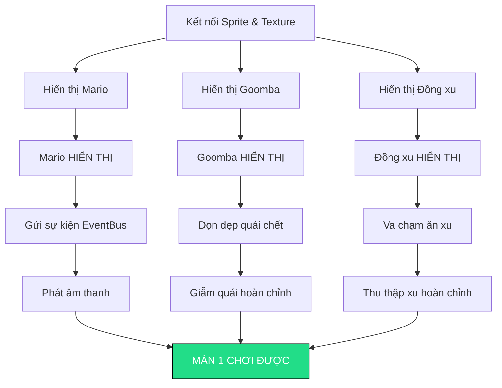

# 🔍 Tổng Review & Danh Sách Task Cần Làm — Sprint 4/5

> Ngày review: 30/07/2026 · Branch: `develop`

---

## 1. Summary

**Verdict: ⚠️ Request Changes — Multiple Blockers Before Playable**

Sprint 4 đã đạt tiến độ tốt về **kiến trúc**: Hệ thống Entity, tích hợp Box2D, Factory, Observer/EventBus, Command pattern, TileMap parsing/rendering và Camera đều đã định hình đúng cấu trúc. Tuy nhiên, **game chưa thể chơi hoàn chỉnh Màn 1**. Việc thiếu kết nối giữa các module khiến chưa demo được màn chơi từ đầu đến cuối.

### Trạng thái các mục tiêu Sprint 4

| Hạng mục Sprint 4 | Trạng thái |
|---|---|
| EntityFactory hoạt động | ✅ Hoàn thành (đã nối Goomba & Coin) |
| Mario hiển thị sprite + animation đi/nhảy | 🔴 **Chưa xong** — setSprite chưa xử lý, AnimationSystem chưa tích hợp vào Mario |
| Camera đi theo player | ✅ Hoàn thành |
| Vật lý chuẩn, không dùng số ma thuật | ✅ Hoàn thành |
| Xử lý hướng va chạm | ⚠️ Một phần — giẫm quái/va ngang đã chạy, va chạm với item chưa nối |
| Render Level 1 | ⚠️ Tile đang dùng khối màu placeholder, Coin và Goomba chưa hiển thị sprite |
| Goomba tuần tra di chuyển qua lại | ⚠️ Body Box2D và logic đã chạy nhưng chưa hiển thị hình ảnh |
| InputHandler map phím thành hành động | ✅ Code đã xong nhưng chưa tích hợp vào Game Loop chính |
| SoundManager phát âm thanh theo sự kiện | ⚠️ Đã đăng ký EventBus nhưng gameplay chưa phát sự kiện (publish event) |
| Coin có thể thu thập | ⚠️ Logic thu thập đã có nhưng chưa gọi trong game loop |

---

## 2. Quy Chuẩn Code (Coding Conventions)

### 🔴 Lỗi cần sửa ngay
- **Ngôn ngữ comment**: Đổi các comment tiếng Việt trong game loop/core sang tiếng Anh theo đúng quy định English-Only.
- **Thứ tự `#include`**: Đảm bảo thư viện chuẩn C++ (`<string>`, `<vector>`, `<optional>`) được include trước các thư viện ngoài (SFML/Box2D).
- **Vị trí `#pragma once`**: Chuyển `#pragma once` xuống bên dưới khối comment header `@file`.
- **Cú pháp C++**: Thay thế các từ khóa `and` / `or` bằng toán tử chuẩn `&&` / `||` đồng bộ toàn dự án.

### ⚠️ Lỗi nhỏ
- Centralize các hằng số kích thước màn hình (`SCREEN_WIDTH`, `SCREEN_HEIGHT`) thay vì khai báo trùng lặp ở nhiều class.
- Đổi thông tin `@author` trong header các class về đúng thành viên phụ trách theo phân công.
- Khởi tạo khung class `GameManager` để chuẩn bị cho State pattern.

---

## 3. Rủi Ro Kiến Trúc & Vật Lý (Architecture & Physics Risks)

### 🔴 BLOCKER — Ngăn cản việc chơi màn chơi

| # | Rủi ro | Mô tả |
|---|---|---|
| **A1** | **Sprite chưa hiển thị** | Hàm gán sprite và chạy animation ở Entity đang là hàm rỗng. Goomba và Mario chưa có hình ảnh hiển thị, nhân vật đang di chuyển dưới dạng khung hình ẩn. |
| **A2** | **TextureManager & AnimationSystem chưa kết nối** | TextureManager và AnimationSystem đã được viết nhưng chưa được kết nối với hệ thống Entity/Mario để nạp và update sprite. |
| **A3** | **Chưa xử lý va chạm Item** | Game loop chưa kiểm tra va chạm giữa Mario và Coin/Item khi di chuyển. |
| **A4** | **Coin chưa khởi tạo hình ảnh & vật lý** | Constructor của Coin chưa thiết lập body vật lý (sensor) và sprite hiển thị. |
| **A5** | **Quái chết chưa được dọn dẹp** | Logic dọn dẹp entity chết chưa xóa bớt entity đã bị tiêu diệt khỏi danh sách quản lý. |
| **A6** | **Gameplay chưa phát sự kiện (EventBus)** | Gameplay chưa phát các sự kiện như nhảy, giẫm quái, ăn xu đến EventBus để SoundManager phát âm thanh. |

### ⚠️ Cần khắc phục cho Sprint 5

| # | Rủi ro | Mô tả |
|---|---|---|
| **B1** | **Chưa dùng InputHandler** | Game đang xử lý phím trực tiếp thay vì thông qua InputHandler (Command Pattern). |
| **B2** | **Chưa có GameManager & State Pattern** | Chưa dựng bộ khung GameManager và các State (`MenuState`, `PlayState`, `PauseState`, `GameOverState`, `WinState`). |
| **B3** | **Lỗi biên dịch TextureManager** | Đổi phương thức nạp texture sang constructor chuẩn của SFML 3 để tránh lỗi biên dịch. |
| **B4** | **Chưa có logic về đích & tính mạng** | Chưa kiểm tra khi Mario chạm cờ về đích, rớt vực hoặc hết máu để chuyển màn/GameOver. |
| **B5** | **Thiếu tài nguyên Asset** | Cần bổ sung đầy đủ các file sprite (tileset, enemy, item) và font vào thư mục assets. |

---

## 4. Tích Hợp Giữa Các Module

| Trạng thái | Tích hợp Module | Mô tả |
|---|---|---|
| 🔴 **BROKEN** | Entity ↔ TextureManager | TextureManager chưa được Entity gọi để nạp hình ảnh. |
| 🔴 **BROKEN** | Entity ↔ AnimationSystem | AnimationSystem chưa được kết nối vào luồng update của Entity. |
| 🔴 **BROKEN** | Level ↔ Item Collision | Chưa kiểm tra va chạm giữa Mario và các vật phẩm trong Level. |
| 🔴 **BROKEN** | Gameplay ↔ EventBus | Các hành động gameplay chưa phát event đến EventBus. |
| ⚠️ **UNUSED** | Game ↔ InputHandler | InputHandler chưa được gọi trong Game loop chính. |
| ✅ **WORKING** | Level ↔ EntityFactory | Level đã tạo Goomba và Coin thông qua EntityFactory. |
| ✅ **WORKING** | Level ↔ TileMap ↔ Camera | TileMap load/render tốt, Camera cuộn theo Player chuẩn. |
| ✅ **WORKING** | Mario ↔ PhysicsEngine | Vật lý Box2D cho Mario (di chuyển, nhảy, trọng lực) hoạt động mượt mà. |
| ✅ **WORKING** | ContactListener ↔ Enemy Stomp | Phát hiện giẫm lên đầu quái và va chạm ngang gây mất máu hoạt động đúng. |

---

## 5. Bất Đồng Bộ Với Kế Hoạch Tuần (WEEKLY_PLAN)

- **Tiến độ**: Sprint 4 đang trễ khoảng 5 ngày so với mốc ban đầu.
- **Hạng mục chưa hoàn thiện**:
  - `GameManager` và các `State` (Menu, Pause, GameOver, Win) chưa được tạo.
  - Các Entity mới (Koopa, FireBall, Mushroom, FireFlower, Star) và UI (HUD, Button) sẽ triển khai trong Sprint 5 & 6.
  - Các file demo tạm cần dọn dẹp gọn gàng.

---

## 6. 🎯 Action Plan Sprint 5 — "Chơi Được 1 Màn"

> Target: **Có thể chơi hoàn chỉnh Màn 1 từ đầu đến cuối.**

### Tiêu chuẩn "Chơi Được Màn 1" (Đã mở rộng cho đủ W5)
✅ Nhóm trạng thái game hoạt động: Chuyển mượt từ MenuState sang PlayState.
✅ Mario hiển thị hình ảnh, hỗ trợ đầy đủ trạng thái Power-up (Nhỏ -> Lớn -> Bắn lửa).
✅ Goomba và Koopa tuần tra chuẩn xác; Koopa bị giẫm chuyển thành mai rùa trượt.
✅ Mario có đạn lửa (`FireBall`) và có hệ thống mạng (`Lives`).
✅ Hệ thống Item hoàn thiện: Nấm, Hoa lửa, Ngôi sao, Đồng xu xuất hiện từ khối block.
✅ Âm thanh phát chuẩn theo EventBus; Giao diện HUD hiển thị điểm/mạng.
✅ Hoàn thành Màn 1 với hiệu ứng chuyển cảnh (Fade-to-black), sẵn sàng cho Màn 2.

---

### Phân Công Task Cho Thành Viên (CẬP NHẬT: Tách rõ Nợ kỹ thuật Sprint 4 & Tính năng Sprint 5)

> 🚨 **QUY TẮC BẮT BUỘC:** Mọi thành viên **PHẢI** hoàn thành các task "Khắc phục Sprint 4" trước khi bắt tay vào code các tính năng mới của Sprint 5. Nếu không game sẽ không thể chạy được.

#### TV1 (Dương) — Integration Architect
**🔴 KHẮC PHỤC SPRINT 4 (LÀM TRƯỚC):**
- [ ] **Hoàn thiện gán Sprite & Animation cho Entity**: Kết nối `TextureManager` và `AnimationSystem` vào class base `Entity`. Đây là **BLOCKER lớn nhất**, nếu không làm thì mọi nhân vật đều tàng hình.
- [ ] **Tích hợp InputHandler vào Game Loop**: Đưa `InputHandler` (Command Pattern) do TV5 viết vào vòng lặp của `PlayState` hoặc gọi trong `Game.cpp` để xử lý phím.
- [ ] **Sửa lỗi Coding Conventions**: Đổi comment tiếng Việt sang tiếng Anh, chỉnh thứ tự `#include`, và sửa lại cách dùng biến theo đúng [Chuẩn Code](#2-quy-chuẩn-code-coding-conventions).

**🟢 NHIỆM VỤ SPRINT 5 (LÀM SAU):**
- [ ] **Dựng khung GameManager (State Pattern)**: Tạo `IGameState`, `GameManager` (Singleton), `PlayState` để tách riêng logic play ra khỏi Game gốc.
- [ ] **Kết nối EventBus vào Gameplay**: Gửi và lắng nghe các sự kiện (Vd: `COIN_COLLECTED`, `SPAWN_FIREBALL`) để tương tác lỏng lẻo giữa các hệ thống.
- [ ] **Chuyển InputHandler sang PlayState**: Nhúng `InputHandler` trực tiếp vào `PlayState` để chỉ nhận phím khi đang chơi.

#### TV2 (Nhật) — Engine & Visuals
**🔴 KHẮC PHỤC SPRINT 4 (LÀM TRƯỚC):**
- [ ] **Fix lỗi biên dịch TextureManager**: Cập nhật hàm nạp texture bằng hàm `loadFromFile` đúng chuẩn SFML 3 để code có thể build được trên mọi máy.
- [ ] **Truyền TextureManager bằng Tham chiếu (Reference)**: Sửa lại để truyền `TextureManager` vào các class cần thiết (như `EntityFactory` hoặc `Level`) thay vì xài Singleton, để tuân thủ giới hạn 5 Design Patterns đã chốt.
- [ ] **Kết nối AnimationSystem cho Mario**: Khởi tạo và cắt các frame animation cơ bản (idle, walk, jump) cho Mario.

**🟢 NHIỆM VỤ SPRINT 5 (LÀM SAU):**
- [ ] **Dựng MenuState & Chuyển cảnh**: Khởi tạo Màn hình chính (MenuState) và hiệu ứng chuyển cảnh mờ dần (Fade-to-black).
- [ ] **Tối ưu Camera**: Khóa trục Y của Camera, chỉ cho phép Camera cuộn ngang theo Mario.
- [ ] **Animation phụ**: Thêm animation "death" và "spawn" cho Mario, hỗ trợ scale sprite khi lớn lên/nhỏ lại.

#### TV3 (Bảo) — Physics & Gameplay
**🔴 KHẮC PHỤC SPRINT 4 (LÀM TRƯỚC):**
- [ ] **Hỗ trợ tạo vật lý Sensor cho Item**: Viết hàm tạo body Box2D dạng "Sensor" để cung cấp cho TV5 tích hợp vào class `Item`/`Coin`.
- [ ] **Xử lý va chạm Item**: Viết logic phát hiện va chạm giữa Mario và Coin/Item trong class `CollisionManager`.

**🟢 NHIỆM VỤ SPRINT 5 (LÀM SAU):**
- [ ] **Hệ thống Power-up**: Thêm các trạng thái `SMALL`, `BIG`, `FIRE` cho Mario. Xử lý logic phình to/thu nhỏ kích thước Box2D.
- [ ] **Hệ thống Đạn lửa (FireBall)**: Code class `FireBall` và xử lý logic đạn bay/giết quái.
- [ ] **Hệ thống Mạng (LivesManager)**: Xử lý rớt vực/chạm quái → mất 1 mạng thay vì chết ngay.

#### TV4 (Vy) — Enemies & Level
**🔴 KHẮC PHỤC SPRINT 4 (LÀM TRƯỚC):**
- [ ] **Sử dụng Asset cho Goomba & Tileset**: Dùng các đường dẫn hình ảnh đã được TV5 gom về thư mục `assets/` để gắn vào `Goomba` và `TileMap`.
- [ ] **Xóa Entity chết (Dọn dẹp bộ nhớ)**: Cập nhật logic trong class `Level` để xóa entity đã chết (như Goomba bị giẫm) khỏi danh sách quản lý.

**🟢 NHIỆM VỤ SPRINT 5 (LÀM SAU):**
- [ ] **Hoàn thiện quái vật Goomba**: Cài đặt logic chuyển đổi animation bẹp, chờ 0.5s rồi bị xóa.
- [ ] **Thêm quái vật Koopa**: Kế thừa Enemy, hành vi tuần tra. Khi bị giẫm đổi thành mai rùa (đứng yên), giẫm phát nữa -> mai rùa trượt vận tốc cao.
- [ ] **Thiết kế Level 2**: Khởi tạo map Level 2 với độ khó cao hơn.

#### TV5 (Truyền) — Sound, Items, UI
**🔴 KHẮC PHỤC SPRINT 4 (LÀM TRƯỚC):**
- [ ] **Quản lý thư mục Assets**: Tìm, tải và bổ sung tất cả hình ảnh còn thiếu (Goomba, Tileset chuẩn, Coin) vào đúng thư mục `assets/` và thông báo cho TV4 đường dẫn.
- [ ] **Hoàn thiện cấu trúc Coin**: Dùng hàm tạo Sensor Box2D (do TV3 cấp) và gắn sprite hiển thị hình ảnh đồng xu cho `Coin`.

**🟢 NHIỆM VỤ SPRINT 5 (LÀM SAU):**
- [ ] **Phát triển Item mới**: Code thêm `Mushroom` (Nấm), `FireFlower` (Hoa lửa) và `Star` (Sao). Gọi EventBus kích hoạt biến hình khi Mario ăn trúng.
- [ ] **Dựng giao diện HUD**: Render điểm số, số mạng và thời gian trên góc màn hình (dùng font mario.ttf).
- [ ] **Âm thanh đầy đủ**: Load đủ bộ sfx và nhạc nền, tự động bật theo event hệ thống.

---

### Sơ Đồ Tiến Độ Ưu Tiên (Critical Path)

> [!WARNING]
> **Ưu tiên số 1 là hiển thị được Sprite của nhân vật và vật thể.** Tất cả các tính năng khác đều phụ thuộc vào việc nhân vật không còn bị ẩn.

---

## 7. Mốc Thời Gian

| Ngày | Mục tiêu |
|---|---|
| 30/07 | Đã trễ 5 ngày so với kế hoạch ban đầu |
| 05/08 | Màn 1 chơi mượt từ đầu đến cuối |
| 08/08 | Hoàn thiện cả 3 màn, Menu & Power-up |
| 15/08 | Refactor, tối ưu & viết tài liệu Pattern |
| 22/08 | **NỘP BÀI CUỐI KỲ** |
