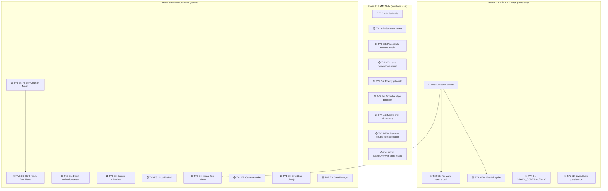

# Sprint 1–5 — Kế Hoạch Sửa Lỗi Tổng Hợp (v2)

> [!IMPORTANT]
> Bản cập nhật v2: Đã rà soát **toàn bộ** code của 5 TV, không chỉ những gì review đề cập. Phát hiện thêm **3 lỗi mới** mà review bỏ sót.

---

## Tổng Kết Nhanh Theo Từng TV

| TV | Đã Xong | Còn Lại | Mới Phát Hiện |
|:---|:---:|:---:|:---:|
| **TV1 (Dương)** | 5.20 | 5.8, 5.9, 5.14, 5.18 | +1 (double-path item collection) |
| **TV2 (Nhật)** | — | 4.1, 4.2, 5.3, 5.15 | +1 (GameOverState/WinState music) |
| **TV3 (Bảo)** | — | 5.1, 5.2, 5.4, 4.7, 5.11 | +1 (FireBall invisible - no sprite) |
| **TV4 (Vy)** | 5.21 | 4.4, 5.5, 5.6, 5.10, 5.16 | — |
| **TV5 (Truyền)** | 4.6, 5.13 | 4.3, 5.7 | +1 (cắt ảnh sprite items/mario) |

---

## TV1 (Dương — Architect) — 5 Tasks

### ✅ Đã xong
- **5.20** — Pointer khi Level reset: `PlayState::rebindCommands()` đã clear + rebind commands.

### 🔴 Task C2: Lives/Score persistence khi reload level (5.8)
**Ưu tiên: KHẨN CẤP**
**Files:** [PlayState.h](file:///f:/APCS(2025-2026)/HK3/OOP/CS202-Group04-FinalProject/include/states/PlayState.h), [PlayState.cpp](file:///f:/APCS(2025-2026)/HK3/OOP/CS202-Group04-FinalProject/src/states/PlayState.cpp)
**Vấn đề:** Khi Mario chết (L84-90), `PlayState::onNotify()` tạo `Level` mới hoàn toàn → score/lives/coins reset về mặc định.
```diff
// PlayState.h — thêm persistent state
+    int m_persistedLives = 3;
+    int m_persistedScore = 0;

// PlayState.cpp — onNotify(PLAYER_DIED), trước khi tạo level mới:
+    m_persistedLives = m_level->getMario()->getLives();
+    m_persistedScore = m_level->getMario()->getScore();
     m_level = std::make_unique<Level>();
     m_level->loadFromFile(getCurrentLevelPath());
+    if (m_level->getMario()) {
+        m_level->getMario()->setLives(m_persistedLives);
+        m_level->getMario()->addScore(m_persistedScore);
+    }
```
Tương tự cho `LEVEL_COMPLETED` (L92-104).

### 🟡 Task G2: Cộng điểm khi stomp quái (5.9)
**Ưu tiên: Trung Bình**
**Files:** [CollisionManager.cpp](file:///f:/APCS(2025-2026)/HK3/OOP/CS202-Group04-FinalProject/src/physics/CollisionManager.cpp)
**Vấn đề:** `enemy->onStomp()` gọi tại L205 nhưng không gọi `mario->addScore()`.
```diff
// L204-206: Sau stomp
+               mario->addScore(enemy->isKoopa() ? 200 : 100);
                enemy->onStomp();
```
Và L196 (Koopa kick):
```diff
                koopa->kick(kickDir);
+               mario->addScore(200);
```

### 🟡 Task G3: PauseState không resume music (5.14)
**Ưu tiên: Trung Bình**
**Files:** [PauseState.cpp](file:///f:/APCS(2025-2026)/HK3/OOP/CS202-Group04-FinalProject/src/states/PauseState.cpp)
**Vấn đề:** `onExit()` (L20) rỗng → nhạc bị pause mãi.
```diff
+#include "core/SoundManager.h"
 ...
-void PauseState::onExit() {}
+void PauseState::onExit() {
+    SoundManager::getInstance().playMusic();
+}
```

### 🟢 Task E8: EventBus clear() (5.18)
**Ưu tiên: Thấp**
**Files:** [EventBus.h](file:///f:/APCS(2025-2026)/HK3/OOP/CS202-Group04-FinalProject/include/patterns/EventBus.h)
**Vấn đề:** Không có hàm `clear()`. Hiện tại các observer đều tự unsubscribe trong destructor nên chưa crash, nhưng rủi ro tương lai.
```diff
// EventBus.h — thêm public method
+    void clear() { m_listeners.clear(); }
```

### 🟡 Task NEW-TV1: Xóa double-path Item collection
**Ưu tiên: Trung Bình**
**Files:** [CollisionManager.cpp](file:///f:/APCS(2025-2026)/HK3/OOP/CS202-Group04-FinalProject/src/physics/CollisionManager.cpp)
**Vấn đề phát hiện mới:** `handleMarioCollision()` (L170-178) gọi `item->onCollect(*mario)` qua Box2D contact, **VÀ** `Level::checkItemCollisions()` cũng gọi `item->onCollect()` qua AABB overlap mỗi frame. Tuy có `m_isCollected` guard nên không bug, nhưng code thừa và có thể gây confusion.
**Giải pháp:** Chọn 1 nơi duy nhất. Recommend **bỏ** phần trong `CollisionManager` vì `Level::checkItemCollisions()` đã cover + gọi `markForRemoval()`:
```diff
// CollisionManager.cpp L170-178 — XÓA hoặc comment out
-    if (other) {
-        if (other->isItem()) {
-            Item* item = static_cast<Item*>(other);
-            if (!item->isCollected()) {
-                item->onCollect(*mario);
-            }
-        }
-    }
```

---

## TV2 (Nhật — Engine & UI) — 5 Tasks

### 🔴 Task C3: Fix Mario texture path (4.1)
**Ưu tiên: KHẨN CẤP**
**Files:** [Mario.cpp](file:///f:/APCS(2025-2026)/HK3/OOP/CS202-Group04-FinalProject/src/entities/Mario.cpp)
**Vấn đề:** `setSprite("assets/textures/mario/idle.png")` (L63, L84) nhưng file `idle.png` **không tồn tại**. Trong `assets/textures/mario/` chỉ có spritesheet `NES - Super Mario Bros. - Playable Characters - Mario & Luigi.png`.

> [!WARNING]
> Cần phối hợp TV5: TV5 cắt spritesheet ra file riêng trước (hoặc rename), TV2 cập nhật path trong code sau.

**Giải pháp (sau khi TV5 cắt ảnh):**
```diff
-    setSprite("assets/textures/mario/idle.png");
+    setSprite("assets/textures/mario/mario_small.png");
```
Và cập nhật animation grid coordinates cho đúng với sprite mới.

### 🔴 Task G1: Sprite flip khi quay mặt (4.2)
**Ưu tiên: KHẨN CẤP**
**Files:** [Entity.cpp](file:///f:/APCS(2025-2026)/HK3/OOP/CS202-Group04-FinalProject/src/entities/Entity.cpp) hoặc [Character.cpp](file:///f:/APCS(2025-2026)/HK3/OOP/CS202-Group04-FinalProject/src/entities/Character.cpp)
**Vấn đề:** Không có code nào gọi `setScale(-1, 1)` để flip sprite khi `m_facingDirection == LEFT`. Tất cả characters (Mario, Goomba, Koopa) luôn nhìn phải.
**Giải pháp:** Override `syncPhysics()` trong `Character`:
```cpp
// Character.cpp — thêm override
void Character::syncPhysics() {
    Entity::syncPhysics();
    if (m_sprite) {
        if (m_facingDirection == Direction::LEFT) {
            m_sprite->setScale({-1.f, 1.f});
            m_sprite->setOrigin({m_size.x, 0.f});
        } else {
            m_sprite->setScale({1.f, 1.f});
            m_sprite->setOrigin({0.f, 0.f});
        }
    }
}
```
Cần thêm `void syncPhysics() override;` vào [Character.h](file:///f:/APCS(2025-2026)/HK3/OOP/CS202-Group04-FinalProject/include/entities/Character.h).

### 🟢 Task E7: Camera shake khi Mario chết (5.3)
**Ưu tiên: Thấp**
**Files:** [Level.cpp](file:///f:/APCS(2025-2026)/HK3/OOP/CS202-Group04-FinalProject/src/level/Level.cpp)
**Vấn đề:** `Camera::shake()` đã implement nhưng chưa ai gọi.
```diff
// Level::update(), sau L109
     if (m_mario) {
         m_mario->update(dt);
+        if (m_mario->isDead()) {
+            m_camera.shake(0.3f, 5.f);
+        }
     }
```

### 🟢 Task E9: High Score / SaveManager (5.15)
**Ưu tiên: Thấp**
**Vấn đề:** Chưa có SaveManager. `MenuState` constructor nhận `topScore` param nhưng luôn mặc định = 0.
**Giải pháp:** Tạo `SaveManager.h/.cpp` đọc/ghi file text đơn giản.

### 🟡 Task NEW-TV2: GameOverState / WinState không quản lý music
**Ưu tiên: Trung Bình**
**Files:** [GameOverState.cpp](file:///f:/APCS(2025-2026)/HK3/OOP/CS202-Group04-FinalProject/src/states/GameOverState.cpp), [WinState.cpp](file:///f:/APCS(2025-2026)/HK3/OOP/CS202-Group04-FinalProject/src/states/WinState.cpp)
**Vấn đề phát hiện mới:**
- `GameOverState::onEnter()` (L20) rỗng → nhạc gameplay vẫn đang chạy (hoặc bị pause bất thường). Nên gọi `SoundManager::getInstance().stopMusic()` và play `gameover.flac`.
- `WinState::onEnter()` (L20) rỗng → tương tự, nên play `level_complete.flac`.
- Cả hai không gọi `changeState(MenuState(...))` với score/coins truyền từ PlayState → data bị mất.

```diff
// GameOverState.cpp
+#include "core/SoundManager.h"
 ...
-void GameOverState::onEnter() {}
+void GameOverState::onEnter() {
+    SoundManager::getInstance().stopMusic();
+    SoundManager::getInstance().loadMusic("assets/sounds/music/gameover.flac");
+    SoundManager::getInstance().playMusic();
+}
```

---

## TV3 (Bảo — Mario & Physics) — 6 Tasks

### 🟡 Task E1: Death animation delay (5.1)
**Ưu tiên: Cao**
**Files:** [Mario.h](file:///f:/APCS(2025-2026)/HK3/OOP/CS202-Group04-FinalProject/include/entities/Mario.h), [Mario.cpp](file:///f:/APCS(2025-2026)/HK3/OOP/CS202-Group04-FinalProject/src/entities/Mario.cpp)
**Vấn đề:** `loseLife()` (L313-329) gọi `notify(PLAYER_DIED)` + `respawn()` ngay lập tức. Không có death animation.
**Giải pháp:** Thêm `m_isDying` flag + `m_deathTimer`:
```cpp
// Mario.h — thêm members
bool m_isDying = false;
float m_deathTimer = 0.f;

// Mario::loseLife() — chỉ set dying, không respawn ngay
void Mario::loseLife() {
    if (m_isDying) return;
    m_isDying = true;
    m_deathTimer = 0.5f;
    playAnimation("death");
    if (m_body) m_body->SetLinearVelocity(b2Vec2(0.f, 0.f));
}

// Mario::update() — đầu hàm
if (m_isDying) {
    m_deathTimer -= dt;
    updateAnimation(dt);
    if (m_deathTimer <= 0.f) {
        m_isDying = false;
        m_lives--;
        EventBus::getInstance().notify(EventType::PLAYER_DIED);
        if (m_lives > 0) respawn(DEFAULT_MARIO_POSITION);
        else { takeDamage(FATAL_DAMAGE); m_active = false; }
    }
    return;
}
```

### 🟢 Task E2: Spawn animation (5.2)
**Ưu tiên: Thấp**
**Files:** [Mario.cpp](file:///f:/APCS(2025-2026)/HK3/OOP/CS202-Group04-FinalProject/src/entities/Mario.cpp)
**Vấn đề:** `respawn()` (L331-341) không gọi `playAnimation("spawn")`. Animation đã khai báo (L61, L82) nhưng không dùng.
```diff
 void Mario::respawn(const sf::Vector2f& spawnPosition) {
     m_marioState = MarioState::SMALL;
     m_health = DEFAULT_MARIO_HEALTH;
     m_active = true;
+    playAnimation("spawn");
     setPosition(spawnPosition);
```

### 🟡 Task E3: shootFireBall logic (5.4)
**Ưu tiên: Trung Bình**
**Files:** [Mario.h](file:///f:/APCS(2025-2026)/HK3/OOP/CS202-Group04-FinalProject/include/entities/Mario.h), [Mario.cpp](file:///f:/APCS(2025-2026)/HK3/OOP/CS202-Group04-FinalProject/src/entities/Mario.cpp), [Level.h](file:///f:/APCS(2025-2026)/HK3/OOP/CS202-Group04-FinalProject/include/level/Level.h), [Level.cpp](file:///f:/APCS(2025-2026)/HK3/OOP/CS202-Group04-FinalProject/src/level/Level.cpp)
**Vấn đề:** `canShootFireBall()` tồn tại nhưng `shootFireBall()` chưa implement. `FireBall` class đã hoàn chỉnh.
**Giải pháp:** Mario cần ref đến `b2World*` và callback để push entity vào Level:
```cpp
// Mario.h
void setWorld(b2World* world) { m_world = world; }
std::unique_ptr<FireBall> shootFireBall();  // Returns fireball for Level to own

// Level.cpp — trong update, check input:
// (hoặc dùng Command pattern — tạo ShootCommand)
```

### 🟡 Task E4: Visual Fire Mario (4.7)
**Ưu tiên: Trung Bình**
**Files:** [Mario.cpp](file:///f:/APCS(2025-2026)/HK3/OOP/CS202-Group04-FinalProject/src/entities/Mario.cpp)
**Vấn đề:** `powerUp(MarioState::FIRE)` chỉ `rebuildFixture()` — không thay đổi visual.
**Giải pháp:** Sau powerUp, load fire spritesheet hoặc apply color tint:
```cpp
if (m_marioState == MarioState::FIRE && m_sprite) {
    setSprite("assets/textures/mario/mario_fire.png");
}
```

### 🟡 Task E5: m_coinCount trong Mario (5.11)
**Ưu tiên: Trung Bình**
**Files:** [Mario.h](file:///f:/APCS(2025-2026)/HK3/OOP/CS202-Group04-FinalProject/include/entities/Mario.h)
**Vấn đề:** Coin count chỉ tồn tại trong HUD (L74 của HUD.h) → mất khi HUD recreate.
```diff
// Mario.h — thêm
+    int m_coinCount = 0;
+    void addCoin() { ++m_coinCount; }
+    int getCoinCount() const { return m_coinCount; }
```

### 🟡 Task NEW-TV3: FireBall không có sprite (invisible)
**Ưu tiên: Trung Bình**
**Files:** [FireBall.cpp](file:///f:/APCS(2025-2026)/HK3/OOP/CS202-Group04-FinalProject/src/entities/FireBall.cpp)
**Vấn đề phát hiện mới:** `FireBall` constructor (L20-27, L29-43) **KHÔNG** gọi `setSprite(...)`. Fireball sẽ hoàn toàn invisible khi spawn. Cần phối hợp TV5 chuẩn bị texture `fireball.png`.
```diff
// FireBall.cpp L35 — sau initPhysics
     initPhysics(world, b2_dynamicBody, FIREBALL_SIZE, false);
+    setSprite("assets/textures/items/fireball.png");
```

---

## TV4 (Vy — Level & Enemy) — 5 Tasks

### ✅ Đã xong
- **5.21** — Physics sync patrol: `Goomba::update()` L40 và `Koopa::update()` L100 đều gọi `syncPhysics()` đầu tiên.

### 🔴 Task C1: Thêm '?' vào SPAWN_CODES + Mushroom offset Y (5.16 + 5.5)
**Ưu tiên: KHẨN CẤP**
**Files:** [Level.cpp](file:///f:/APCS(2025-2026)/HK3/OOP/CS202-Group04-FinalProject/src/level/Level.cpp)
**Vấn đề:** `SPAWN_CODES` (L26) thiếu `'?'` → Mushroom không spawn. Nếu thêm `'?'` nhưng spawn ở cùng tọa độ → overlap với static tile body.
```diff
// L26
-constexpr char SPAWN_CODES[] = {'G', 'K', 'C'};
+constexpr char SPAWN_CODES[] = {'G', 'K', 'C', '?'};

// spawnEntitiesFromTileMap() L86-99 — offset Y cho '?'
 for (char code : SPAWN_CODES) {
     auto positions = m_tileMap.findTiles(code);
     for (const auto& gridPos : positions) {
         sf::Vector2f worldPos = TileMap::gridToWorldPosition(gridPos);
+        if (code == '?') {
+            worldPos.y -= static_cast<float>(TILE_SIZE);
+        }
         Entity* raw = EntityFactory::createFromTileCode(code, worldPos, m_world.get());
```

### 🟡 Task G4: Goomba edge detection (4.4)
**Ưu tiên: Trung Bình**
**Files:** [Goomba.cpp](file:///f:/APCS(2025-2026)/HK3/OOP/CS202-Group04-FinalProject/src/entities/Goomba.cpp), [Goomba.h](file:///f:/APCS(2025-2026)/HK3/OOP/CS202-Group04-FinalProject/include/entities/Goomba.h)
**Vấn đề:** `patrol()` (L71-85) chỉ set velocity theo direction, không kiểm tra tile phía dưới → Goomba đi thẳng rớt hố.
**Giải pháp:** Truyền `TileMap*` vào Goomba (hoặc iterate trong Level):
```cpp
void Goomba::patrol() {
    if (m_isStomped || isDead()) return;
    
    if (m_tileMap) {
        int col = static_cast<int>((m_position.x + m_size.x / 2.f) / 32.f);
        int row = static_cast<int>((m_position.y + m_size.y) / 32.f);
        int checkCol = (getFacingDirection() == Direction::LEFT) ? col - 1 : col + 1;
        if (!m_tileMap->isSolid(checkCol, row + 1)) {
            reverseDirection();
            return;
        }
    }
    // ... existing velocity logic
}
```

### 🟡 Task G5: Enemy pit death cleanup (5.10)
**Ưu tiên: Trung Bình**
**Files:** [Goomba.cpp](file:///f:/APCS(2025-2026)/HK3/OOP/CS202-Group04-FinalProject/src/entities/Goomba.cpp), [Koopa.cpp](file:///f:/APCS(2025-2026)/HK3/OOP/CS202-Group04-FinalProject/src/entities/Koopa.cpp)
**Vấn đề:** Không có kiểm tra Y position → enemies rơi mãi mãi, body vĩnh viễn.
```diff
// Goomba::update() — sau syncPhysics() L40
+    if (m_position.y > 800.f) {
+        markForRemoval();
+        return;
+    }
```
Tương tự cho `Koopa::update()`.

### 🟡 Task G6: Koopa shell giết Goomba (5.6)
**Ưu tiên: Trung Bình**
**Files:** [CollisionManager.cpp](file:///f:/APCS(2025-2026)/HK3/OOP/CS202-Group04-FinalProject/src/physics/CollisionManager.cpp)
**Vấn đề:** Chỉ xử lý Enemy ↔ Wall (L121-133), không xử lý Enemy ↔ Enemy.
```cpp
// Thêm trước khối Enemy ↔ Wall (khoảng L120):
if (entityA && entityA->isEnemy() && entityB && entityB->isEnemy()) {
    Enemy* eA = static_cast<Enemy*>(entityA);
    Enemy* eB = static_cast<Enemy*>(entityB);
    
    auto tryShellKill = [](Enemy* shooter, Enemy* victim) {
        if (shooter->isKoopa()) {
            Koopa* k = static_cast<Koopa*>(shooter);
            if (k->isShellSliding()) {
                victim->takeDamage(100);
            }
        }
    };
    tryShellKill(eA, eB);
    tryShellKill(eB, eA);
    return;
}
```

---

## TV5 (Truyền — Sound/UI & Items) — 3 Tasks

### ✅ Đã xong
- **4.6** — `COIN_SCORE_VALUE` đã khai báo `static constexpr int = 200` trong [Coin.h L25](file:///f:/APCS(2025-2026)/HK3/OOP/CS202-Group04-FinalProject/include/items/Coin.h#L25).
- **5.13** — HUD constructor nhận `worldNumber`, `levelNumber` params. [PlayState.cpp L102](file:///f:/APCS(2025-2026)/HK3/OOP/CS202-Group04-FinalProject/src/states/PlayState.cpp#L102) truyền đúng.

### 🔴 Task NEW-TV5: Cắt sprite từ spritesheet (KHẨN CẤP)
**Ưu tiên: KHẨN CẤP — Blocking tất cả visual tasks**
**Thư mục:** `assets/textures/`
**Vấn đề phát hiện mới:** Code tham chiếu các file cụ thể nhưng **KHÔNG** file nào tồn tại:

| Code tham chiếu | File cần có | Hiện tại |
|:---|:---|:---|
| `"assets/textures/mario/idle.png"` | `mario/idle.png` hoặc `mario/mario_small.png` | ❌ Chỉ có spritesheet NES lớn |
| `"assets/textures/items/coin.png"` | `items/coin.png` | ❌ Chỉ có `items_objects.png` + `items_blocks.png` |
| `"assets/textures/items/mushroom.png"` | `items/mushroom.png` | ❌ |
| `"assets/textures/items/fireflower.png"` | `items/fireflower.png` | ❌ |
| `"assets/textures/items/star.png"` | `items/star.png` | ❌ |
| `"assets/textures/items/fireball.png"` | `items/fireball.png` (cho TV3) | ❌ |

**Việc cần làm:**
1. Cắt từ `items_objects.png` → `coin.png` (16×16, spritesheet 3 frames), `mushroom.png` (32×32), `fireflower.png` (32×32), `star.png` (32×32)
2. Cắt `fireball.png` (12×12) từ spritesheet
3. Cắt từ NES Mario spritesheet → `mario_small.png` (spritesheet chứa: idle 1 frame, walk 3 frames, jump 1 frame, death 1 frame, spawn 3 frames)
4. Nếu cần: `mario_big.png` cho SUPER state, `mario_fire.png` cho FIRE state
5. Verify `goomba.png` (32×32, 2 walk frames + 1 squish frame) và `koopa.png` (32×48, 2 walk frames + 1 shell frame) dimension

> [!IMPORTANT]
> Task này **BLOCK** task C3 (TV2), E4 (TV3), NEW-TV3 (FireBall sprite). Cần làm TRƯỚC.

### 🟡 Task G7: Load powerdown sound (4.3)
**Ưu tiên: Trung Bình**
**Files:** [SoundManager.cpp](file:///f:/APCS(2025-2026)/HK3/OOP/CS202-Group04-FinalProject/src/core/SoundManager.cpp)
**Vấn đề:** `onNotify` (L93) gọi `playSound("powerdown")` nhưng **không có** `loadSound("powerdown", ...)` trong constructor. File `pipepowerdown.wav` tồn tại trong assets.
```diff
// SoundManager.cpp L55 — sau loadSound("powerup")
     loadSound("powerup", "assets/sounds/effects/powerup.wav");
+    loadSound("powerdown", "assets/sounds/effects/pipepowerdown.wav");
```

### 🟡 Task E6: HUD lấy coin từ Mario (5.7)
**Ưu tiên: Trung Bình (phụ thuộc TV3 E5)**
**Files:** [HUD.cpp](file:///f:/APCS(2025-2026)/HK3/OOP/CS202-Group04-FinalProject/src/ui/HUD.cpp)
**Vấn đề:** `refreshText()` (L180-182) dùng `m_coinCount` nội bộ HUD. Khi HUD bị recreate (level reload), coin reset về 0.
```diff
// HUD::refreshText() L180-182 — sau khi TV3 thêm getCoinCount():
-    << m_coinCount;
+    << m_mario.getCoinCount();
```
Cần bỏ `m_coinCount` member và unsubscribe `COIN_COLLECTED` (coin counting sẽ do Mario xử lý).

---

## Thứ Tự Thực Hiện (Dependency Graph)



### Bảng tổng kết task theo Phase

| Phase | TV1 | TV2 | TV3 | TV4 | TV5 |
|:---|:---|:---|:---|:---|:---|
| **1 (Khẩn cấp)** | C2 | C3 | — | C1 | **SPRITE** |
| **2 (Gameplay)** | G2, G3, NEW | G1, NEW | — | G4, G5, G6 | G7 |
| **3 (Polish)** | E8 | E7, E9 | E1, E2, E3, E4, E5, NEW | — | E6 |
| **Tổng** | **5** | **5** | **6** | **5** | **3** |

---

## Verification Plan

### Build Test
```bash
cmake --build build --config Debug 2>&1 | head -50
```

### Manual Test Checklist
- [ ] Mario hiển thị sprite đúng, flip khi đi trái
- [ ] Goomba/Koopa hiển thị sprite đúng, flip khi quay đầu
- [ ] Items (Coin, Mushroom, Star) hiển thị sprite đúng
- [ ] Đạp Goomba → score +100
- [ ] Đạp Koopa → score +200
- [ ] Mario chết → lives -1, score/coins giữ nguyên
- [ ] Mario chết → death animation 0.5s trước khi respawn
- [ ] Block ? → Mushroom spawn phía trên, không bị kẹt
- [ ] Nhạc pause khi ESC → resume khi ESC lần nữa
- [ ] Goomba quay đầu khi gặp hố
- [ ] Koopa shell trượt → giết Goomba
- [ ] FireBall visible khi bắn (nếu implement E3)
- [ ] GameOver → nhạc gameover chạy
- [ ] Enemies rớt hố → bị cleanup
